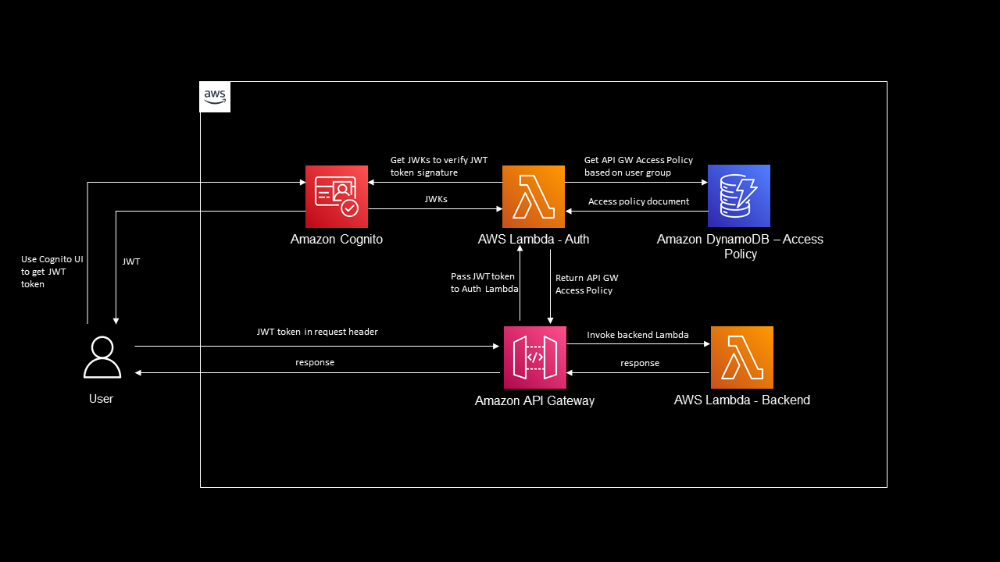
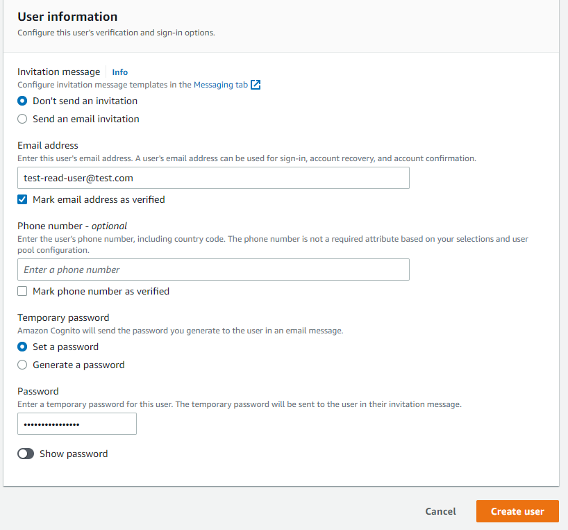
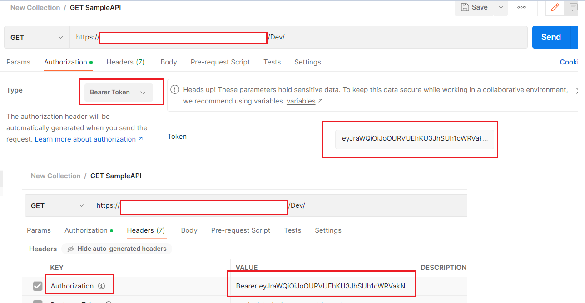

# Fine-grained access control for API Gateway using Lambda Authorizer

## <!--BEGIN STABILITY BANNER-->


> **This is a stable example. It should successfully build out of the box**
>
> This examples is built on Construct Libraries marked "Stable" and does not have any infrastructure
> prerequisites to build.

---

<!--END STABILITY BANNER-->

This C# CDK example creates an Amazon Cognito user pool, Amazon API Gateway API, AWS Lambda function for authentication, Amazon DynamoDB table, and AWS Lambda function to act as a backend. The authentication function verifies a JWT token received in the request headers, then (if the token is valid) returns the access policy associated with the token's user group. Based on this access policy, API Gateway will to forward the request to the backend Lambda function or return a 401/403 http status.



Important: this application uses various AWS services and there are costs associated with these services after the Free Tier usage - please see the [AWS Pricing page](https://aws.amazon.com/pricing/) for details. You are responsible for any AWS costs incurred.

## Requirements

- [Create an AWS account](https://portal.aws.amazon.com/gp/aws/developer/registration/index.html) if you do not already have one and log in. The IAM user that you use must have sufficient permissions to make necessary AWS service calls and manage AWS resources.
- [AWS CLI](https://docs.aws.amazon.com/cli/latest/userguide/install-cliv2.html) installed and configured
- [AWS CDK](https://docs.aws.amazon.com/cdk/v2/guide/cli.html) installed and configured
- [Git Installed](https://git-scm.com/book/en/v2/Getting-Started-Installing-Git)
- [.Net 6.0 SDK](https://dotnet.microsoft.com/en-us/download/visual-studio-sdks) installed

## Deployment Instructions

1. Create a new directory, navigate to that directory in a terminal and clone the GitHub repository:
   ```
   git clone https://github.com/aws-samples/aws-cdk-examples.git
   ```
2. Change directory to this example's directory:
   ```
   cd csharp/apigateway-cognito-lambda-dynamodb
   ```
3. Build the application:
   ```
   dotnet build src
   ```
4. Create the necessary files for the backend function using `dotnet publish`:
   ```
   dotnet publish src/Lambda/BackendFunction/BackendFunction.csproj -c Release -o dist/BackendFunction
   ```
5. Repeat for the authentication function:
   ```
   dotnet publish src/Lambda/AuthFunction/AuthFunction.csproj -c Release -o dist/AuthFunction
   ```
6. Deploy the application using the AWS CDK:
   ```
   cdk deploy ApiGatewayAuthStack --app 'dotnet run --project src/CDK/cdk.csproj'
   ```
7. Note down the `CognitoHostedUIUrl` and `APIGWEndpoint` outputs from CloudFormation. You'll use them to test your function.

8. Populate the DynamoDB table used for authenticating requests. From the `apigateway-cognito-lambda-dynamodb` directory, run
   ```
   aws dynamodb batch-write-item --request-items file://src/DynamoDBData.json
   ```

## How it works

Users must present a JWT token from Cognito in the request to API Gateway. The AWS Cognito hosted UI, set up via the CDK, is the simplest way to interact with Cognito. If the header is not present in the request, API Gateway will return an HTTP401 Unauthorized status code. If a token is present in the request header then the request is passed on to the authentication lambda function for validation.

The token signature gets verified by the Auth lambda using JSON Web Keys (JWKs) provided by a Cognito User pool.

Once the token signature is verified (both in structure and expiry), code verifies the token's claims and retrieves the user group associated with the token. Based on that user group, the Lambda function reads the API Gateway access policy document from the DynamoDB table. If user group not present in DynamoDB table then the function returns a deny policy which will make API Gateway return an HTTP 403 Forbidden response to user. If user group is present in the DynamoDB table, the associated policy document will be return to API Gateway.

Based on the policy returned by Auth Lambda function, API Gateway decides either to forward the request to backend Lambda or return an HTTP 403 Forbidden response. If JWT token is invalid, in terms of JWT structure or signature, the authentication function raises an "Unauthorized" exception which in turns into 401 Unauthorized response back to the user.

As populated in DynamoDB as part of deployment steps, this configuration creates two user groups: `read-only` and `read-update-add`. `read-only` may only call GET on the backend, while `read-update-add` may make GET and POST operations against the backend.

## Testing

1. Login to the AWS console and navigate to Cognito service

2. Select User pool - `CognitoUserPool` and create a user. Remember the users email id and password -- you'll need it for testing
   

3. Add the newly created user to user group - "read-only"
   

4. Create another user and add it to user group `read-update-add`. Again, remember these credentials for testing.

5. Access the Cognito app client hosted UI - It's the `CognitoHostedUIUrl` from earlier.

6. Login to the Hosted UI with first user which is assigned to "read-only" user group. You may be asked to enter new password if this is the first login attempt. After a successful login, the UI will navigate user to a localhost URL with `access_token` in the url

7. Get the `access_token` (not id_token) from the localhost url

8. Use Postman or `curl` or REST client like `Yet Another Rest Client` chrome extension to invoke the GET endpoint in your API Gateway API (the `APIGWEndpoint` URL from CloudFormation), making sure to pass the value from access_token as the `Authorization` header. Make sure to include "Bearer " at the start of the token.
   

9. Confirm that you are returned an 200 Success response

10. Now invoke the same request with the POST verb and the same `access_token`.

11. Confirm that you are returned an HTTP 403 Unauthorized response.

12. Log into the Hosted UI as the second user you created following the steps previously described.

13. Make a GET request to the API Gateway HTTP Endpoint as you did previously, this time using the second user's `access_token` for the bearer token.

14. Confirm that you are returned a 200 Success response

15. Make a POST request to the API HTTP Endpoint

16. Confirm you are returned an HTTP 201 Created response

17. Try making a GET or POST request to the endpoint with invalid token

18. Observe that you're returned an HTTP 401 Unauthorized response

## Cleanup

Run the following commands at eventbridge-firehose-s3-cdk folder level

1. Delete the stack
   ```bash
   cdk destroy ApiGatewayAuthStack ---app 'dotnet run --project src/CDK/cdk.csproj'
   ```
1. Confirm the stack has been deleted
   ```bash
   aws cloudformation list-stacks --query "StackSummaries[?contains(StackName,'ApiGatewayAuthStack')].StackStatus"
   ```

## Related resources

[Verifying a JSON web token](https://docs.aws.amazon.com/cognito/latest/developerguide/amazon-cognito-user-pools-using-tokens-verifying-a-jwt.html)

[API GW Resource Policies](https://docs.aws.amazon.com/apigateway/latest/developerguide/apigateway-resource-policies.html)

[Control access for invoking an API](https://docs.aws.amazon.com/apigateway/latest/developerguide/api-gateway-control-access-using-iam-policies-to-invoke-api.html)

[API GW Policy statement resource expression format](https://docs.aws.amazon.com/apigateway/latest/developerguide/api-gateway-control-access-using-iam-policies-to-invoke-api.html#api-gateway-iam-policy-resource-format-for-executing-api)

[Lambda authorizer request format](https://docs.aws.amazon.com/apigateway/latest/developerguide/api-gateway-lambda-authorizer-input.html)

[Lambda authorizer response format](https://docs.aws.amazon.com/apigateway/latest/developerguide/api-gateway-lambda-authorizer-output.html)

[Amazon Cognito hosted UI](https://docs.aws.amazon.com/cognito/latest/developerguide/cognito-user-pools-app-integration.html)

[API Gateway Lambda authorizers](https://docs.aws.amazon.com/apigateway/latest/developerguide/apigateway-use-lambda-authorizer.html)
