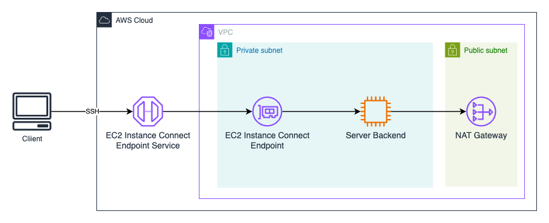

# EC2 based dev server

This sample create an EC2 instance that can be used and a backend server for .NET development.

Remote development using tools such as [JetBrains Rider](https://www.jetbrains.com/help/rider/Remote_development_overview.html) 
and [VS Code](https://code.visualstudio.com/docs/remote/ssh) where a client machine runs the development environment that connects to a backend server using SSH.

This example will create:
* VPC with one private and one public subnet
* EC2 instance with .NET SDK and Docker installed and configured, placed in a private subnet 
* EC Instance Connect Endpoint for secure connection to the EC2 instance using SSH



## To Build and Deploy

```bash
$ dotnet build
$ cdk bootstrap
$ cdk deploy
```

## To Destroy

```bash
# Destroy all project resources.
$ cdk destroy