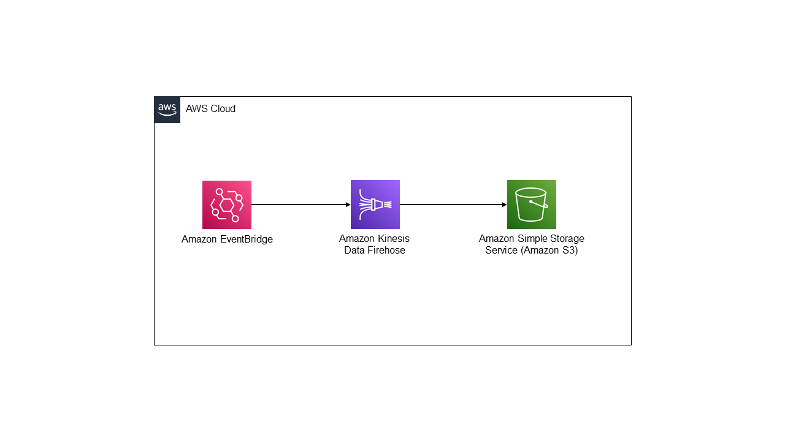

# Amazon EventBridge to Amazon Firehose Delivery Stream to Amazon S3 using .Net CDK

## <!--BEGIN STABILITY BANNER-->


> **This is a stable example. It should successfully build out of the box**
>
> This examples is built on Construct Libraries marked "Stable" and does not have any infrastructure
> prerequisites to build.

---

<!--END STABILITY BANNER-->

This pattern creates EventBridge, Firehose Delivery Stream, and S3 bucket. Apply Firehose DynamicPartitioningConfiguration to parse the input message to extract department value to use it to create S3 partition.



Important: this application uses various AWS services and there are costs associated with these services after the Free Tier usage - please see the [AWS Pricing page](https://aws.amazon.com/pricing/) for details. You are responsible for any AWS costs incurred.

## Requirements

- [Create an AWS account](https://portal.aws.amazon.com/gp/aws/developer/registration/index.html) if you do not already have one and log in. The IAM user that you use must have sufficient permissions to make necessary AWS service calls and manage AWS resources.
- [AWS CLI](https://docs.aws.amazon.com/cli/latest/userguide/install-cliv2.html) installed and configured
- [AWS CDK](https://docs.aws.amazon.com/cdk/v2/guide/cli.html) installed and configured
- [Git Installed](https://git-scm.com/book/en/v2/Getting-Started-Installing-Git)
- [.Net Core 3.1 SDK](https://dotnet.microsoft.com/en-us/download/dotnet/3.1) installed

## Deployment Instructions

1. Create a new directory, navigate to that directory in a terminal and clone the GitHub repository:
   ```
   git clone https://github.com/aws-samples/serverless-patterns
   ```
1. Change directory to the pattern directory:
   ```
   cd eventbridge-firehose-s3-cdk
   ```
1. Build the application:
   ```
   dotnet build
   ```
1. From the command line, use AWS CDK to deploy the AWS resources for the pattern as specified in CdkStack.cs file:
   ```
   cdk deploy EventBridgeFirehoseS3Stack
   ```
1. Note the S3BucketName in the deployment output. Use this S3 bucket for the testing

## How it works

When user send message to EventBridge bus, message will get routed to EventBridge rule based on "DetailType". Then EventBridge rule send "Detail" field value from message to rule target Firehose delivery stream. Once message reach at Firehose delivery stream, message will get process by JsonParsingEngine to read "Department" field value, this value used for S3 prefix. After message processing, message will get delivred to targeted S3 bucket by following calculated S3 prefix based on "Department" field value.

## Testing

1. Send message to EventBridge by using command at eventbridge-firehose-s3-cdk folder level -

   ```
   aws events put-events --entries file://SampleEvent.json
   ```

2. Navigate to S3 bucket created by CDK and confirm message has saved at path {department}/{event message file}
3. Please note: Firehose delivery stream buffer is configured for 60secs (default time), so please wait for 1-2 mins after event send command to get the message in S3 bucket

## Cleanup

Run the following commands at eventbridge-firehose-s3-cdk folder level

1. Delete the stack
   ```bash
   cdk destroy EventBridgeFirehoseS3Stack
   ```
1. Confirm the stack has been deleted
   ```bash
   aws cloudformation list-stacks --query "StackSummaries[?contains(StackName,'EventBridgeFirehoseS3Stack')].StackStatus"
   ```
