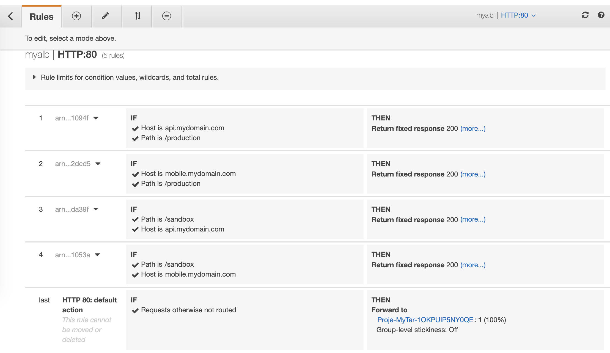

<!--BEGIN STABILITY BANNER-->
---


> **This is a stable example. It should successfully build out of the box**
>
> This examples does is built on Construct Libraries marked "Stable" and does not have any infrastructure prerequisites to build.

---
<!--END STABILITY BANNER-->

# ALB using a combination of host and path based routing with Java AWS-CDK 
The ALB is backed by an EC2 instance acting as frontend client and built-in ALB response rules that simulates mobile and application api

## Testing the responses
### testing mobile produciton api
``` bash 
curl -H "Host: mobile.mydomain.com" [ALB-DNS-FQDN]/production
```
Resonse received
```json
{"status":"succes","apiversion":"prod_mobile_v1"}
```

### Testing frontend production api
``` bash 
curl -H "Host: api.mydomain.com" [ALB-DNS-FQDN]/production
```

```json
{"status":"succes","apiversion":"prod_api_v1"}
```

## List of ALB rules



It is a Maven-based project, so you can open this directory with any Maven-compatible Java IDE, and you should be able to build and run tests from your IDE.

You should explore the contents of this template. It demonstrates a CDK app to create a codebuild Project. 
A codebuild project includes information about how to run a build, including where to get the source code, which build environment to use, which build commands to run, and where to store the build output. In short, build project provides information to Code Build about how to build, as project contains all the information.
To get more details on the properties and methods of a Project object, do look at https://docs.aws.amazon.com/cdk/api/latest/docs/@aws-cdk_aws-codebuild.Project.html

The cdk.json file tells the CDK Toolkit how to execute your app. This example relies on maven to do that.

## Useful commands

 * `mvn package`     compile and run tests
 * `cdk ls`          list all stacks in the app
 * `cdk synth`       emits the synthesized CloudFormation template
 * `cdk deploy`      deploy this stack to your default AWS account/region
 * `cdk diff`        compare deployed stack with current state
 * `cdk docs`        open CDK documentation

Enjoy!
