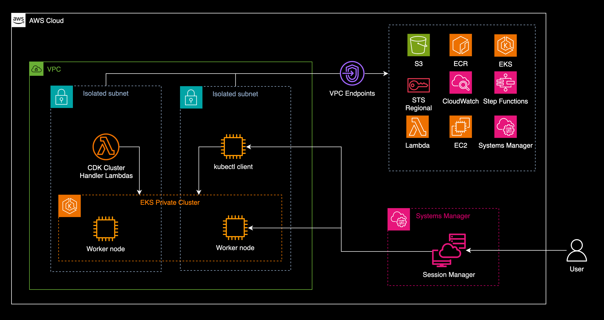

<!--BEGIN STABILITY BANNER-->
---


> **This is a stable example. It should successfully build out of the box**
>
> This example is built on Construct Libraries marked "Stable" and does not have any infrastructure prerequisites to build.
---
<!--END STABILITY BANNER-->

# Build an EKS Private Cluster in Isolated Subnets with CDK

This is a CDK example in Java that creates a private EKS cluster isolated from the Internet. This CDK first deploys a VPC with only Isolated Subnets. There are no Internet Gateway or NAT Gateway in the VPC. The cluster will have one worker node to run the pods and one client EC2 instance for `kubectl`. The EC2 instances will be accessible through AWS Systems Manager. The connection to the AWS services required to create the cluster, download assets, pull container repositories will be through VPC Endpoints.

## Architecture diagram of the deployed resources




## Build and deploy 
1. Go the root directory of this example
    ```
    cd ./eks-private-cluster
    ```
1. Synthesize the code
    ```
    cdk synth
    ```
1. Deploy
    ```
    cdk deploy
    ```
    This will take about 25 mins. It includes the creation of the EKS cluster, the VPC endpoints, and the Lambda functions required by CDK to monitor the cluster lifecycle. The functions are deployed in the VPC and is configured in the cluster's `placeClusterHandlerInVpc` set to `true`. See the [EKS Construct Library](https://docs.aws.amazon.com/cdk/api/v2/java/software/amazon/awscdk/services/eks/package-summary.html) for more details.
1. After a successful deployment, note the output of CDK i.e. the cluster's name, the `kubeconfig` settings, and the master IAM role of the cluster.

## Accessing the EC2 instances with AWS Systems Manager Session Manager
1. Login to the AWS Console and go to the EC2 Service. Find and select the instance created by CDK with the name `kubectl-client`. Click `Connect`. Choose `Session Manager.`
1. Optional. Update the [Session Manager Preferences](https://docs.aws.amazon.com/systems-manager/latest/userguide/session-preferences-shell-config.html) to use bash and set alias for kubectl.
    ```
    /bin/bash
    set -o vi
    alias k=kubectl
    export AWS_STS_REGIONAL_ENDPOINTS=regional
    cd $HOME
    ```

## Installing tools and packages
### Docker
Amazon Linux repositories are hosted in Amazon Simple Storage Service (Amazon S3) buckets. Installing or updating packages from these repositories will work even in an isolated environment. See this [AWS re:Post entry](https://repost.aws/knowledge-center/ec2-al1-al2-update-yum-without-internet). The CDK we just deployed used Amazon Linux instances and has an S3 VPC gateway endpoint. For example, we can access this repository to install docker.

```
sudo yum update -y
sudo amazon-linux-extras install docker
sudo service docker start
```

### kubectl
For other packages or tools like `kubectl`, create an S3 bucket accessible from the isolated environment to store these assets. You can use [AWS CloudShell](https://aws.amazon.com/cloudshell/) to download the assets and upload them in the asset bucket. Follow the steps [here](https://docs.aws.amazon.com/eks/latest/userguide/install-kubectl.html) to install `kubectl` in the `kubectl-client` instance.

Sample cloudshell session:

```
[cloudshell-user@ip-10-2-84-204 ~]$ curl -O https://s3.us-west-2.amazonaws.com/amazon-eks/1.28.5/2024-01-04/bin/linux/amd64/kubectl
% Total    % Received % Xferd  Average Speed   Time    Time     Time  Current
                                Dload  Upload   Total   Spent    Left  Speed
100 47.5M  100 47.5M    0     0  7975k      0  0:00:06  0:00:06 --:--:-- 10.4M
[cloudshell-user@ip-10-2-84-204 ~]$ aws s3 cp kubectl s3://my-bucket/kubectl-1.28.5
upload: ./kubectl to s3://my-bucket/kubectl-1.28.5          
```

## Accessing the EKS cluster with kubectl
To access the EKS cluster, SSM to the `kubectl-client` instance

Update the kubeconfig

```
[ssm-user@ip-10-0-0-240 bin]$ aws eks update-kubeconfig --name eks-private --region ap-southeast-1 --role-arn arn:aws:iam::111111111111:role/EksPrivateCluster-clusteradminxxxxxxxx-xxxxxxxxxxxx
Added new context arn:aws:eks:ap-southeast-1:111111111111:cluster/eks-private to /home/ssm-user/.kube/config
```

Get pods and nodes
```
[ssm-user@ip-10-0-0-240 ~]$ kubectl get nodes
NAME                                           STATUS   ROLES    AGE   VERSION
ip-10-0-0-60.ap-southeast-1.compute.internal   Ready    <none>   19h   v1.28.5-eks-5e0fdde

[ssm-user@ip-10-0-0-240 ~]$ kubectl get pods -A
NAMESPACE     NAME                       READY   STATUS    RESTARTS        AGE
kube-system   aws-node-9sqcb             2/2     Running   2 (4h39m ago)   19h
kube-system   coredns-6787556b84-cg29g   1/1     Running   1 (4h39m ago)   19h
kube-system   coredns-6787556b84-q98ks   1/1     Running   1 (4h39m ago)   19h
kube-system   kube-proxy-m9ms4           1/1     Running   1 (4h39m ago)   19h
```