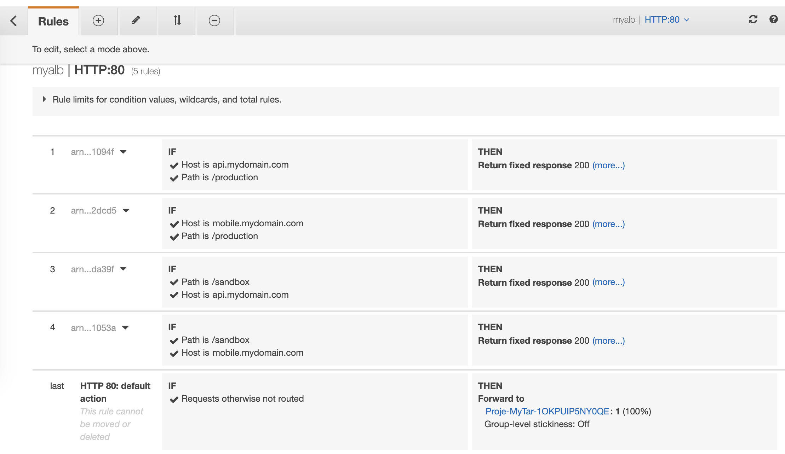

<!--BEGIN STABILITY BANNER-->
---


> **This is a stable example. It should successfully build out of the box**
>
> This examples is built on Construct Libraries marked "Stable" and does not have any infrastructure prerequisites to build.

---
<!--END STABILITY BANNER-->

# ALB using a combination of host and path based routing with Java AWS-CDK 
The ALB is backed by an EC2 instance acting as frontend client and built-in ALB response rules that simulates mobile and application api

## Testing the responses
### testing mobile produciton api
``` bash 
curl -H "Host: mobile.mydomain.com" [ALB-DNS-FQDN]/production
```
Resonse received
```json
{"status":"succes","apiversion":"prod_mobile_v1"}
```

### Testing frontend production api
``` bash 
curl -H "Host: api.mydomain.com" [ALB-DNS-FQDN]/production
```

```json
{"status":"succes","apiversion":"prod_api_v1"}
```

## List of ALB rules



It is a Maven-based project, so you can open this directory with any Maven-compatible Java IDE, and you should be able to build and run tests from your IDE.

You should explore the contents of this template. It demonstrates a CDK app to create a multi-rule ALB, based on path and host headers.  
More information on ALB and Path routing is available here https://docs.aws.amazon.com/elasticloadbalancing/latest/application/tutorial-load-balancer-routing.html

The cdk.json file tells the CDK Toolkit how to execute your app. This example relies on maven to do that.

## Useful commands

 * `mvn package`     compile and run tests
 * `cdk ls`          list all stacks in the app
 * `cdk synth`       emits the synthesized CloudFormation template
 * `cdk deploy`      deploy this stack to your default AWS account/region
 * `cdk diff`        compare deployed stack with current state
 * `cdk docs`        open CDK documentation

Enjoy!
