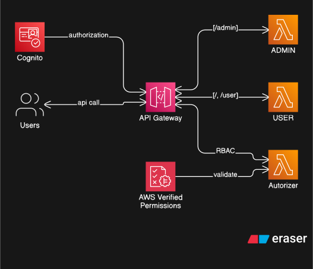

# Architecture Overview

## Solution Summary

This project deploys a reference REST API that protects endpoints with [Amazon Verified Permissions (AVP)](https://aws.amazon.com/verified-permissions/) and Amazon Cognito. It demonstrates how to combine a Cedar policy store with an API Gateway Request Authorizer so that only members of the appropriate Cognito group can invoke protected routes.

## High-Level Diagram

## Core Components

| Component | Purpose | Source Reference |
|-----------|---------|------------------|
| Amazon Cognito User Pool | Manages users and issues JWT access tokens. Provides `admin` and `user` groups for RBAC. | `stack/cognito/main.py` |
| Amazon Verified Permissions | Stores the Cedar schema and group-based policies. | `stack/verified_permissions/` |
| Amazon API Gateway REST API | Provides `/`, `/user`, and `/admin` resources secured by the custom authorizer. | `stack/apigw/main.py` |
| Request Authorizer Lambda (Node.js) | Exchanges the bearer token and request context for an AVP decision via `isAuthorizedWithToken`. | `stack/lambdas/authorizer/main.js` |
| Demo Business Lambdas (Python) | Return simple payloads to illustrate RBAC outcomes. | `stack/lambdas/{user,admin}/main.py` |

## Request Authorization Flow

1. A client authenticates against the Cognito User Pool to obtain an access token.
2. The client calls the API Gateway endpoint, sending the JWT in the `Authorization` header.
3. API Gateway forwards the request to the custom Request Authorizer Lambda.
4. The authorizer extracts the bearer token, request path, and method, then calls `VerifiedPermissions.isAuthorizedWithToken`.
5. Verified Permissions evaluates the Cedar policies against the supplied action and principal:
   - Members of the `admin` group can invoke all routes.
   - Members of the `user` group can invoke `/` and `/user` only.
6. API Gateway allows or denies the original request based on the evaluation result.

## Authorization Model

### Namespace and Entities

The Cedar namespace is `amazonverified`. It defines:

- `User`: Represents a Cognito user.
- `UserGroup`: Represents Cognito groups (`admin`, `user`).
- `Application`: Represents the protected API surface.

Actions map one-to-one with the REST routes: `get /`, `get /user`, and `get /admin`.

### Schema Reference

The Cedar schema is defined in `stack/verified_permissions/schema.py` and supplied to the `PolicyStore` during stack synthesis. The schema is serialized to JSON through `cedar_schema = {"cedar_json": json.dumps(cedar_json_schema)}`.

### Policies

Policies are provided via `StaticPolicyDefinitionProperty` constructs:

- `stack/verified_permissions/policy/admin.py` grants the `admin` group access to every action.
- `stack/verified_permissions/policy/user.py` grants the `user` group access to `get /` and `get /user`.

Because policies refer to Cognito groups using the pattern `"<userPoolId>|<groupName>"`, redeploying to a new environment automatically scopes the policy to the correct pool.

### Extending the Model

1. Update `cedar_json_schema` with new actions or entity types.
2. Add or modify policy definitions. You can compose static policies or migrate to policy templates for dynamic authorizations.
3. Re-deploy the stack to publish the new schema and policies.
