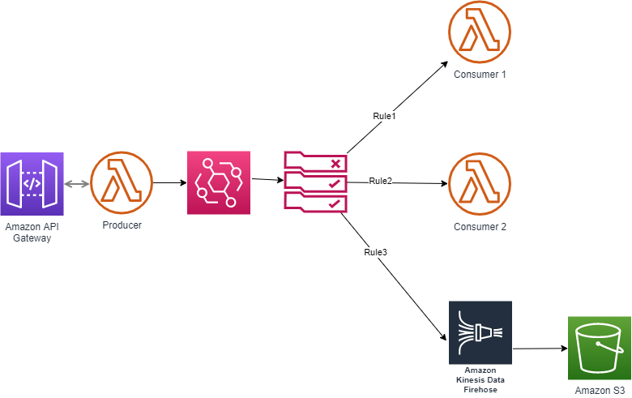

# API Gateway + Lambda + EventBridge  + [Lambda , KinesisFirehose(S3)] 

Creates an API Gateway API with a POST Method, a Lambda as data Producer, EventBridge that can route to different AWS services based on the Rule, two Lambda functions for consumption of data based on different Rules, and a Kinesis Firehose that takes data from eventbridge based on Rule to store data in to S bucket every 60 sec.
 Requests to the API are sent to eventbridge using the producer Lambda, which triggers the Consumer Lambda functions and KinesisFirehose based on the Rule.




The `cdk.json` file tells the CDK Toolkit how to execute your app.

This project is set up like a standard Python project. The initialization process also creates a virtualenv within this
project, stored under the `.env` directory. To create the virtualenv it assumes that there is a `python3` (or `python`
for Windows) executable in your path with access to the `venv` package. If for any reason the automatic creation of the
virtualenv fails, you can create the virtualenv manually.

To manually create a virtualenv on MacOS and Linux:

```
$ python3 -m venv .env
```

After the init process completes and the virtualenv is created, you can use the following
step to activate your virtualenv.

```
$ source .env/bin/activate
```

If you are a Windows platform, you would activate the virtualenv like this:

```
% .env\Scripts\activate.bat
```

Once the virtualenv is activated, you can install the required dependencies.

```
$ pip install -r requirements.txt
```

At this point you can now synthesize the CloudFormation template for this code.

```
$ cdk synth
```

## Testing the app

Upon successful deployment, you should see an API Gateway REST API in your account. It can be tested from the console or the CLI:

[Validate Deployment](Validate_sample.pdf)

or 
```
$ aws apigateway test-invoke-method --rest-api-id <API ID> --resource-id <RESOURCE ID> --http-method POST --body {"item1":"123","item2":"234"}
```

This request should complete with a 200 OK. The Lambda function should print the API Gateway request body in its CloudWatch logs. (https://docs.aws.amazon.com/lambda/latest/dg/monitoring-cloudwatchlogs.html)

This message will also be visible in the S3 bucket that has been created by KinesisFirehose. Also you should be able to see the event in Consumer Lambda's cloudwatch logs.
