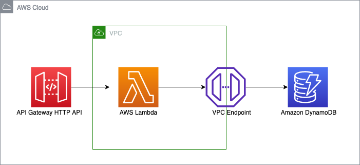

# AWS API Gateway HTTP API to AWS Lambda in VPC to DynamoDB CDK Python Sample!


## Overview

Creates an [AWS Lambda](https://aws.amazon.com/lambda/) function writing to [Amazon DynamoDB](https://aws.amazon.com/dynamodb/) and invoked by [Amazon API Gateway](https://aws.amazon.com/api-gateway/) REST API. 

This implementation follows AWS Well-Architected Framework best practices with comprehensive logging and monitoring capabilities.



## Security & Compliance Features

This stack implements **SEC04-BP01: Configure service and application logging** from the AWS Well-Architected Framework:

- **API Gateway Logging**: Access logs and execution logs with 1-year retention
- **Lambda Logging**: CloudWatch Logs with 1-year retention policy
- **VPC Flow Logs**: Network traffic monitoring with 1-month retention
- **DynamoDB PITR**: Point-in-time recovery enabled for data protection
- **CloudWatch Metrics**: API Gateway metrics enabled for monitoring

### Log Retention Policies

| Service | Log Type | Retention Period |
|---------|----------|------------------|
| API Gateway | Access Logs | 1 Year |
| API Gateway | Execution Logs | 1 Year |
| Lambda | Function Logs | 1 Year |
| VPC | Flow Logs | 1 Month |

## Setup

The `cdk.json` file tells the CDK Toolkit how to execute your app.

This project is set up like a standard Python project.  The initialization
process also creates a virtualenv within this project, stored under the `.venv`
directory.  To create the virtualenv it assumes that there is a `python3`
(or `python` for Windows) executable in your path with access to the `venv`
package. If for any reason the automatic creation of the virtualenv fails,
you can create the virtualenv manually.

To manually create a virtualenv on MacOS and Linux:

```
$ python3 -m venv .venv
```

After the init process completes and the virtualenv is created, you can use the following
step to activate your virtualenv.

```
$ source .venv/bin/activate
```

If you are a Windows platform, you would activate the virtualenv like this:

```
% .venv\Scripts\activate.bat
```

Once the virtualenv is activated, you can install the required dependencies.

```
$ pip install -r requirements.txt
```

At this point you can now synthesize the CloudFormation template for this code.

```
$ cdk synth
```

To add additional dependencies, for example other CDK libraries, just add
them to your `setup.py` file and rerun the `pip install -r requirements.txt`
command.

## Deploy
At this point you can deploy the stack. 

Using the default profile

```
$ cdk deploy
```

With specific profile

```
$ cdk deploy --profile test
```

## After Deploy
Navigate to AWS API Gateway console and test the API with below sample data 
```json
{
    "year":"2023", 
    "title":"kkkg",
    "id":"12"
}
```

You should get below response 

```json
{"message": "Successfully inserted data!"}
```

## Monitoring and Logs

After deployment, you can access logs and metrics:

### CloudWatch Logs
- **API Gateway Access Logs**: Navigate to CloudWatch Logs → Log group `/aws/apigateway/ApigwHttpApiLambdaDynamodbPythonCdkStack-ApiGatewayAccessLogs`
- **Lambda Function Logs**: Navigate to CloudWatch Logs → Log group `/aws/lambda/apigw_handler`
- **VPC Flow Logs**: Navigate to CloudWatch Logs → Log group for VPC Flow Logs

### CloudWatch Insights Queries
Use CloudWatch Logs Insights to query logs:

```sql
# API Gateway - Find errors
fields @timestamp, status, ip, requestId
| filter status >= 400
| sort @timestamp desc

# Lambda - Find slow requests
fields @timestamp, @duration
| filter @duration > 1000
| sort @duration desc
```

## Cleanup 
Run below script to delete AWS resources created by this sample stack.
```
cdk destroy
```

## Useful commands

 * `cdk ls`          list all stacks in the app
 * `cdk synth`       emits the synthesized CloudFormation template
 * `cdk deploy`      deploy this stack to your default AWS account/region
 * `cdk diff`        compare deployed stack with current state
 * `cdk docs`        open CDK documentation

Enjoy!
