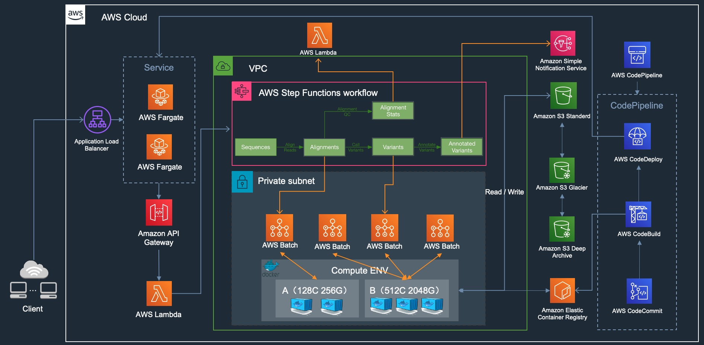
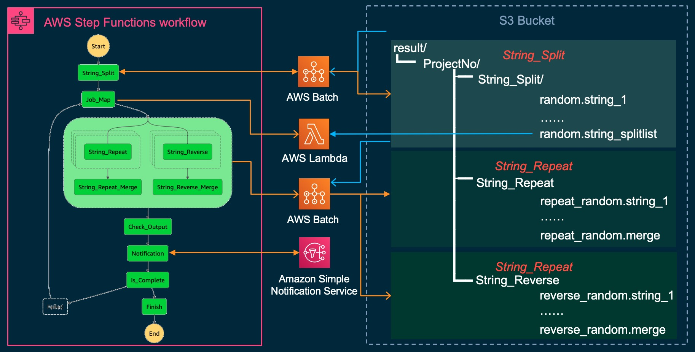
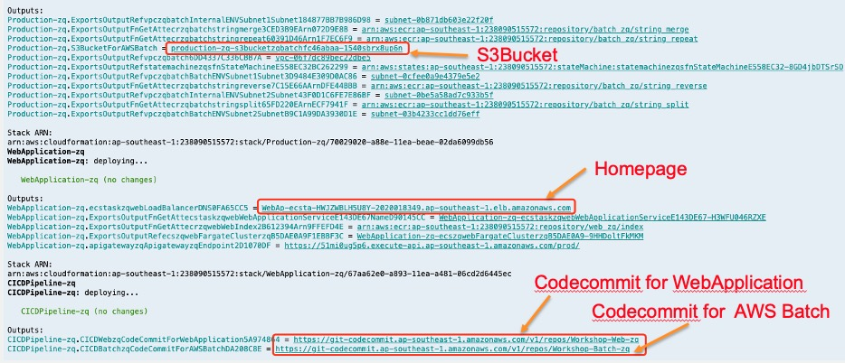

# AWS Batch + AWS Stepfunctions + AWS Fargate + CI/CD Pipeline





The `cdk.json` file tells the CDK Toolkit how to execute your app.

This project is set up like a standard Python project. The initialization process also creates a virtualenv within this
project, stored under the `.env` directory. To create the virtualenv it assumes that there is a `python3` (or `python`
for Windows) executable in your path with access to the `venv` package. If for any reason the automatic creation of the
virtualenv fails, you can create the virtualenv manually.

To manually create a virtualenv on MacOS and Linux:

```
$ python3 -m venv .env
```

After the init process completes and the virtualenv is created, you can use the following
step to activate your virtualenv.

```
$ source .env/bin/activate
```

If you are a Windows platform, you would activate the virtualenv like this:

```
% .env\Scripts\activate.bat
```

Once the virtualenv is activated, you can install the required dependencies.

```
$ pip install -r requirements.txt
```

At this point you can now list the stacks.

```
$ cdk ls
```

## Deploy the app
### At first, You need to open `app.py` and modify the  environment variables, such as `UserName,EmailAddress,CustomeENV`, then you can list stacks.
```
#......
from workshop.stack.production_stack import ProductionStack
from workshop.stack.cicdpipeline_stack import CICDPipelineStack
from workshop.stack.webapplication_stack import WebApplicationStack

UserName = "example" # Need modify
EmailAddress = "example@qq.com" # Need modify
CustomeENV = core.Environment(account="2383838383xxx", region="ap-northeast-1") # Need modify
#......
```

### When you run `cdk ls`, you will find three stacks below, such as `Production-xxxx,Webapplication-xxxx,CICDPipeline-xxxx`, then you can run `deploy one by one`.
```
cdk deploy Production-xxxx
cdk deploy Webapplication-xxxx
cdk deploy CICDPipeline-xxxx
```

### After you deploy these stack, you can find the information like this.


### you need pull the repo from AWS codecommit for Webapplication and BatchTaskdefination, Copy files to the corresponding directory ，for example:`cp -r batch-compute-with-step-functions/docker-image/BatchJob/* Workshop-Batch-xx/`
```
git clone <codecommit for web>
git clone <codecommit for batch>
cp -r batch-compute-with-step-functions/docker-image/BatchJob/* Workshop-Batch-xx/
cp -r batch-compute-with-step-functions/docker-image/WebApplication/* Workshop-Web-xx/
```

### modify the `buildspec.yaml` in every git repo, such as `username,accountid,region`,then `git push` these repo, when you push the code, you can use AWS View progress and results on CodePipeline
```
git add .
git commit -m "example"
git push origin master
```


## Testing the app

### upload some test data to specified bucket
```
aws s3 cp batch-compute-with-step-functions/testdata/random.string s3://<buckname>
```

### visit the homepage（find the elb dns from cdk deploy message）, submit the form
