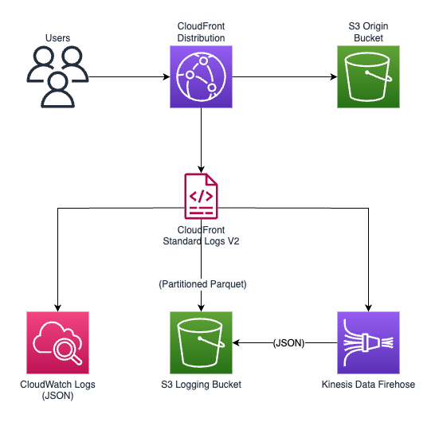

# CloudFront V2 Logging with AWS CDK (Python)

This project demonstrates how to set up Amazon CloudFront with the new CloudFront Standard Logging V2 feature using AWS CDK in Python. The example shows how to configure multiple logging destinations for CloudFront access logs, including:

1. Amazon CloudWatch Logs
2. Amazon S3 (with Parquet format)
3. Amazon Kinesis Data Firehose (with JSON format)

## Architecture



The project deploys the following resources:

- An S3 bucket to host a simple static website
- A CloudFront distribution with Origin Access Control (OAC) to serve the website
- A logging S3 bucket with appropriate lifecycle policies
- CloudFront Standard Logging V2 configuration with multiple delivery destinations
- Kinesis Data Firehose delivery stream
- CloudWatch Logs group
- Necessary IAM roles and permissions

## Prerequisites

- [AWS CLI](https://aws.amazon.com/cli/) configured with appropriate credentials
- [AWS CDK](https://aws.amazon.com/cdk/) installed (v2.x)
- Python 3.6 or later
- Node.js 14.x or later (for CDK)

## Setup

1. Create and activate a virtual environment:

```bash
python3 -m venv .venv
source .venv/bin/activate  # On Windows: .venv\Scripts\activate.bat
```

2. Install the required dependencies:

```bash
pip install -r requirements.txt
```

3. Synthesize the CloudFormation template:

```bash
cdk synth
```

4. Deploy the stack:

```bash
cdk deploy
```

You can customize the log retention periods by providing parameters:

```bash
cdk deploy --parameters LogRetentionDays=90 --parameters CloudWatchLogRetentionDays=60
```

5. After deployment, the CloudFront distribution domain name will be displayed in the outputs. You can access your website using this domain.

## How It Works

This example demonstrates CloudFront Standard Logging V2, which provides more flexibility in how you collect and analyze CloudFront access logs:

- **CloudWatch Logs**: Logs are delivered in JSON format for real-time monitoring and analysis
- **S3 (Parquet)**: Logs are delivered in Parquet format with Hive-compatible paths for efficient querying with services like Amazon Athena
- **Kinesis Data Firehose**: Logs are streamed in JSON format, allowing for real-time processing and transformation

The CDK stack creates all necessary resources and configures the appropriate permissions for log delivery.

## Example Log Outputs

### CloudWatch Logs (JSON format)
```json
{
  "timestamp": "2023-03-15T20:12:34Z",
  "c-ip": "192.0.2.100",
  "time-to-first-byte": 0.002,
  "sc-status": 200,
  "sc-bytes": 2326,
  "cs-method": "GET",
  "cs-uri-stem": "/index.html",
  "cs-protocol": "https",
  "cs-host": "d111111abcdef8.cloudfront.net",
  "cs-user-agent": "Mozilla/5.0 (Windows NT 10.0; Win64; x64) AppleWebKit/537.36",
  "cs-referer": "https://www.example.com/",
  "x-edge-location": "IAD79-C2",
  "x-edge-request-id": "tLAGM_r7TyiRgwgk_4U5Xb-vv4JHOjzGCh61ER9nM_2UFY8hTKdEoQ=="
}
```

### S3 Parquet Format
The Parquet format is a columnar storage format that provides efficient compression and encoding schemes. The logs are stored in a Hive-compatible directory structure:

```
s3://your-logging-bucket/s3_delivery/EDFDVBD6EXAMPLE/2023/03/15/20/
```

### Kinesis Data Firehose (JSON format)
Firehose delivers logs in JSON format with a timestamp-based prefix:

```
s3://your-logging-bucket/firehose_delivery/year=2023/month=03/day=15/delivery-stream-1-2023-03-15-20-12-34-a1b2c3d4.json.gz
```

## Querying Logs with Athena

You can use Amazon Athena to query the Parquet logs stored in S3. Here's an example query to get started:

```sql
CREATE EXTERNAL TABLE IF NOT EXISTS cloudfront_logs (
  `timestamp` string,
  `c-ip` string,
  `time-to-first-byte` float,
  `sc-status` int,
  `sc-bytes` bigint,
  `cs-method` string,
  `cs-uri-stem` string,
  `cs-protocol` string,
  `cs-host` string,
  `cs-user-agent` string,
  `cs-referer` string,
  `x-edge-location` string,
  `x-edge-request-id` string
)
PARTITIONED BY (
  `distributionid` string,
  `year` string,
  `month` string,
  `day` string,
  `hour` string
)
STORED AS PARQUET
LOCATION 's3://your-logging-bucket/s3_delivery/';

-- Update partitions
MSCK REPAIR TABLE cloudfront_logs;

-- Example query to find the top requested URLs
SELECT cs_uri_stem, COUNT(*) as request_count
FROM cloudfront_logs
WHERE year='2023' AND month='03' AND day='15'
GROUP BY cs_uri_stem
ORDER BY request_count DESC
LIMIT 10;
```

## Troubleshooting

### Common Issues

1. **Logs not appearing in CloudWatch**
   - Check that the CloudFront distribution is receiving traffic
   - Verify the IAM permissions for the log delivery service
   - Check CloudWatch service quotas if you have high traffic volumes

2. **Parquet files not appearing in S3**
   - Verify bucket permissions allow the log delivery service to write
   - Check for any errors in CloudTrail related to log delivery

3. **Firehose delivery errors**
   - Check the Firehose error prefix in S3 for error logs
   - Verify IAM role permissions for Firehose
   - Monitor Firehose metrics in CloudWatch

### Useful Commands

- Check CloudFront distribution status:
  ```bash
  aws cloudfront get-distribution --id <distribution-id>
  ```

- List log files in S3:
  ```bash
  aws s3 ls s3://your-logging-bucket/s3_delivery/ --recursive
  ```

- View CloudWatch logs:
  ```bash
  aws logs get-log-events --log-group-name <log-group-name> --log-stream-name <log-stream-name>
  ```

## Cleanup

To avoid incurring charges, delete the deployed resources when you're done:

```bash
cdk destroy
```

## Security Considerations

This example includes several security best practices:

- S3 buckets are configured with encryption, SSL enforcement, and public access blocking
- CloudFront uses Origin Access Control (OAC) to secure S3 content
- IAM permissions follow the principle of least privilege
- Logging bucket has appropriate lifecycle policies to manage log retention
