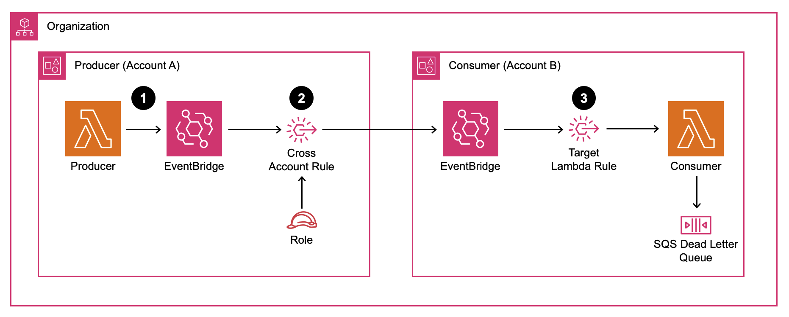
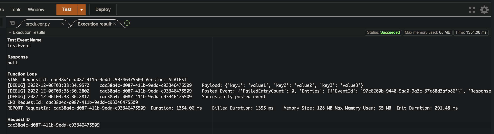
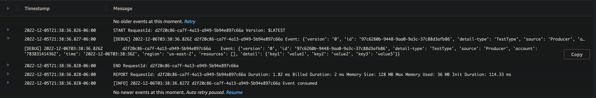

# Cross Account Amazon EventBridge Event Bus in an AWS Organization

<!--BEGIN STABILITY BANNER-->
---


> **This is a stable example. It should successfully build out of the box**
>
> This example is built on Construct Libraries marked "Stable" and does not have any infrastructure prerequisites to build.
---
<!--END STABILITY BANNER-->

This [AWS CDK](https://aws.amazon.com/cdk/) sample illustrates how to implement an Event Driven Architecture with [Amazon EventBridge](https://aws.amazon.com/eventbridge/) that involves multiple accounts in an [AWS Organization](https://aws.amazon.com/organizations/).



### Architecture Flow
1. The Producer Lambda function in Account A puts an event on the EventBridge Bus.
1. The cross-account EventBridge Rule routes the event to an EventBridge Bus in Account B.
1. The EventBridge Bus in Account B has a Rule target which invokes the Consumer Lambda function.

EventBridge is a key AWS Service in Event Driven Architectures, it allows separation between producers of messages and consumers of those messages.  In a single account this is straight forward, but in a modern multi account structure some additional considerations are required in order to allow for events on the Event Bus in one account to be consumed from the Event Bus in another account.

## EventBridge Cross Account Target Limitations

[Amazon EventBridge targets](https://docs.aws.amazon.com/eventbridge/latest/userguide/eb-targets.html) are generally only able to target endpoints/consumers in the same account, however an [Event Bus in a different account](https://docs.aws.amazon.com/eventbridge/latest/userguide/eb-cross-account.html) is also a valid target.  In order to consume events from one Event Bus in another account, events must be pushed from the producer account's Event Bus to the consumer account Event Bus.

## Account Specific Considerations

### Producer

In the consumer account, an EventBridge Event Bus is created to accept messages from producers.  Rules with accompanying IAM Permissions are created on this Event Bus that target the EventBridge Event Bus in the consumer account according to the following cdk.json structure:

```json
    "rules": [
      {
        "id": "CrossAccount",
        "sources": ["Producer"],
        "detail_types": ["TestType"],
        "targets": [
          {
            "id": "ConsumerEventBus",
            "arn": "arn:aws:events:us-east-2:012345678901:event-bus/CrossAccount"
          }
        ]
      }
    ]
```

For each consuming Event Bus there are several key details that must be included in addition to the construct id:

#### Event Pattern

[Event Patterns](https://docs.aws.amazon.com/eventbridge/latest/userguide/eb-event-patterns.html) are used to filter which events this rule will apply to.  For purposes of this example the sources of the events and the detail_type of the record will be used for identifying which events to transmit from the Producer Event Bus to the Consumer Event Bus

#### Target Event Bus

The Event Bus that this rule will target that exists in another account.  The full ARN is needed in order to uniquely identify the target Event Bus.  It's worth noting, the Event Bus need not actually exist at this point, but if it does not then messages will not be delivered.

### Consumer

In the consumer account, an EventBridge Event Bus is created to receive messages from the Producer Event Bus.  In order to allow events to be published from the Producer account a [resource-based policy](https://docs.aws.amazon.com/eventbridge/latest/userguide/eb-use-resource-based.html) must be created.

#### Resource Based Policy

```json
{
  "Version": "2012-10-17",
  "Statement": [{
    "Sid": "AllowOrgToPutEvents",
    "Effect": "Allow",
    "Principal": "*",
    "Action": "events:PutEvents",
    "Resource": "arn:aws:events:us-east-2:012345678901:event-bus/CrossAccount",
    "Condition": {
      "StringEquals": {
        "aws:PrincipalOrgID": "o-XXXXXXXXX"
      }
    }
  }]
}
```

Especially important is to grant the `events:PutEvents` permission, because we want to allow any other account in the same organization to publish events to this Event Bus, a condition where the `aws:PrincipalOrgId` is equal to the organization id will grant the needed permissions.

## Trying It Out

### Deploy The Producer

#### Context Values

Update [cdk.json](./cdk.json):

1. organization_id - The AWS Organization ID of the accounts involved in your deployment.
1. event_bus_name - Can be renamed, or keep the default of "CrossAccount"
2. rules[].targets[].arn - to reflect the consuming account account id.

#### Deploy the ProducerStack

In the producer account:

```sh
cdk deploy ProducerStack
```

This will create the EventBridge Event Bus, a sample producer, and a Rule with the target being the specified cross account EventBridge Event Bus.

### Deploy the Consumer

#### Context Values

No additional changes are required.

#### Deploy the ConsumerStack

In the consumer account:

```sh
cdk deploy ConsumerStack
```

This will create the EventBridge Event Bus, a sample consumer, and a Rule with the target being the sample consumer.

### Produce and Consume Events

In the producer account, invoke the ProducerLambda with any JSON payload (the sample hello-world payload works well for this).



In the consumer account, inspect [Amazon CloudWatch Logs](https://docs.aws.amazon.com/AmazonCloudWatch/latest/logs/WhatIsCloudWatchLogs.html) for the consumed event.



## Additional Considerations

### Event Pattern

The include Event Pattern can be freely modified to meet your use case:

```python
    rule = events.Rule(
        self,
        self.id + 'Rule' + rule_definition['id'],
        event_bus=event_bus,
        event_pattern=events.EventPattern(
            source=rule_definition['sources'],
            detail_type=rule_definition['detail_types'],
        )
    )
```

In general, to reduce the need for unnecessary processing the Event Pattern should be specified such that only events that the consuming account intends to process are transmitted to the consumer Event Bus.

### Resource Based Policy

This example uses the organization id to control what is allowed to put events on the Consumer Event Bus.  A more restrictive policy (such as specifying the source account) could also be used.

### Amazon EventBridge Quotas

The relevant [quotas](https://docs.aws.amazon.com/eventbridge/latest/userguide/eb-quota.html) to keep in mind are:

* 300 Rules per Event Bus is the default quota, this can be expanded if needed but should fit most use cases
* 5 Targets Per Rule is the maximum allowed.  In general, application architects should leverage a distinct rule for each consumer account, this is to allow for fine grained control over the Event Pattern

