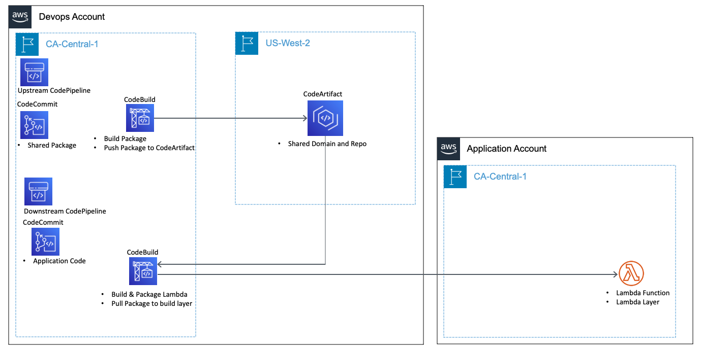
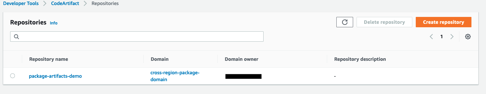
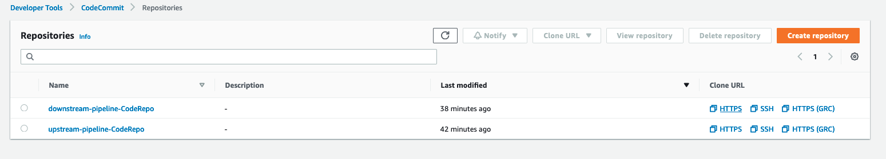
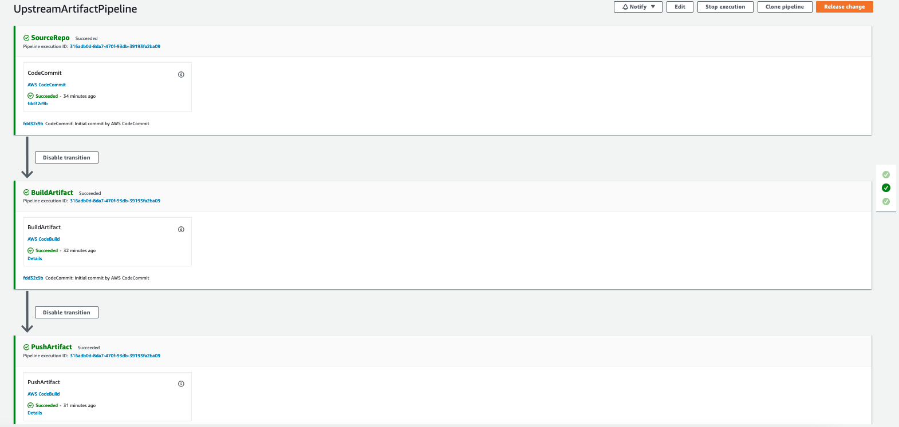
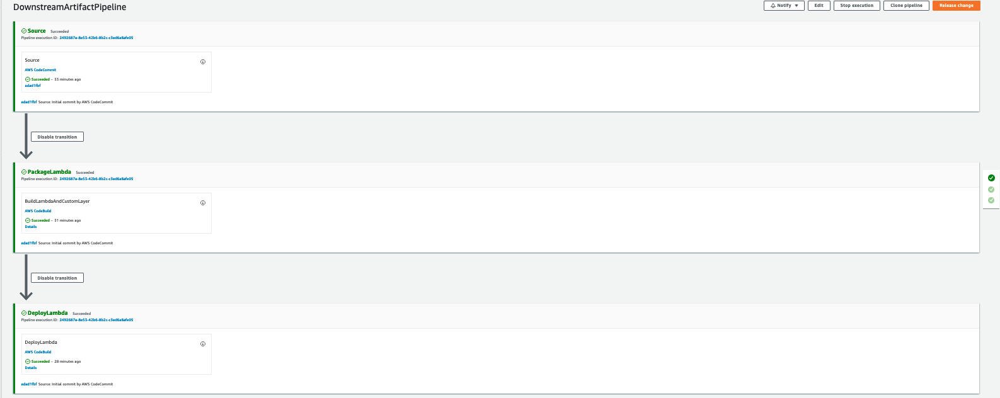

# CrossRegionArtifact Project

## Introduction

Customers utilize AWS CodeArtifact to store and distribute software packages , currently AWS CodeArtifact is only available in 13 regions listed [here](https://aws.amazon.com/codeartifact/faq/).

In this guide we will will provide a demo on how to utilize AWS CodePipeline via AWS CodeBuild to build and publish an artifact to CodeArtifact and then consume the built artifact in another CodePipeline to deploy a lambda and layer built from the custom package hosted in a cross region CodeArtifact repository.

## Prerequisites

please create a virtualenv 

```
$ python3 -m venv .venv
```

After the init process completes and the virtualenv is created, you can use the following
step to activate your virtualenv. on Mac or Linux

```
$ source .venv/bin/activate
```

If you are a Windows platform, you would activate the virtualenv like this:

```
% .venv\Scripts\activate.bat
```

Once the virtualenv is activated, you can install the required dependencies.

```
$ pip install -r requirements.txt
```

## Target Architecture


## To deploy cdk project

### Please update the values for your enviornment in the common.py file: 

**REGION_MAIN** -> Region where the upstream and downstream pipeline will be hosted

**REGION_ARTIFACTS** -> Region where CodeArtifact Repo is created

**ACCOUNT** -> Account ID that will host CodePipeline and CodeArtifact Repo

**APP_ACCOUNT** -> Account ID that will host the deployed Lambda + Layer created from 
CodeArtifact Repo Package

**ORG_ID** -> Org ID required for adding permission org wide to CodeArtifact Repo

To bootstrap the envs for cdk use the following, you will need to run it for each account:

```
cdk bootstrap --profile {aws_account_profile}
```

Run:
```
cdk deploy --profile {aws_application_account_profile} crossaccount-role
```
This will deploy a crossaccount IAM role in the Application account
    
Followed by:
```
cdk deploy --profile {aws_devops_account_profile} downstream-pipeline
```
This will deploy the following resources:
1. CodeArtifact domain and repository in us-west-2 or REGION_ARTIFACTS as defined in common.py.

2. CodeCommit repositories in ca-central-1 if using the defaults or REGION_MAIN as defined in common.py

3. UpstreamArtifactPipeline in ca-central-1 if using the defaults or REGION_MAIN as defined in common.py

4. DownstreamArtifactPipeline in ca-central-1 if using the defaults or REGION_MAIN as defined in common.py



## To clean up and remove all deployed resources

Please run:
```
cdk destroy --profile {aws_application_account_profile} crossaccount-role
```
    
Followed by:
```
cdk destroy --profile {aws_devops_account_profile} codeartifact
```

Througout the project cdk-nag has been used [cdk-nag on github](https://github.com/cdklabs/cdk-nag) to check for security best practices of deployed resources 

## Useful commands
 *  
 * `cdk ls`          list all stacks in the app
 * `cdk synth`       emits the synthesized CloudFormation template
 * `cdk deploy`      deploy this stack to your default AWS account/region
 * `cdk diff`        compare deployed stack with current state
 * `cdk docs`        open CDK documentation

Enjoy!
