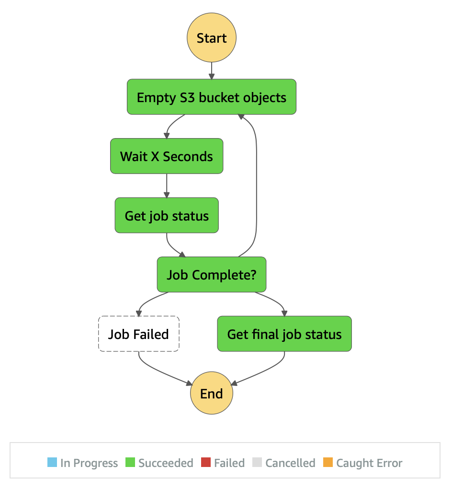

# AWS Step Function to empty existing S3 bucket with Python CDK!

## Overview

Creates an AWS Step Functions StateMachine with the Python language bindings for CDK.



## Prerequisites

This stack uses custom resources so you will need to install Docker engine and 
make sure that it's started before you run cdk commands.

## Setup

The `cdk.json` file tells the CDK Toolkit how to execute your app.

This project is set up like a standard Python project.  The initialization
process also creates a virtualenv within this project, stored under the .env
directory.  To create the virtualenv it assumes that there is a `python3`
(or `python` for Windows) executable in your path with access to the `venv`
package. If for any reason the automatic creation of the virtualenv fails,
you can create the virtualenv manually.

To manually create a virtualenv on MacOS and Linux:

```shell
$ python3 -m venv .env
```

After the init process completes and the virtualenv is created, you can use the following
step to activate your virtualenv.

```shell
$ source .env/bin/activate
```

If you are a Windows platform, you would activate the virtualenv like this:

```shell
% .env\Scripts\activate.bat
```

Once the virtualenv is activated, you can install the required dependencies.

```shell
$ pip install -r requirements 
```

At this point you can now synthesize the CloudFormation template for this code.

```shell
$ cdk synth
```

To add additional dependencies, for example other CDK libraries, just add
them to your `setup.py` file and rerun the `pip install -r requirements.txt`
command.

To be able to deploy the stack you need to pass a required parameter named "BucketName"
that indicates the bucket name to be deleted as follows

```shell
$ cdk deploy --parameters BucketName=<please-put-your-bucket-name-here-to-be-emptied>
```

# Useful commands

 * `cdk ls`          list all stacks in the app
 * `cdk synth`       emits the synthesized CloudFormation template
 * `cdk deploy`      deploy this stack to your default AWS account/region
 * `cdk diff`        compare deployed stack with current state
 * `cdk docs`        open CDK documentation

Enjoy!
