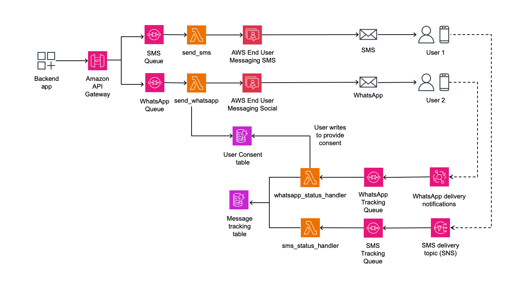
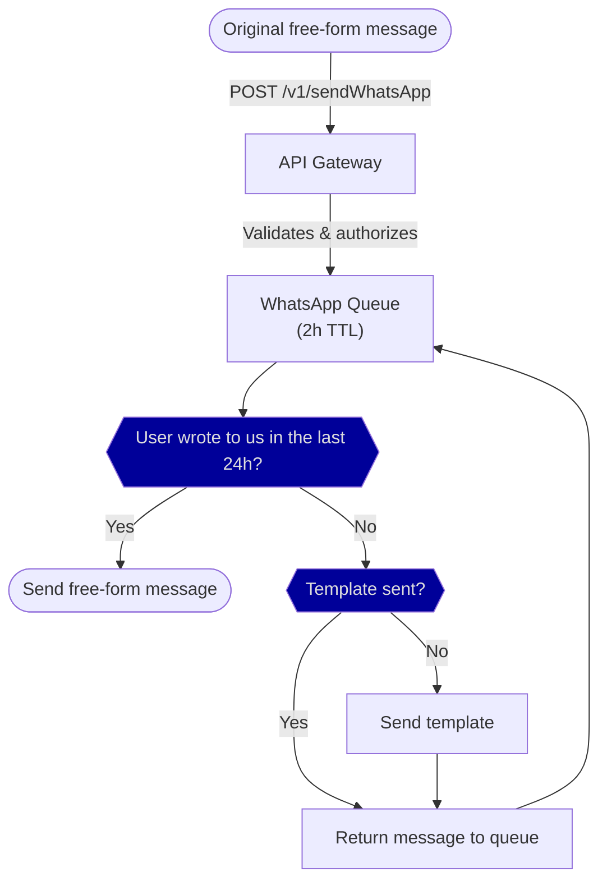

# Introduction

This repository implements an Infrastructure as Code (IaC), serverless stack that exposes a REST API for sending
SMS & WhatsApp messages to your customers while handling conversation windows with WhatsApp destinations
(more on this below).

It uses AWS End User Messaging as its communications platform and logs message history and handles
WhatsApp user consent automatically in Amazon DynamoDB.

# Requirements

The code has been tested with Python 3.12 in macOS. You will also need:
* [AWS CDK](https://docs.aws.amazon.com/cdk/v2/guide/getting_started.html)
* Python 3.12
* Docker or Podman for compiling the Lambda images
* The requirements defined in [`requirements.txt`](requirements.txt)
* SMS-related requirements in AWS End User Messaging SMS:
  - [Configuration set](https://docs.aws.amazon.com/sms-voice/latest/userguide/configuration-sets.html)
  - [Phone number or sender ID](https://docs.aws.amazon.com/sms-voice/latest/userguide/phone-number-types.html). This is
    referred to as the "originating entity" later in this document.
* WhatsApp-related requirements:
  - A [WhatsApp Business Account](https://docs.aws.amazon.com/social-messaging/latest/userguide/managing-waba.html)
    [configured in AWS End User Messaging Social](https://docs.aws.amazon.com/social-messaging/latest/userguide/managing-phone-numbers-add.html).
    + If you only have configured a single WhatsApp phone number, the solution will use that for sending messages.
      For other use cases and for efficiency purposes, you can specify the phone number to use when deploying the
      solution.
    + The Business Account in End User Messaging Social must be configured with a
      [message and event destination](https://docs.aws.amazon.com/social-messaging/latest/userguide/managing-event-destinations.html)
      pointing to an SNS topic that this solution will use for tracking SMS message delivery.
  - A default WhatsApp template in English requesting that your users to connect with you. When you try to send a
    WhatsApp message to a number that has not communicated with you in the last 24h, the solution will send this
    template to the user and keep the message in a queue for 2h. If the customer replies to your template in this 2h
    window your original message will be automatically sent to the user automatically.

# Architecture

The diagram below ilustrates the main components of the architecture of the solution and their dependencies.
There are two main flows of information:

* The flow which sends the SMS/WhatsApp messages to the end users, automatically tracking user consent in a
  specific DynamoDB table.
* The flow which receives the message notifications from either SNS or EventBridge and tracks their status in a
  separate DynamoDB table. This flow also handles the case where the end user writes a WhatsApp message to the
  phone associated with the WhatsApp Business Account and registers their consent receive free-text messages.



# Sending messages

## SMS

Sending SMS messages is handled with AWS End User Messaging SMS and in order to be able to send SMS you will need to
register a Configuration set and a phone number or sender ID, as described above.

The tracking of SMS delivery is performed by monitoring
[EventBridge events](https://docs.aws.amazon.com/sms-voice/latest/userguide/monitor-event-bridge.html) and follows
the principles described [below](#observability).

## WhatsApp

In WhatsApp you generally cannot send free-form messages to users unless they have contacted you in the previous 24
hours. In order to contact new users, you must either have them send you a message or send them
[a Meta-approved template](https://developers.facebook.com/docs/whatsapp/message-templates/guidelines/) asking the
destination user to write back to you. When they do, you are allowed to send free-text messages to your users for the
next 24 hours.

The communication flow for talking to your clients in WhatsApp is as follows:

1. You send a pre-approved message template to your customer asking them to write back to you. This message should
   explicitly ask the user to not answer anything if they do not want to be contacted.
2. If the user answers with any text you can start sending free-form messages for the next 24 hours.
3. After 24 hours the communication window closes and you have to send a new template to the customer in order to be
   able to send free-form messages.

This solution tracks user communications with your number by automatically sending a template as needed and only trying
to send free-form messages if the user has responded to the template. If the user does not respond 2 hours after the
template is sent to them, the initiating message is discarded.

The following flow is executed when you send a request to the REST API endpoint to send a free-form message:



This handling is transparent to you, and you are only responsible for sending the initial request to send a free-form
message.

Once you make the initial request to the API to send the message, you can track its status as described
[below](#observability).

# Observability

Metadata about the messages and whether they were delivered or not (but not the messages themselves) is stored in
a DynamoDB table for observability purposes. This data does not, however, contain destination phone numbers and has a
TTL of 1 year. These messages are identified by their AWS End User Messaging message ID and (sometimes) by their
WahtsApp message ID, but contain no other perrsonally identifiable information.

An entry in the message tracking table will typically contain the following fields:

* `type`: Message type (either `sms` or `whatsapp`)
* `eum_msg_id`: AWS End User Messaging message ID. This is a random unique id.
* `wa_msg_id`: Meta-provided WhatsApp Message ID. Only available for WhatsApp messages and only once
  Meta server have processed the message send request. Contains `__UNKOWN__` for SMS messages or WhatsApp messages
  that have not yet been processed by Meta.
* `delivery_history`: Map with the history of the ISO-formatted instants when the message transitioned states.
* `expiration_date`: The UTC timestamp when the memssage will expire.
* `latest_status`: The most recent delivery status for the message.
* `latest_update`: The UTC timestamp when the message delivery information was last updated.
* `registration_date`: The ISO-formatted instant when the message was registered.

The status a message transverses through its lifecyle are:

* `unknown`: Message status is unknown. Unused.
* `failed`: Message delivery has failed. Unused.
* `sent_for_delivery`: Message has been processed by this stack and sent to AWS End User Messaging for delivery.
* `sent`: Message has been sent to the user. Does not gguarantee that the user has received it.
* `delivered`: Message has been delivered to the user's terminal. Does not guarantee that the user has read it. Also,
  SMS carriers might not provide us with this information so correctly delivered SMS messages might not be marked as
  `delivered` in the table.
* `read`: [WhatsApp specific] The message has been shown to the user in the WhatsApp application.

# Deployment sample

```bash
# Run this only if using Podman instead of Docker
export CDK_DOCKER=podman
# Deploy the solution
cdk deploy \
	--parameters ConfigurationSetArn='${CONFIGURATION_SET_ARN}' \
	--parameters OriginatingEntity='${ORIGINATING_PHONE_ARN}' \
	--parameters WhatsAppNotificationTopicARN='${SNS_TOPIC_ARN}' \
	--parameters MessageType='TRANSACTIONAL' \
	--parameters WATemplate='${WHATSAPP_TEMPLATE_NAME}' \
	--parameters WAPhoneNumberARN='${WHATSAPP_PHONE_NUMBER_ARN}'
```

You will get several outputs if everything is correct, they're referenced in the step below as the following fields:
* `RestAPIAPIKey`: the ID of the Rest API key
* `RestAPISMSApiGateway`: the URL of the SMS send endpoint in API Gateway
* `RestAPIWhatsAppApiGateway`: the URL of the WhatsApp send endpoint in API Gateway

# Message sending sample

```bash
# Send a SMS message
curl -X POST -H "x-api-key: $(aws apigateway get-api-key --api-key ${RestAPIAPIKey} --include-value | jq -r .value)" -H "Content-Type: application/json" -d '{"destination_number": "${DESTINATION_NUMBER}", "message_body": "${MESSAGE_BODY}"}' ${RestAPISMSApiGateway}
# Send a WhatsApp message
curl -X POST -H "x-api-key: $(aws apigateway get-api-key --api-key ${RestAPIAPIKey} --include-value | jq -r .value)" -H "Content-Type: application/json" -d '{"destination_number": "${DESTINATION_NUMBER}", "message_body": "${MESSAGE_BODY}"}' ${RestAPIWhatsAppApiGateway}
```

# Future work

More work is required to turn this code into a production sample. Some ideas for future improvement:

* WhatsApp delivery error handling in particular should be improved. While the solution should handle 24h
  WhatsApp communication windows automatically and re-sends the default template if needed, it does not
  handle the case where delivery to WhatsApp phone numbers fails for whatever reason.
  The logic for handling these failures can be found in the [`wa_status_handler`](lambda/wa_status_handler/main.py)
  lambda code.
* Also, the WhatsApp sending logic only sends English templates. WhatsApp templates can be configured per-language, so
  you will most likely want to make the template sending logic configurable per-language.
  The handling code is located in the [`send_whatsapp`](lambda/send_whatsapp/main.py) lambda.
* In the WhatsApp flow, if the user answers to the template message more than 2h after the template has been sent (and
  therefore the initiating free-form message has already been automatically discarded) no extra communication is sent,
  which can be confusing for users. Extra work should be done to improve the UX for these cases (maybe by sending a
  specific message explaining that the original message has expired?).
* The solution only supports sending basic message types. WhatsApp supports a
  [wide variety of rich messages](https://developers.facebook.com/docs/whatsapp/cloud-api/guides/send-messages). The
  solution could be extended to support these different message types.
