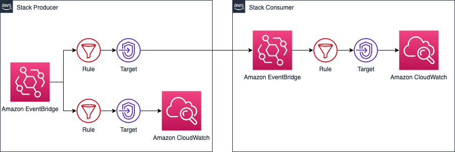
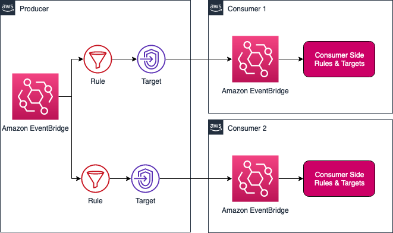

# CDK Python Sample: Event Bridge mesh with CDK


## Description:
A CDK way to set up a Event Bridge Mesh(Cross-Account), where you relay the messages from one Event Bridge in a producer account to another Event Bridge in a consumer account

## Backgroud:
This is a CDK application that implements cross-account event routing using Amazon EventBridge. It's designed for enterprise scenarios where:

- Teams work in separate AWS accounts (producer and consumer)
- Consumer teams need autonomy to manage their event processing
- Event routing changes shouldn't require coordination with producer teams

## Solution:

### Single consumer


### Multiple consumers



## Instructions

### CDK bootstrapping
To deploy the stacks in different accounts, you need to bootstrap the CDKToolkit with trust flag. Assuming you will run `cdk deploy` command from account ID: `123456789012`, and deploys producer stack to account ID: `111111111111`, and consumer stack to account ID: `222222222222`

1. In account: `111111111111`, run the below command:
```
cdk bootstrap aws://111111111111/us-east-1 \
    --trust 123456789012 \
    --cloudformation-execution-policies arn:aws:iam::aws:policy/AdministratorAccess
```

2. In account: `222222222222`, run the below command:
```
cdk bootstrap aws://222222222222/us-east-1 \
    --trust 123456789012 \
    --cloudformation-execution-policies arn:aws:iam::aws:policy/AdministratorAccess
```

3. (Optional: Only do this step, when you deploys multiple consumers solution) In account: `333333333333`, run the below command:
```
cdk bootstrap aws://333333333333/us-east-1 \
    --trust 123456789012 \
    --cloudformation-execution-policies arn:aws:iam::aws:policy/AdministratorAccess
```

### Deploy Single consumer solution:
1. Run: `cd single-consumer`
2. Change the values of `producerAccountId` and `consumerAccountId` in `cdk.json`
3. Install and configure the CDK: https://docs.aws.amazon.com/CDK/latest/userguide/install_config.html
4. Make sure you use a role or user has proper permission in account ID: `123456789012`, and run below commands:
```shell
npm run build

cdk ls

cdk synth

cdk deploy --all
```

### Deploy Multiple consumers solution:
1. Run: `cd multiple-consumer`
2. Change the values of `producerAccountId`, `consumer1AccountId`, and `consumer2AccountId` in `cdk.json`
3. Install and configure the CDK: https://docs.aws.amazon.com/CDK/latest/userguide/install_config.html
4. Make sure you use a role or user has proper permission in account ID: `123456789012`, and run below commands:
```shell
npm run build

cdk ls

cdk synth

cdk deploy --all
```
