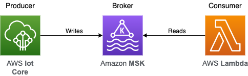

# AWS Iot Core, Lambda, Amazon Managed Streaming for Apache Kafka (Amazon MSK) 

<!--BEGIN STABILITY BANNER-->
---


> **This is an experimental example. It may not build out of the box**
>
> This example is built on Construct Libraries marked "Developer Preview" and may not be updated for latest breaking changes.
>
> It may additionally requires infrastructure prerequisites that must be created before successful build.
>
> If build is unsuccessful, please create an [issue](https://github.com/aws-samples/aws-cdk-examples/issues/new) so that we may debug the problem 
---
<!--END STABILITY BANNER-->

## Overview
Creates an AWS Lambda function, an Iot Core topic rule destination and an MSK cluster with the Python language bindings for CDK. The Iot Core message gets routed to an MSK topic. The Lambda function is triggered when an MSK topic message is created.



The cdk.json file tells the CDK Toolkit how to execute your app.

This project is set up like a standard Python project.  The initialization process also creates
a virtualenv within this project, stored under the .venv directory.  To create the virtualenv
it assumes that there is a `python3` executable in your path with access to the `venv` package.
If for any reason the automatic creation of the virtualenv fails, you can create the virtualenv
manually once the init process completes.

To manually create a virtualenv on MacOS and Linux:

```
$ python3 -m venv .venv
```

After the init process completes and the virtualenv is created, you can use the following
step to activate your virtualenv.

```
$ source .venv/bin/activate
```

If you are a Windows platform, you would activate the virtualenv like this:

```
% .venv\Scripts\activate.bat
```

Once the virtualenv is activated, you can install the required dependencies.

```
$ pip install -r requirements.txt
```

At this point you can now bootstrap the CloudFormation template for this code.

```
$ cdk bootstrap
```

At this point you can now synthesize the CloudFormation template for this code.

```
$ cdk synth
```

You can now begin exploring the source code, contained in the hello directory.
There is also a very trivial test included that can be run like this:

```
$ pytest
```

To deploy the ressources, you need to run cdk deploy on both stacks defined in the template. First you can deploy the `msk-demo` stack like this:

```
$ cdk deploy msk-demo
```


This will deploy everything excluding the Lambda function. To deploy the rest of the template, complete the following steps:

1. In the Secret Manager console, you will find a secret named `AmazonMSK_iotCluster_demo`. In that secret's values, change the `password` field to `demo-secret`. 

2. Grab the complete arn, including the 6-digit suffix, of the secret named `AmazonMSK_iotCluster_demo` that was created by the previous command and paste it into the follow command like this:


```
$ cdk deploy msk-demo/LambdaConsumer -c SecretFullArn="<secret-full-arn>"
```

To add additional dependencies, for example other CDK libraries, just add to
your requirements.txt file and rerun the `pip install -r requirements.txt`
command.

## Useful commands

 * `cdk ls`          list all stacks in the app
 * `cdk synth`       emits the synthesized CloudFormation template
 * `cdk deploy`      deploy this stack to your default AWS account/region
 * `cdk diff`        compare deployed stack with current state
 * `cdk docs`        open CDK documentation

Enjoy!
