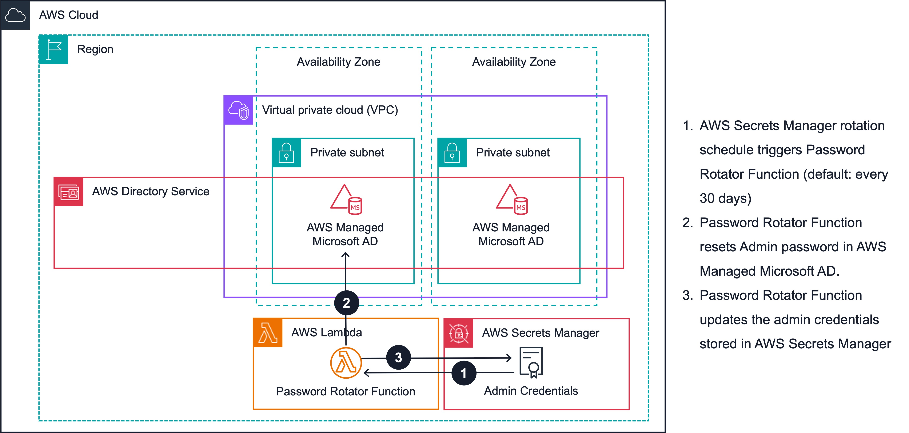

## <!--BEGIN STABILITY BANNER-->


> **This is a stable example. It should successfully build out of the box**
>
> This example is built on Construct Libraries marked "Stable" and does not have any infrastructure prerequisites to build.

---

<!--END STABILITY BANNER-->

# Managed Active Directory Solution

This project provides a solution for deploying and managing an AWS Managed Microsoft Active Directory (AD) service using AWS Cloud Development Kit (CDK). The solution creates a Managed AD instance within a Virtual Private Cloud (VPC) and sets up the necessary infrastructure, including a Lambda function for periodically rotating the AD administrator password. The AD administrator password is securely stored in an AWS Secrets Manager secret, which is automatically updated during the password rotation process.

## Key Components

1. **Managed AD Instance**: The solution creates a Managed AD instance within a specified VPC. If no VPC is provided, a new VPC is created with public and private subnets.

1. **Secrets Manager Secret**: A Secrets Manager secret is used to store the AD administrator password. The password is updated and stored securely in this secret after each rotation.

1. **Password Rotation Lambda**: A Lambda function is responsible for periodically rotating the AD administrator password. It retrieves the current password from Secrets Manager, generates a new random password, updates the Secrets Manager secret, and resets the AD administrator password with the new value.

## Architecture



## Deployment

1. Ensure you have the AWS CDK Toolkit installed and configured with your AWS credentials.

1. Bootstrap the CDK environment, if it has not already been bootstrapped, by running:

   ```
   $ cdk bootstrap aws://{{AWS-ACCOUNT-NUMBER}}/{{AWS-REGION}}
   ```

1. Clone this repository or download the source code.

1. Navigate to the project directory.

1. Create and activate the python virtual environment.

   ```
   $ python3 -m venv .venv
   $ source .venv/bin/activate
   ```

1. Activate the virtual environment.

   ```
   $ source .venv/bin/activate
   ```

1. Install python requirements.

   ```
   $ python3 -m pip install -r requirements.txt
   ```

1. Create or update the required context values.
   ```
   $ python3 context.py set
   ```
   Respond to the script prompts.
1. Deploy the solution.

   ```
   $ cdk deploy
   ```

   **Note: Deploying a Managed AD instance can take a significant amount of time, typically around 30 minutes for Standard edition and 1-2 hours for Enterprise edition.**

1. Follow the prompts to provide any additional required information or confirmation.

1. After successful deployment, the Managed AD instance and associated resources will be created.

**Note:** The password for the Admin account of the new Directory Service is stored in the AWS Secrets Manager secret referenced in the 'ADPasswordSecret' output of the CloudFormation stack.

## Usage

### `context.py` Script

The `context.py` script is used to print, set or validate the required context values for the solution. It prompts you to provide the following information:

1. **Active Directory (AD) Domain Name**: The desired name for the Managed AD domain.

1. **AD Edition**: The edition of Active Directory to use (Standard or Enterprise).

1. **VPC ID**: The ID of the existing VPC where the Managed AD instance should be deployed, or whether a new VPC should be created. If a new VPC is created, you will be prompted to specify whether internet access should be enabled or not.

**Note:** If an existing VPC is used, the internet access value will be ignored, and no changes will be made to the VPC.

### Password Rotation

The solution includes a Lambda function responsible for periodically rotating the AD administrator password. The rotation is triggered by an EventBridge rule, scheduled to run every 30 days by default.

The rotation process involves the following steps:

1. Retrieve the current AD administrator password from the Secrets Manager secret.

1. Generate a new random password.

1. Update the Secrets Manager secret with the new password.

1. Reset the AD administrator password using the AWS Directory Service API with the new password.

The `rotate_ad_password` function in `password_rotator.py` performs these steps, using the necessary AWS SDK clients for Secrets Manager and Directory Service.

## Cleanup

Follow these steps from the project directoy to delete the deployed resources. This will delete the Managed AD instance, VPC (if created by the solution), and all associated resources.

1. Create and activate the python virtual environment.

   ```
   $ python3 -m venv .venv
   $ source .venv/bin/activate
   ```

1. Activate the virtual environment.

   ```
   $ source .venv/bin/activate
   ```

1. Install python requirements.

   ```
   $ python3 -m pip install -r requirements.txt
   ```

1. At this point you can now destroy the CDK deployment for this code.
   ```
   $ cdk destroy
   ```

## Setting Initial Context

Before deploying the CDK app, you need to set the initial context values. The required context values are:

- `ad_domain_name`: A valid Microsoft Active Directory domain name.
- `ad_edition`: Must be either 'Standard' or 'Enterprise'.
- `vpc_id`: A valid VPC ID, or `None` to create a new VPC.
- `internet_access`: A boolean value, applicable only if creating a new VPC.

To set the context values, run the `context.py` script with the `set` argument:

```
$ python bin/context.py set
```

The script will prompt you to enter valid values for each required context value. After setting the context values, you can proceed with `cdk synth` or `cdk deploy`.

## Useful commands

- `cdk ls` list all stacks in the app
- `cdk synth` emits the synthesized CloudFormation template
- `cdk deploy` deploy this stack to your default AWS account/region
- `cdk diff` compare deployed stack with current state
- `cdk docs` open CDK documentation
