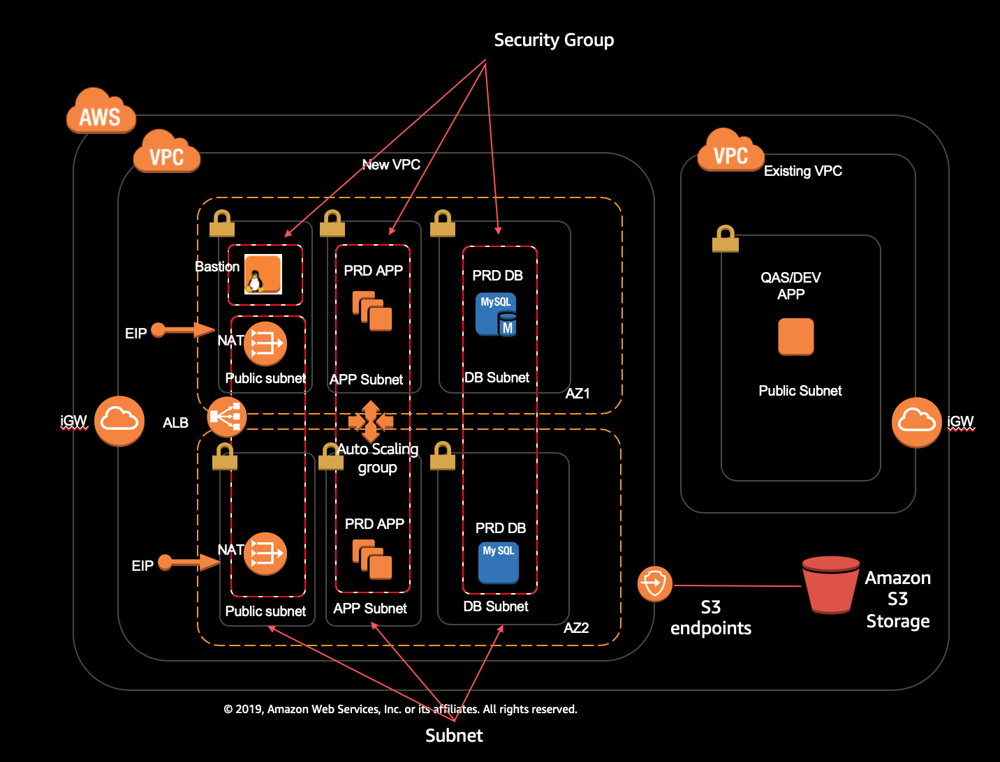

# Create VPC, EC2 ASG and RDS with AWS CDK Python

This is a project to create a new VPC, EC2 autoscaling group and RDS on AWS with the AWS Cloud Development Kit.

This project also demonstrates:
* Create VPC in 3 tier layers of subnets: PUBLIC, PRIVATE and ISOLATED, you can specify the number of AZ and the CIDR.
* Create Bastion instance, NAT Gateway and S3 endpoint
* Create ALB, EC2 Autoscaling group with scaling policy and customize EBS volume
* Creat RDS MySQL M-AZs Database or Aurora
* Create security group and allow access from the other security group: Internet -> ALB -> EC2ASG -> RDS
* Using customized user data of EC2 and specify generation AMI property and do not need to specify the AMI id in every region

## Architeture 
  

This project create the new VPC part of the architeture. For the existing VPC part, please refer to the project in aws-cdk-examples/existing-vpc-new-ec2-ebs-userdata

## Useful commands

 * `cdk ls`          list all stacks in the app
 * `cdk synth`       emits the synthesized CloudFormation template
 * `cdk deploy`      deploy this stack to your default AWS account/region
 * `cdk diff`        compare deployed stack with current state
 * `cdk docs`        open CDK documentation
