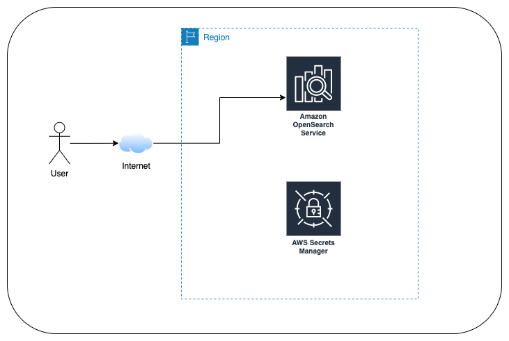

<!--BEGIN STABILITY BANNER-->
---


> **This is a stable example. It should successfully build out of the box**
>
> This example is built on Construct Libraries marked "Stable" and does not have any infrastructure prerequisites to build.
---
<!--END STABILITY BANNER-->

# Overview

This example creates a public OpenSearch domain, but with HTTP access restricted to a specific list of IP addresses. More info on VPC versus public domains [here](https://docs.aws.amazon.com/opensearch-service/latest/developerguide/vpc.html).


Default user is `admin-user`. Password is generated automatically and stored on [Secrets Manager](https://aws.amazon.com/secrets-manager/).



## Build/deploy
1. Set an environment variable with the list of allowed IP addresses to include your IP. Ex.:
   ```
   export OPENSEARCH_ALLOWED_IP='1.2.3.4/32'
   ```
2. Deploy stack with `cdk deploy`
3. Check stack outputs and retrieve admin password from AWS Secrets Manager. Remember to replace the secret id with the output value from `OpenSearchPasswordSecretName`. E.g.:
    ```
    aws secretsmanager get-secret-value --secret-id OpenSearchDemoDomainAdminUs-HAisfd87ASd
    ```
4. Open the url output in `OpenSearchDashboardsURL` and use `OpenSearchAdminUser` and the above password to log in. 
