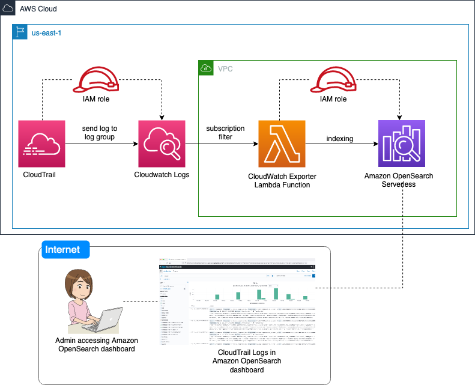

## Amazon OpenSearch Serverless

## <!--BEGIN STABILITY BANNER-->


> **This is a stable example. It should successfully build out of the box**
>
> This example is built on Construct Libraries marked "Stable" and does not have any infrastructure prerequisites to build.

---

<!--END STABILITY BANNER-->

## Overview

[Amazon OpenSearch Serverless](https://docs.aws.amazon.com/opensearch-service/latest/developerguide/serverless.html) is an on-demand auto scaling configuration for [Amazon OpenSearch Service](https://docs.aws.amazon.com/opensearch-service/latest/developerguide/what-is.html). An OpenSearch Serverless collection is an OpenSearch cluster that scales compute capacity based on your application's needs. OpenSearch Serverless provides a simple, cost-effective option for infrequent, intermittent, or unpredictable workloads. It's cost-effective because it automatically scales compute capacity to match your application's usage.

In this example, we show you how to use the [AWS Cloud Development Kit (CDK)](https://docs.aws.amazon.com/cdk/v2/guide/home.html) to deploy an Amazon OpenSearch Serverless collection in an [Amazon Virtual Private Cloud (VPC)](https://aws.amazon.com/vpc/). We use [AWS CloudTrail logs](https://docs.aws.amazon.com/awscloudtrail/latest/userguide/cloudtrail-user-guide.html) as a sample data set. The stack sets up a CloudTrail Trail to send logs to [Amazon CloudWatch Logs](https://docs.aws.amazon.com/AmazonCloudWatch/latest/logs/WhatIsCloudWatchLogs.html). It sets up a CloudWatch Logs Subscription Filter to forward logs to an included [AWS Lambda](https://aws.amazon.com/lambda/) function. The Lambda function decodes the CloudTrail data and transforms  it to [JavaScript Object Notation (JSON)](https://www.json.org/) format. It then writes the data to OpenSearch Serverless.


_figure1.Architecture Diagram of CloudTrail log streaming to Amazon OpenSearch Serverless_

The CDK stack sets up roles and permissions to enable all of the services to communicate with one-another. It further provides access for the deploying user's IAM identity. Finally, the stack sets up a VPC, and creates a VPC endpoint for communication to OpenSearch Serverless (see below for configuration).

### Configuration of the code

To configure the solution for your account, visit _opensearch_serverless_stack.py_. At the top of this [opensearch_serverless_stack file](./stacks/opensearch_serverless_stack.py), you can modify the OpenSearch Serverless index name, CloudTrail log group name, OpenSearch Serverless collection name, and CloudWatch logs retention time and IAM User role who can access the dashboard. Below are default values.

```
INDEX_NAME = "cwl"
LOG_GROUP_NAME = "SvlCTCWL/svl_cloudtrail_logs"
COLLECTION_NAME = "ctcollection"
CWL_RETENTION = cwl.RetentionDays.THREE_DAYS
# This is the arn of the user role who wants to visualize the dashboard
ARN_IAM_ROLE = "#TODO:" # add your IAM role which has permission for `arn:aws:aoss:*` for `aoss:*` action.
```

Once deployed, navigate to the Amazon OpenSearch Service console. In the left, navigation pane, click the reveal triangle if it's not already open. Click **Collections**. Click **ctcollection** (or find your **COLLECTION_NAME** if you changed it). Scroll down until you see the **Endpoint** section, and click the URL under **OpenSearch Dashboards URL**. This will launch OpenSearch Dashboards.

In OpenSearch Dashboards, dismiss the initial splash screen. In the upper right, find the **Manage** link, and click it. Click **Index Patterns** in the left navigation pane. Click **Create index pattern**. and type `cwl` into the **Index pattern name** text box. Click **Next step**. Drop down the **Time field** menu, and select `@timestamp`. Click **Create index pattern**.

You're now set up and ready to explore your logs!

## Build and Deploy

The `cdk.json` file tells the CDK Toolkit how to execute your app.

### Python setup

This project is set up like a standard Python project. The initialization process also creates a virtualenv within this project, stored under the `.env` directory. To create the virtualenv it assumes that there is a `python3` (or `python` for Windows) executable in your path with access to the `venv` package. If for any reason the automatic creation of the virtualenv fails, you can create the virtualenv manually.

To manually create a virtualenv on MacOS and Linux:

```
$ python3 -m venv .env
```

After the bootstrap process completes and the virtualenv is created, use the following step to activate your virtualenv.

```
$ source .env/bin/activate
```

If you are a Windows platform, activate the virtualenv like this:

```
% .env\Scripts\activate.bat
```

Once the virtualenv is activated, install the required dependencies.

```
$ pip install -r requirements.txt
```

Now synthesize the CloudFormation template for this code. This will generate the CloudFormation template for you to examine, and verify that your setup is complete.

```
$ cdk synth
```

### CDK Deploy

You use `cdk deploy` actually to create the resources.

```
$ cdk deploy
```

### CDK Destroy

You use `cdk destroy` to remove the resources you created with `cdk deploy`.

```
$ cdk destroy
```

⚠️ You must delete the below resources manually.

1. `CloudWatch Log groups`
2. `s3 buckets`

# cwctl-oss
