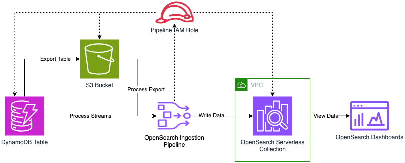

## Amazon OpenSearch Ingestion

## <!--BEGIN STABILITY BANNER-->


> **This is a stable example. It should successfully build out of the box**
>
> This example is built on Construct Libraries marked "Stable" and does not have any infrastructure prerequisites to build.

---

<!--END STABILITY BANNER-->

## Overview

[Amazon OpenSearch Ingestion](https://docs.aws.amazon.com/opensearch-service/latest/developerguide/ingestion.html) is a fully managed, serverless data collector that delivers real-time log, metric, and trace data to [Amazon OpenSearch Service domains](https://docs.aws.amazon.com/opensearch-service/latest/developerguide/what-is.html) and [Amazon OpenSearch Serverless collections](https://docs.aws.amazon.com/opensearch-service/latest/developerguide/serverless.html).

In this example, we show you how to use the [AWS Cloud Development Kit (CDK)](https://docs.aws.amazon.com/cdk/v2/guide/home.html) to set up an Amazon OpenSearch Ingestion Pipeline to pull data from [Amazon DynamoDB](https://aws.amazon.com/dynamodb/) and write it to an Amazon OpenSearch Serverless collection in an [Amazon Virtual Private Cloud (VPC)](https://aws.amazon.com/vpc/). The pipeline triggers an export from DynamoDB into an [Amazon S3 bucket](https://aws.amazon.com/s3/). Data from that export is processed through the pipeline then DynamoDB streams are processed by the pipeline to perform change data capture.


_figure1.Architecture Diagram of loading DynamoDB data into an OpenSearch Serverless collection using an OpenSearch Ingestion pipeline_

The CDK stack sets up roles and permissions to enable all of the services to communicate with one-another. It further provides access for the deploying user's IAM identity. Finally, the stack sets up a VPC, and creates a VPC endpoint for communication to OpenSearch Serverless (see below for configuration).

### Configuration of the code

To configure the solution for your account, visit [ddb_to_aoss_zero_etl_stack](./ddb_zero_etl/ddb_to_aoss_zero_etl_stacj.py). At the top of this file, you can modify the names of various resources that will be created. Below are default values:

```
STACK_NAMING_PREFIX = f'ddb-to-aoss-{random_id}'

STACK_RESOURCE_NAMING_PREFIX = 'DdbAossZetl'

COLLECTION_NAME = f'{STACK_NAMING_PREFIX}-col'
PIPELINE_NAME = f'{STACK_NAMING_PREFIX}-pipe'
DYNAMO_TABLE_NAME = f'{STACK_NAMING_PREFIX}-table'
S3_BACKUP_BUCKET_FOR_DDB = f'{STACK_NAMING_PREFIX}-buck'
NETWORK_POLICY_NAME = f'{COLLECTION_NAME}-net-pol'
ENCRYPTION_POLICY_NAME = f'{COLLECTION_NAME}-encr-pol'
DATA_ACCESS_POLICY_NAME = f"{COLLECTION_NAME}-data-pol"
```

Once deployed you can add items to the DynamoDB table and these will be persisted into the OpenSearch serverless collection.

To add data to your DynamoDB table navigate to the DynamoDB console. In the left navigation pane click **Tables**. Click **ddb-to-aoss-{id}-table**. Click **Explore table items**. Click **Create item**. Add whatever fields you'd like.

To view data in your OpenSearch Serverless Collection navigate to the Amazon OpenSearch Service console. In the left navigation pane click the reveal triangle if it's not already open. Click **Collections**. Click **ddb-to-aoss-{id}-col** (or find your **COLLECTION_NAME** if you changed it). Scroll down until you see the **Endpoint** section, and click the URL under **OpenSearch Dashboards URL**. This will launch OpenSearch Dashboards.

In OpenSearch Dashboards, dismiss the initial splash screen. In the upper right, find the **Manage** link, and click it. Click **Index Patterns** in the left navigation pane. Click **Create index pattern**. and type `ddb-to-aoss-*` into the **Index pattern name** text box. Click **Next step**. Drop down the **Time field** menu, and select `@timestamp`. Click **Create index pattern**.

## Build and Deploy

The `cdk.json` file tells the CDK Toolkit how to execute your app.

### Python setup

This project is set up like a standard Python project.  The initialization
process also creates a virtualenv within this project, stored under the `.venv`
directory.  To create the virtualenv it assumes that there is a `python3`
(or `python` for Windows) executable in your path with access to the `venv`
package. If for any reason the automatic creation of the virtualenv fails,
you can create the virtualenv manually.

To manually create a virtualenv on MacOS and Linux:

```
$ python3 -m venv .venv
```

After the init process completes and the virtualenv is created, you can use the following
step to activate your virtualenv.

```
$ source .venv/bin/activate
```

If you are a Windows platform, you would activate the virtualenv like this:

```
% .venv\Scripts\activate.bat
```

Once the virtualenv is activated, you can install the required dependencies.

```
$ pip install -r requirements.txt
```

At this point you can now synthesize the CloudFormation template for this code.

```
$ cdk synth
```

You can optionally provide the ARN of an IAM user or role that will be used to access OpenSearch Dashboards.
If provided the OpenSearch Serverless collection will be automatically updated to provide access for the given user or role.
```
$ cdk synth -c iam_user_arn="arn:aws:iam::123456789012:role/MyRole"
```

### CDK Deploy

You can use `cdk deploy` to actually create the resources.

```
$ cdk deploy
```

You can optionally provide the ARN of an IAM user or role that will be used to access OpenSearch Dashboards.
If provided the OpenSearch Serverless collection will be automatically updated to provide access for the given user or role.
```
$ cdk deploy -c iam_user_arn="arn:aws:iam::123456789012:role/MyRole"
```

### CDK Destroy

You use `cdk destroy` to remove the resources you created with `cdk deploy`.

```
$ cdk destroy
```

⚠️ You may need to delete the below resources manually.

1.`S3 buckets`

# ddb-zero-etl
