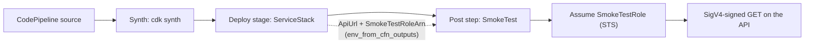

<!--BEGIN STABILITY BANNER-->
---


> **This is a stable example. It should successfully build out of the box**
>
> This example is built on Construct Libraries marked "Stable" and does not have any infrastructure prerequisites to build.
---
<!--END STABILITY BANNER-->

# Smoke Testing a Deployment with CDK Pipelines

Deploying without errors does not prove the thing you deployed works. This
example adds a **smoke test that runs after the deployment**, calls the API that
was just created, and fails the pipeline stage when the answer is wrong.

Two problems come up when you write that test, and this example exists to show
both answers:

1. **The test cannot know the endpoint ahead of time.** The URL only exists once
   the stack deploys. `env_from_cfn_outputs` reads it out of the deployed stack
   and hands it to the test as an environment variable.
2. **The test needs permission to call the endpoint, without the pipeline
   holding that permission itself.** The deployment creates a small role that
   can do exactly one thing. The test assumes that role and signs its request
   with the temporary credentials.

The API method requires IAM authentication. That is deliberate: an unsigned
request gets a `403`, so the test can only pass by assuming the deployed role.
The role is doing real work here, not decoration.

## What gets built

The pipeline deploys one stage, then tests it.



`ServiceStack` is the application under test:

- **Lambda function** returning `{"status": "ok"}`. Its code is inline, so the
  example synthesizes with no bundler and no Docker.
- **REST API** in front of it, with the `GET /` method set to
  `AuthorizationType.IAM`.
- **Smoke-test role**, created under the IAM path `/smoke-test/`, whose only
  permission is `execute-api:Invoke` on that one method.
- **Two CfnOutputs**, `ApiUrl` and `SmokeTestRoleArn`.

`PipelineStack` wires it together:

- A `pipelines.CodePipeline` with a source and a synth step.
- The stage added with `pipeline.add_stage(...)`, then the smoke test attached
  with `deployment.add_post(...)` so it runs once the stack is up.
- The smoke-test step is a `CodeBuildStep` granted `sts:AssumeRole` on
  `role/smoke-test/*` and nothing else. It holds no permission on the API, so
  it can only reach the API through the role the deployment created.

`smoke_tests/smoke_test.py` is the test that runs in the pipeline. It assumes
the role, signs a `GET` with `SigV4Auth`, and checks both the status code and
the response body. A `200` carrying the wrong payload still fails. It retries a
few times first, because a brand-new API stage and a brand-new role both take a
moment to start working, and one failed call is not yet a broken deployment.

## Before you deploy

Point the pipeline at your own repository. Edit the three placeholders at the
top of `pipeline_smoke_test/pipeline_stack.py`:

```python
SOURCE_REPO = "my-org/my-repo"
SOURCE_BRANCH = "main"
SOURCE_CONNECTION_ARN = "arn:aws:codestar-connections:..."
```

Create the connection once, then finish authorizing it in the console:

```bash
aws codestar-connections create-connection \
  --provider-type GitHub \
  --connection-name my-connection
```

A CDK Pipeline is self-mutating, so the pipeline updates itself from the source
repository on every run. Commit this example to that repository and branch
before deploying, or the first pipeline run will replace your pipeline with
whatever the branch contains.

## Build

```bash
python3 -m venv .venv
source .venv/bin/activate      # Windows: .venv\Scripts\activate.bat
pip install -r requirements.txt
```

Synthesize the template:

```bash
cdk synth
```

Run the unit tests:

```bash
pip install -r requirements-dev.txt
python -m pytest tests
```

## Deploy

The account needs to be bootstrapped for CDK Pipelines first:

```bash
cdk bootstrap
cdk deploy
```

`cdk deploy` creates the pipeline. The pipeline itself deploys the service and
runs the smoke test. Watch the run in the CodePipeline console: the `Prod` stage
shows `Service.Deploy` followed by `SmokeTest`.

To see the test actually catch a bad deployment, change the handler in
`pipeline_smoke_test/service_stack.py` to return something other than
`"status": "ok"`, push, and let the pipeline run. The deploy succeeds and the
`SmokeTest` action turns red.

## Clean up

```bash
cdk destroy
```

`cdk destroy` removes the pipeline. The stack the pipeline deployed is separate,
so delete `PipelineSmokeTestStack/Prod` as well, either from the CloudFormation
console or with `cdk destroy` from a checkout configured for that stage.
