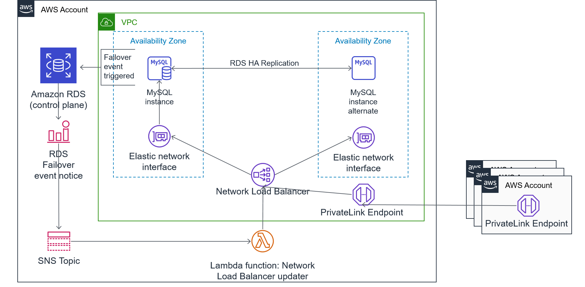

<!--BEGIN STABILITY BANNER-->
---

> **This is a stable example. It should successfully build out of the box**
>
> This example is built on Construct Libraries marked "Stable" and does not have any infrastructure prerequisites to build.
---
<!--END STABILITY BANNER-->

# Cross-account RDS access using AWS Privatelink demo

This demo shows how to leverage AWS Privatelink to publish a Relational Database Service (RDS) database from one account to other accounts. This method allows for point-to-point connectivity between accounts without relying on routing subnets. It leverages a Lambda function to keep the Privatelink's associated Network Load Balancer (NLB) updated with the RDS endpoint which is triggered whenever the RDS cluster enters a failover state.

Reasons this demo was created:
1. A use case was presented where routing between VPCs was not allowed and the database team and application team were in separate accounts. This enabled the resources to remain where they were but still be connected.
2. Another use case where the application and database were in separate VPCs that had overlapping CIDR blocks. This meant VPC peering could not be used (not without some fancy NATing). This architecture does not rely on routing so enabled communication between the application and database.

Check the AWS documentation for NLB features. As of publishing this demo, an NLB only supports an EC2 instance or IP address as targets, hence the need for the associated Lambda function. Should NLB ever support DNS entries as targets, the Lambda won't be needed.

Running this CDK code generates the left side of the below architecture diagram.

This demo creates the following:
1. A Virtual Private Cloud (VPC) with two isolated (no Internet) subnets
2. An RDS MySQL multi-availability zone cluster
3. A Simple Notification Service (SNS) topic for receiving RDS failover events
4. An RDS event subscription filtered by failover notices and published to the SNS topic
5. An NLB and associated PrivateLink (aka VPC Endpoint Service) endpoint
6. A Lambda function, triggered by SNS, that resolves the RDS endpoint DNS name to the IP address of the active instance and updates the NLB's target group accordingly

**Terms to be aware of**
- VPC Endpoint Service: This is the AWS Console and CDK name for a PrivateLink connection. In the console, you'll see this under VPC / Endpoint Services. An Endpoint Service is what you create to share out. Endpoint Services need an associated NLB.
- VPC Endpoint: This is where you create an endpoint to use, as opposed to above for sharing. An Endpoint can be to an AWS service (such as to access S3 or other services without Internet access in your VPC) or a custom share you've been granted permission to use, such as in this demo.
- PUBLIC (subnet): In the CDK code, this refers to a subnet that is created with an Internet Gateway and NAT Gateways to allow for Internet access (not used in this demo).
- PRIVATE (subnet): In the CDK code, this refers to a subnet that is created with a route to NAT Gateways in the PUBLIC subnet for egress traffic (not used in this demo).
- ISOLATED (subnet): In the CDK code, this refers to a subnet that is created without a route for egress traffic.

    
<b>Beware:</b> CDK, Lambda, and CFT steps/code are for example/learning purposes and not production-quality code.
 
    
<i>Please be aware of the caveats and limitations in the <a href="#appendix">Appendix</a>.</i>

## Pre-requisites

To use this demo, you need:
1. The AWS Cloud Development Kit (CDK)[[1]](#fn1) installed. See Getting Started With AWS CDK[[2]](#fn2) for installation and usage.
2. An AWS account to deploy this demo in.
3. Another AWS account to consume the database from.
4. This other account will need a VPC in the same region as where you deploy the CDK stack, and subnets created. Ideally, subnets should exist in all Availabity Zones, but at a minimum will need them in the same AZ-IDs as the RDS account's. You can see subnet AZ-IDs in the AWS Console under / VPC / Subnets in the column "Availability Zone IDs" and will, for us-east, look like "use-azN".

## Usage

### RDS Account
1. Clone this repo locally.
2. Open app.py and adjust the "props" section with appropriate values. At least "principals_to_share_with" needs to be adjusted.
3. Deploy the CDK stack: `cdk deploy --all`.
4. Watch the output for "function ARN:" and for "Endpoint service ID: " and make note of the values.
5. Once deployed, kick off the Lambda function for initially populating the target group, either by logging into the AWS Console and executing the function or running `run_lambda.py [arn from output]`.

### Consumer Account
1. From the AWS account listed in "principals_to_share_with", log in and go to VPC / Endpoints and create a new Endpoint. 
2. Choose custom and search by the "Endpoint service ID" from the output. 
3. Scroll down and ensure appropriate subnets are selected. Note: you will need a VPC already created with subnets in the same Availability Zones as the RDS account. The security group you assign should allow for the DB port from the instances/applications you'll be querying RDS.

## Testing

**Connectivity**: In the AWS account listed under "principals_to_share_with", you can create an EC2 instance that can route to the Endpoint you created and use the MySql cli to connect.

**Failover**: In the AWS console, reboot the RDS instance and choose "reboot with failover". Watch the target group's members in another tab and in a few minutes it should update to a new IP address.

## Appendix

### Caveats and Limitations

- This code is as-is and is not endorsed or supported by AWS. Use at your own risk.
- The AWS NLB has a start delay on performing a health check on targets. This doesn't appear to be configurable and can add a minute or so until traffic is directed to the new IP. This means, using RDS natively, a failover may take ~30 seconds to be active but in this architecture, may take a few minutes.
- Your RDS, PrivateLink, and the consuming accounts must be in the same region and same underlying AWS Availability Zones. Ensure you have subnets in the consuming accounts with the same AZ-IDs (check the AWS Console / Subnets and column Availability Zone ID). If, when creating the Endpoint in the consuming account, your expected subnets are not selectable, it is due to not being in the same AZ-IDs.

### Enhancements

Below are ideas for taking this further, especially if "production-izing":

1. Instead of using "allowed_principals" in the privatelink_stack.py and specifying an array principals, leverage AWS Resource Access Manager (RAM) and share with an AWS Organization or OU.
2. Move the props dictionary to AWS Systems Manager (SSM) Parameter Store or at least source from a separately managed configuration file so adding/removing shared accounts doesn't requiring editing the core stack.
3. Create a one-time cron to kick off the initial Lambda run.
4. Create a multi-account CDK and a stack to create the endpoint in the consumer account.
5. Convert your working solution to AWS Service Catalog so others can deploy the stack in a self-service model.

### Restarting CDK session
Always be sure to enable the virtualenv before working: run `source .venv/bin/activate` from the project root

### AWS SSO
If your account uses AWS SSO for access be aware that, as of this demo, AWS SSO isn't supported by the CDK. There's a  utility, yawsso[[3]](#fn3), that can be used to sync the cached SSO credentials for CDK to use:

1. Install yawsso: `pip3 install yawsso`
2. Log into AWS SSO: `aws sso login`
3. Sync the cached credentials: `yawsso`
4. To avoid appending `--profile` to every CDK call, set the default profile via shell: `export AWS_DEFAULT_PROFILE={what you named the profile when running aws sso login}`

Alternatively, there's cdk-sso-sync[[4]](#fn4) but I haven't used it.

## Footnotes
1. AWS Cloud Development Kit: https://docs.aws.amazon.com/cdk/latest/guide/work-with-cdk-python.html
2. Getting Started With AWS CDK: https://docs.aws.amazon.com/cdk/latest/guide/getting_started.html
3. Yawsso for bridging AWS SSO with CDK (and anything that doesn't support AWS SSO) for auth: https://github.com/victorskl/yawsso
4. cdk-sso-sync: https://www.npmjs.com/package/cdk-sso-sync
5. Working with the AWS CDK in Python: https://docs.aws.amazon.com/cdk/latest/guide/work-with-cdk-python.html</a>
