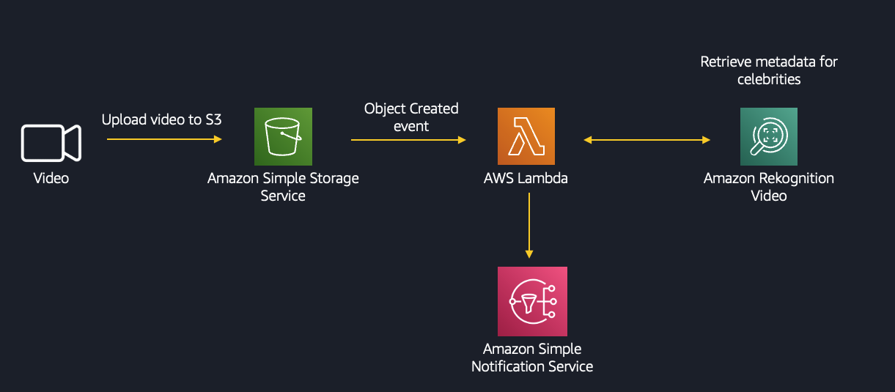

<!--BEGIN STABILITY BANNER-->
---


> **This is a stable example. It should successfully build out of the box**
>
> This example is built on Construct Libraries marked "Stable" and does not have any infrastructure prerequisites to build.
---
<!--END STABILITY BANNER-->

This project is intended to be sample code only. Not for use in production.

## Architecture



This project will create the following in your AWS cloud environment:
* S3 bucket
* SNS topic
* Lambda function that starts video processing via AWS Rekognition when new videos are uploaded to the S3 bucket
* Lambda function that reads the processed data when Rekognition jobs ends
* Roles and policies allowing appropriate access to these resources


Rekognition will detect the celebrities that appear in the video uploaded to S3. 

## Deploy
  
---

Requirements:
* git
* npm (node.js)
* python 3.x
* AWS access key & secret for AWS user with permissions to create resources listed above
  
---

First, you will need to install the AWS CDK:

```
$ sudo npm install -g aws-cdk
```

You can check the toolkit version with this command:

```
$ cdk --version
```

Next, you will want to create a project directory:

```
$ mkdir ~/cdk-samples
```

Now you're ready to clone this repo and change to this sample directory:

```
$ git clone https://github.com/aws-samples/aws-cdk-examples.git
$ cd python/rekognition-video-processor
```

Now you are ready to create a virtualenv:

```
$ python3 -m venv .venv
```

Activate your virtualenv:

```
$ source .venv/bin/activate
```

Install the required dependencies:

```
$ pip install -r requirements.txt
```

At this point you can now synthesize the CloudFormation template for this code.

```
$ cdk synth
```

If everything looks good, go ahead and deploy!  This step will actually make
changes to your AWS cloud environment.  

```
$ cdk bootstrap
$ cdk deploy
```

## Testing the app
Upload a video file to the S3 bucket that was created by CloudFormation.
The video will be processed by Rekognition.
After Rekognition ends the job, it will trigger a Lambda function where you will be able to see the results in CloudWatch
  
To clean up, issue this command (this will NOT remove CloudWatch logs nor IAM roles -- you will need to do those manually)

Also, you will need to empty the bucket before deleting the stack.

```
$ cdk destroy
```

To exit the virtualenv python environment:

```
$ deactivate
```

# Useful commands

 * `cdk ls`          list all stacks in the app
 * `cdk synth`       emits the synthesized CloudFormation template
 * `cdk deploy`      deploy this stack to your default AWS account/region
 * `cdk diff`        compare deployed stack with current state
 * `cdk docs`        open CDK documentation

---
This code has been tested and verified to run with AWS CDK 2.81.0
