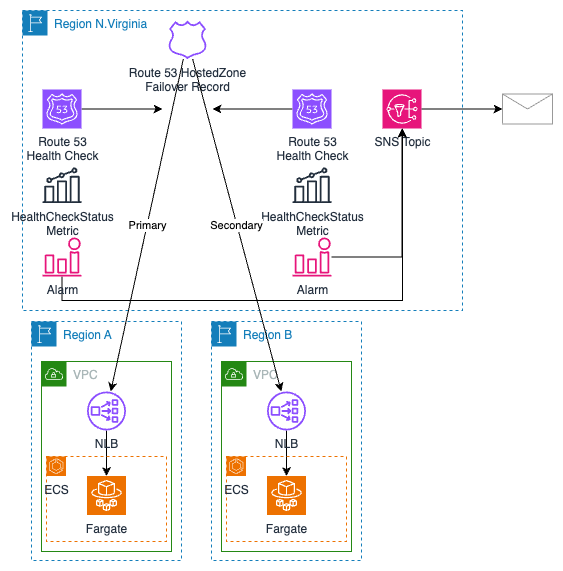

# CDK Failover DNS with Route 53 Health Check

This sample project demonstrates how to create a Failover DNS record in Route 53 using a CDK application. It leverages the Route 53 Health Check feature to monitor the status of endpoints and automatically fail over to a backup endpoint in case of failure. Additionally, it configures SNS notifications to alert administrators when a failover event occurs, ensuring prompt awareness and response.

## Architecture

The architecture of this solution is illustrated in the following diagram:

The key components of the architecture are:

1. **Primary Endpoint**: The main endpoint that serves traffic under normal circumstances.
2. **Secondary Endpoint**: The backup endpoint that takes over traffic when the primary endpoint fails.
3. **Route 53 Hosted Zone**: The DNS hosted zone where the Failover DNS record is created.
4. **Route 53 Health Checks**: Health checks that monitor the availability of the primary and secondary endpoints.
5. **Route 53 Failover DNS Record**: The DNS record that routes traffic to the primary endpoint by default, but automatically switches to the secondary endpoint when the primary endpoint fails the health check.
6. **SNS Topic**: The Simple Notification Service (SNS) topic that publishes notifications when a failover event occurs.
7. **SNS Subscription**: The subscription to the SNS topic, which can be configured to deliver notifications via email or other channels.

## Getting Started

To get started with this project, follow these steps:

1. Clone the repository.
2. Install the required dependencies using `npm install`.
3. Configure the necessary AWS credentials and environment variables.
4. Select a Route 53 HostedZone that can be used for this project.
5. **Provide the required context values in the `cdk.json` file, including `domain` refering the HostedZone, `email` to get notifications, `primaryRegion`, and `secondaryRegion` to deploy the sample application.**
6. Deploy the CDK application using `cdk deploy`.

Refer to the project's documentation for more detailed instructions and configuration options.
