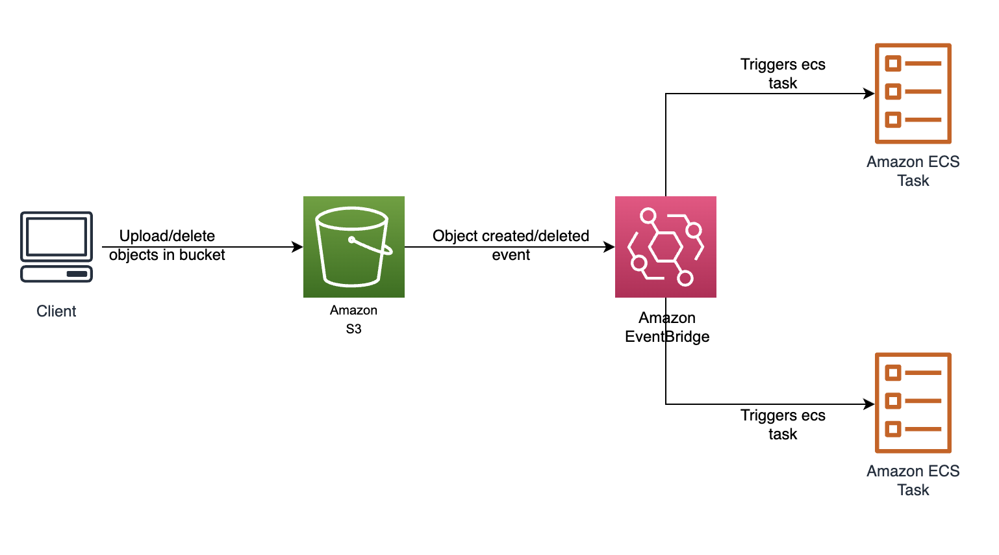

# S3 + EventBridge + ECS

Creates following components:
1. S3 bucket
2. ECS cluster and task definition
3. Evenbridge Rule that triggers stand alone ecs task when an object in the s3 bucket gets added/deleted.
4. vpc for ecs cluster
5. Lambda function generated by cloudformation to handle s3 notifications




The `cdk.json` file tells the CDK Toolkit how to execute your app.

This project is set up like a standard Python project.  The initialization process also creates
a virtualenv within this project, stored under the .venv directory.  To create the virtualenv
it assumes that there is a `python3` executable in your path with access to the `venv` package.
If for any reason the automatic creation of the virtualenv fails, you can create the virtualenv
manually once the init process completes.

To manually create a virtualenv on MacOS and Linux:

```
$ python3 -m venv .venv
```

After the init process completes and the virtualenv is created, you can use the following
step to activate your virtualenv.

```
$ source .venv/bin/activate
```

If you are a Windows platform, you would activate the virtualenv like this:

```
% .venv\Scripts\activate.bat
```

Once the virtualenv is activated, you can install the required dependencies.

```
$ pip install -r requirements.txt
```

At this point you can now synthesize the CloudFormation template for this code.

```
$ cdk synth
```

## Testing the Functionality

Upon successful deployment, there will be a S3 bucket, ecs cluster, vpc, ecs task definition and eventbridge rule deployed in your account. To test the functionality add/delete objects in the s3 bucket and navigate to ecs cluster to confirm status of newly launched ecs task. 
