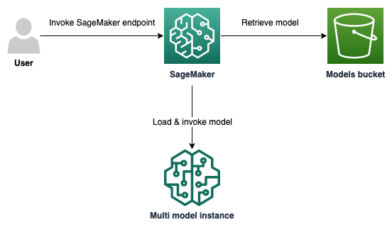

## Hosting multiple models on a single Amazon SageMaker endpoint using CDK

### Table of contents
1. [Introduction](#introduction)
2. [Architecture](#architecture)
3. [Tools and services](#tools-and-services)
4. [Project structure](#project-structure)
5. [Prerequisites](#prerequisites)
6. [Deploy an example](#deploy-an-example)
7. [Clean up](#clean-up)
8. [Conclusion](#conclusion)
9. [License](#license)

## Introduction

This sample application show how you can use [AWS Cloud Development Kit (AWS CDK)](https://aws.amazon.com/cdk/) to deploy multiple SageMaker models on a singular endpoint.
With Amazon SageMaker multi-model endpoints, customers can create an endpoint that seamlessly hosts up to thousands of models. These endpoints are well suited to use cases where any one of a large number of models, which can be served from a common inference container, needs to be invokable on-demand and where it is acceptable for infrequently invoked models to incur some additional latency. For applications which require consistently low inference latency, a traditional endpoint is still the best choice.


## Solution Architecture

The following architecture diagram shows the infrastructure consisting of an Amazon S3 bucket, and a SageMaker model accessible through a SageMaker Endpoint.
At a high level, Amazon SageMaker manages the loading and unloading of models for a multi-model endpoint, as they are needed. When the endpoint is invoked for a particular model, Amazon SageMaker routes the request to an instance assigned to that model, downloads the model artifacts from S3 onto that instance, and initiates loading of the model into the memory of the container. As soon as the loading is complete, Amazon SageMaker performs the requested invocation and returns the result. If the model is already loaded in memory on the selected instance, the downloading and loading steps are skipped and the invocation is performed immediately.



## Tools and services
* [AWS CDK](https://aws.amazon.com/cdk/) – The AWS Cloud Development Kit (AWS CDK) is a software development framework for defining your cloud infrastructure and resources by using programming languages such as TypeScript, JavaScript, Python, Java, and C#/.Net.
* [Amazon SageMaker](https://aws.amazon.com/sagemaker/) - Build, train, and deploy machine learning (ML) models for any use case with fully managed infrastructure, tools, and workflows
* [Docker](https://www.docker.com/) – Docker is a set of platform as a service products that use OS-level virtualization to deliver software in packages called containers.
* Based on the [Sagemaker Notebook from Amazon Sagemaker Examples](https://github.com/aws/amazon-sagemaker-examples/blob/master/advanced_functionality/multi_model_bring_your_own/multi_model_endpoint_bring_your_own.ipynb)

### External requests
This project sends HTTP requests to external sources.
AWS is not responsible for their availability or security. Users should assume responsibility for making sure these resources are secure before using.
- [data.mxnet.io](http://data.mxnet.io) - For downloading Apache MXNet CPU models - [See code](./examples/download_models.py) & [see mxnet.io](https://mxnet.io) for more info.
- [github.com/dmlc/web-data](https://github.com/dmlc/web-data) - For model test data - [See code](./examples/invoke_endpoint.py)


## Project structure

    ├── cdk_sagemaker_hosting_multiple_models   # Directory containing the AWS CDK stacks describing the infrastructure. See https://docs.aws.amazon.com/cdk/latest/guide/stacks.html
    ├── models                                  # Directory containing the models that will deployed by the CDK stack
    ├── docker                                  # Directory containing files for model Docker deployment
    ├── examples                                # Directory containing files used for retrieving example models and testing deployment
    └── images                                  # Directory containing the architecture diagram

## Prerequisites
- [Create AWS Account](https://aws.amazon.com/premiumsupport/knowledge-center/create-and-activate-aws-account/).
- [Install the AWS CDK Toolkit](https://docs.aws.amazon.com/cdk/v2/guide/cli.html) (`cdk` CLI command), e.g. by running:
```bash
npm install -g aws-cdk
```
- [Install Docker](https://www.docker.com/get-started). *Ensure the Docker daemon is running when executing deployment*
- [Bootstrap the AWS account and region](https://docs.aws.amazon.com/cdk/v2/guide/bootstrapping.html) to provision resources required for deploying CDK stacks:
```bash
cdk bootstrap
```
----

## Deploy an example

1. Create a Python virtual environment
```bash
python3 -m venv .venv
```
2. Activate your Python virtual environment
```bash
source .venv/bin/activate
```
Successful activation can be verified by running `pip -V`, the output should show that pip is being accessed at a path that contains the `.venv` directory.
3. Install the required dependencies
```bash
pip install -r requirements.txt
```
4. Execute `download_models.py` in the `examples` directory
```bash
python3 -m examples.download_models
```
This downloads Apache MXNet CPU models to be deployed. _Note_: this script makes HTTPS requests to mxnet.io URLs to download the models.  

5. Execute `cdk deploy`. After successful deployment our endpoint will be running two models.
```bash
cdk deploy
```
6. To validate successful deployment, execute `invoke_endpoint.py` in the `examples` directory
```bash
python3 -m examples.invoke_endpoint
```
(*Ensure you are using the same AWS credentials used when deploying*). The first invocation of a model may be slow, since behind the scenes, SageMaker is downloading the model artifacts from S3 to the instance and loading it into the container.

----

## Clean Up

1. Post testing, clean up all resource to avoid incurring charges when resources are not in use, by running the following command:
```bash
cdk destroy
```
2. Leave your Python virtual environment, simply run:
```bash
deactivate
```

----

## License

This library is licensed under the MIT-0 License. See the LICENSE file.