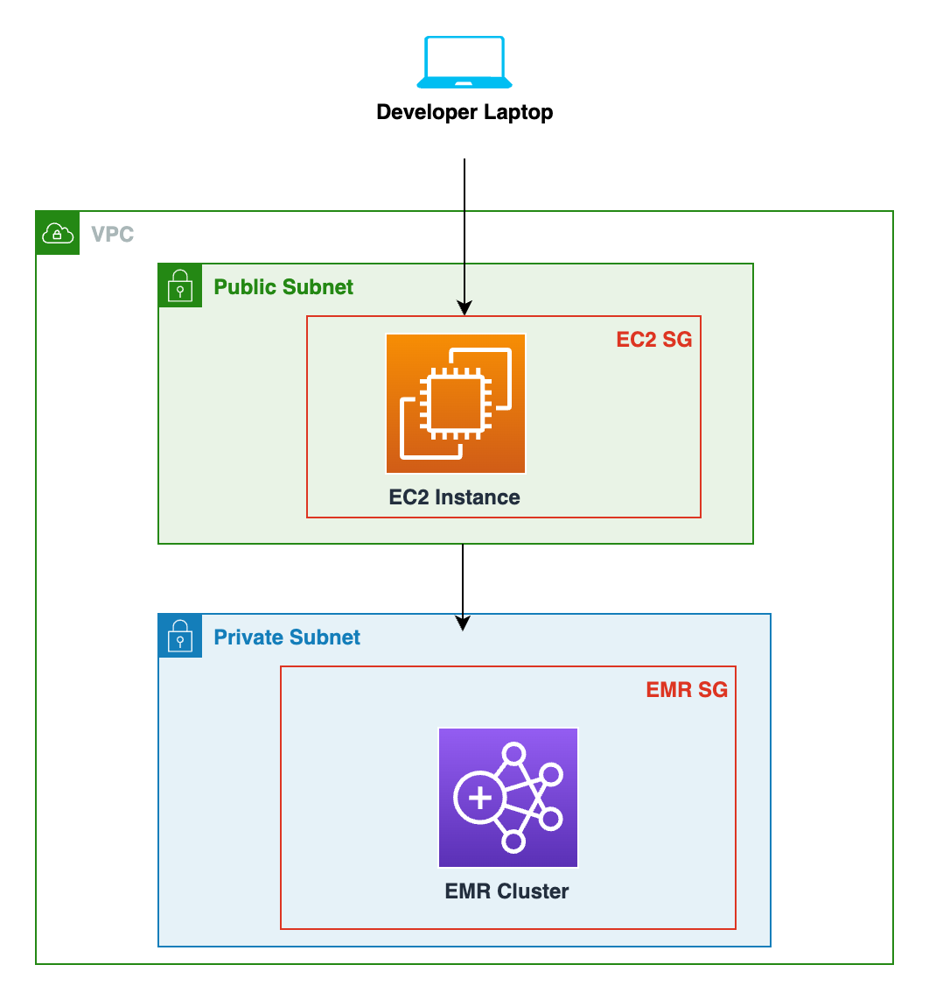
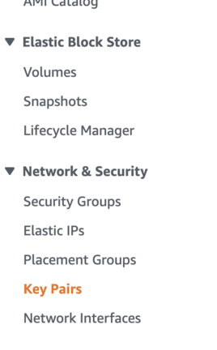
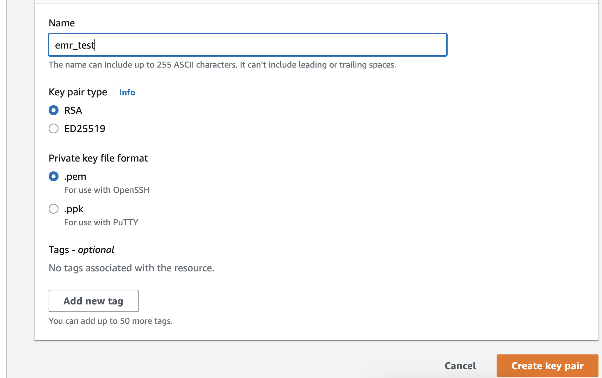
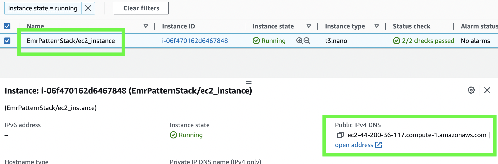
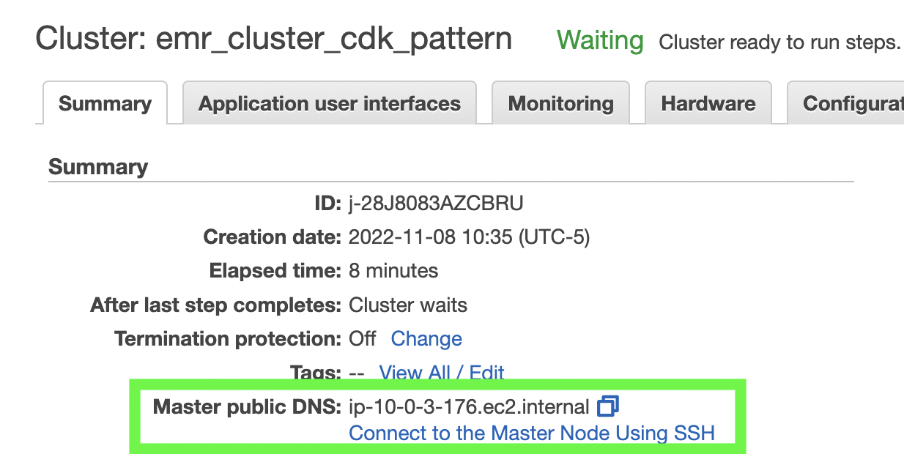
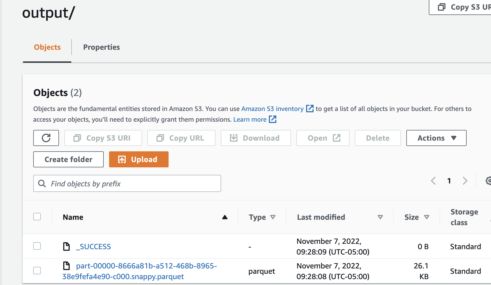

# Deploying a SSH-able EMR Cluster via CDK

This README provides instructions to deploy the architecture shown below:

>

In short, the CDK is used to deploy an EC2 instance in a public subnet and an EMR cluster in a private subnet. With the networking setup detailed in the CDK code, you can securely SSH into the EC2 instance from your computer, then SSH from the EC2 instance into the main EMR node that sits within a private subnet.

The goal of this pattern was to provide an easy-to-create and secure EMR cluster that could be used for development purposes, and to provide code which could be extended for production use-cases.


## Requirements

You must have an AWS console access and the [AWS CLI configured](https://docs.aws.amazon.com/cli/latest/userguide/cli-chap-configure.html) for the same account.


## Set up Local Environment

To manually create a virtualenv on MacOS and Linux:

```
$ python3 -m venv .venv
```

After the init process completes and the virtualenv is created, you can use the following
step to activate your virtualenv.

```
$ source .venv/bin/activate
```

If you are a Windows platform, you would activate the virtualenv like this:

```
% .venv\Scripts\activate.bat
```

Once the virtualenv is activated, you can install the required dependencies.

```
$ pip install -r requirements.txt
```


## Create RSA Key Pair and download PEM file for SSH

In the EC2 console, navigate to "Key Pairs" under "Network & Security" in the left side-bar:

>

Then, create an RSA key pair named "emr_test" with the ".pem" format and save it securely somewhere on your local computer for future use.

>


 Note where the path where the key is stored! This key pair will be used to SSH into the EC2 instance, then will subsequently be used to SSH into the EMR cluster.

## Edit app.py

In app.py enter you AWS Account Id and your desired region for the resource deployment (be sure to save changes).

```
EmrPatternStack(
    app, 
    "EmrPatternStack",
    env=cdk.Environment(
        account="<YOUR-AWS-ACCOUNT-ID>", 
        region="<DESIRED-AWS-REGION-FOR-DEPLOYMENT>"
    ),
    ssh_origin_ip= None # Leave as is or pass in your IP as a string: "12.34.56.78"
)
```

## Add your IP address as "ssh_origin_ip" to app.py (Optional)

In "app.py" there is an optional parameter to pass in your IP address to they key "ssh_origin_ip". Otherwise, leave it as None.

If you pass this value in, the created EC2 instance will only allow SSH connections from that IP. You can simply google "my ip" and it will return your IP address.

If not passed in, the EC2 instance will accept SSH from any IP (of course, only when the correct key pair is passed in).

If you are using VPN, either turn it off before passing in your IP address OR leave the value as None, as VPNs can tamper with ability to SSH into instances that only allow one specific IP. 

For example, if your IP address was "12.34.56.78", you'd enter:

```
EmrPatternStack(
    app, 
    "EmrPatternStack",
    env=cdk.Environment(
        account='222222222222',  
        region='us-east-1'
    ),
    ssh_origin_ip= "12.34.56.78" 
)
```

Be sure to save your change! 

## Bootstrap CDK, If Not Yet Done Previously in Your AWS Account/ Region

If you not have used the CDK in the AWS Account/ Region specified in 'app.py', you must run the command below to bootstrap your environment for CDK use. Be sure to enter your configured AWS CLI profile name.

```
cdk bootstrap --profile <AWS_PROFILE_NAME>
```

This is a one-time bootstrapping, and should take a few minutes. Wait for the CloudFormation stack to complete before proceeding.

## Deploy the CDK Stack!

Run the command below. Be sure to enter your configured AWS CLI profile name.

```
cdk deploy --profile <AWS_PROFILE_NAME>
```

It takes around 20 minutes to spin up the resources, with the last resource to finish creation being the EMR cluster itself. Feel free to get a coffee when you wait! You can monitor stack status in the CloudFormation console or via the command line.

Once the entire stack is successfully deployed, move to the next section!

Note: The EMR instance terminates after 1 hour of inactivity, so be sure to complete the steps below within that timeframe.

## SSH to into the EC2 Instance

#### 1: Change Key Pair file permissions locally (Skip if Using Windows)

Be sure to insert the path to the "emr_test" key pair in the command below! 

For example, "chmod 400 /Users/user/Documents/keypairs/emr_test.pem"

```
chmod 400 <LOCAL_PATH_TO_PEM_FILE>/emr_test.pem
```

#### 2: Copy Key Pair to EC2 Instance

We do this so that we can use the key pair when SSHing into the EMR cluster's master node from the EC2 instance.

Insert your local path to the key pair in the command below.

Also, insert your EC2 instance's public IPv4 DNS value in the command below! The EC2 instance will be named "EmrPatternStack/ec2_instance". 

Do **NOT** use the IPv4 for one of the EC2 instances that are core/ main nodes for the EMR cluster.

You can find the IPv4 DNS value in the EC2 AWS console. For reference on where to find this value, see the image below:

<br/>

>

<br/>
<br/>

```
scp -i <LOCAL_PATH_TO_PEM_FILE>/emr_test.pem <LOCAL_PATH_TO_PEM_FILE>/emr_test.pem ec2-user@<REPLACE_WITH_EC2_PUBLIC_IPV4_DNS>:/home/ec2-user/emr_test.pem
```

<br/>

#### 3. SSH into EC2 Instance in Public Subnet

```
ssh -i <LOCAL_PATH_TO_PEM_FILE>/emr_test.pem ec2-user@<REPLACE_WITH_EC2_PUBLIC_IPV4_DNS>
```

*Congrats! You should now be "inside" the EC2 instance, and ready to SSH into your EMR cluster that sits in the private subnet!!!*

## SSH from EC2 to EMR Main Node and Test Cluster

#### 1. Change File Permissions to Key Pair on the EC2 instance

```
chmod 400 emr_test.pem
```

#### 2. SSH to EMR cluster

In the command below, be sure you enter your master/ main EMR instance's DNS that is found in the **EMR console** into the command below. 

For an example on where to find this in the EMR cluster, see the image below:

>

<br/>


```
ssh -i ~/emr_test.pem hadoop@<REPLACE_WITH_EMR_MASTER_PUBLIC_DNS>
```

*Congrats! You now should be SSHed inside your main EMR node! You are now ready to test the cluster with a PySpark script!*


## Run Spark-Submit Command Below to Test Out the Cluster! (Optional)

Be sure to enter the name of the S3 bucket in **two** different parts of the the command below. 

The bucket should be named something like: "emr-cdk-pattern-AWS_ACCOUNT_ID-RANDOM_STRING"

```
spark-submit --master yarn --deploy-mode cluster s3://<REPLACE_WITH_CDK_CREATED_BUCKET_NAME>/pyspark_test/glue_script.py <REPLACE_WITH_CDK_CREATED_BUCKET_NAME>
```

The command will run the PySpark script included in the "emr_pattern/src" path within this repo, which has been uploaded to the S3 bucket via CDK.

The script simply loads a csv file from the S3 bucket and outputs it in parquet format to the same S3 bucket. The job should only take a few moments to run!

Upon successful completion, the result should look like this in the "output" path of your S3 bucket:

>

<br/>

**Congrats!! You have sucessfuly SSHed into your EMR cluster and ran a Spark job from it!**

## Clean Up 

1. Terminate the EMR cluster in the console. **Wait** for it to finish terminating before proceeding.

2. Empty the cdk-created S3 Bucket in the console.

3. Run the command below to delete the rest of the resources, except the VPC and its associated resources. Be sure to enter your configured AWS CLI profile name! Also, be sure to run the command from your local command line, not the EC2 shell.

```
cdk destroy --profile <AWS_PROFILE_NAME>
```

4. If not already deleted, delete the VPC named: "emr_cdk_vpc" in the VPC console. The VPC can have a dependency issue when deleting with CDK destroy, thus the CDK code retains it and we can delete it after the fact.

5. Finally, you may need to manually delete the cdk-created S3 bucket if cdk destroy did not delete it for you!
