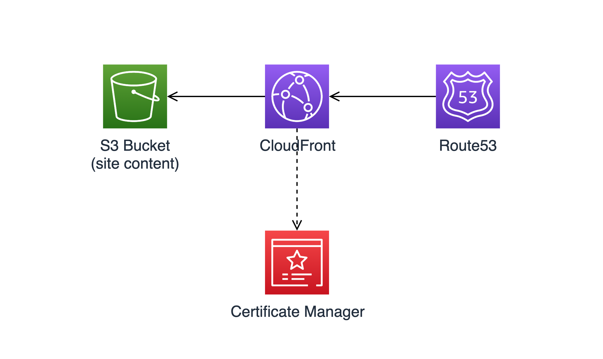

# Static Site with AWS CDK
This sample project uses S3, CloudFront and Route53 to create a stack for 
hosting static web sites.



## Prerequisites
- A registered domain in Route53.
- If using a public S3 bucket, a secret phrase needs to be created in the parameter store. The name of the parameter to be passed in the context as `origin_custom_header_parameter_name`. Make sure to create the parameter in the same region as the static site. This parameter will be set in both CloudFront and S3 Bucket Policy to make sure only traffic from CloudFront can access the S3 objects.
- If using an existing certificate, make sure it's in the `us-east-1` region otherwise the deployment fails. [See this link](https://docs.aws.amazon.com/AmazonCloudFront/latest/DeveloperGuide/cnames-and-https-requirements.html#https-requirements-aws-region)

## Install, Build, Deploy and Clean up
### CDK
Install AWS CDK Toolkit
```sh
npm install -g aws-cdk
```
Verify the installation
```sh
cdk --version
```
Bootstrap the AWS environment
```
cdk bootstrap aws://123456789012/us-east-1
```

### Python Setup
Create a python virtual environment in the root directory of the example.

```sh
python3 -m venv .env
```
Activate the virtual environment and install the dependencies.
```sh
source .env/bin/activate
pip install -r requirements
```

Synthesize the CloudFromation template.
```sh
cdk synth
```
Deploy the stack.
> Make sure your aws profile has sufficient permissions to create the resources. Update the `cdk.json` according to your settings. See the [Context Values](#context-values) down below.
```sh
cdk deploy
```
Clean up and remove the stack.
```sh
cdk destroy
```


## Context Values
Context values are key-value pairs that can be provided to the cdk app. It can be done in [multiple ways](https://docs.aws.amazon.com/cdk/latest/guide/context.html) such as `--context` option to the `cdk` command, or `cdk.json` file.

- **namespace**: Use as a prefix for the resource names
- **domain_name**: domain name. e.g. example.com
- **sub_domain_name**: If provided, the site will be hosted under the sub domain name (e.g. blog.example.com)
- **enable_s3_website_endpoint**: If `true` it creates a public S3 bucket with website endpoint enabled. Otherwise it creates a private S3 bucket.
- **origin_custom_header_parameter_name**: In case of using a public S3 bucket with website enabled, we can use a custom header (e.g. referer) to block all traffic S3 except from the CloudFront. This parameter is the reference to the parameter in *parameter store* where we keep the secret phrase.
- **domain_certificate_arn**: If provided, CloudFront uses this certificate for the domain. Otherwise, it creates a new certificate.
- **hosted_zone_id**: Route53 Hosted Zone ID for the domain
- **hosted_zone_name**: Route53 Hosted Zone Name for the domain

### cdk.json examples

A site with a public S3 bucket. Bucket policy limits the access to s3 objects by using `referer` header.
```json
...
    "namespace": "static-site",
    "domain_name": "example.com",
    "enable_s3_website_endpoint": true,
    "origin_custom_header_parameter_name": "/prod/static-site/origin-custom-header/referer",
    "hosted_zone_id": "ZABCDE12345",
    "hosted_zone_name": "example.com."
...
```
Above example with a subdomain setup. It hosts the site under `blog.example.com`
```json
...
    "namespace": "static-site",
    "domain_name": "example.com",
    "sub_domain_name": "blog",
    "enable_s3_website_endpoint": true,
    "origin_custom_header_parameter_name": "/prod/static-site/origin-custom-header/referer",
    "hosted_zone_id": "ZABCDE12345",
    "hosted_zone_name": "example.com."
...
```
A site with a private S3 bucket origin.
```json
...
    "namespace": "static-site",
    "domain_name": "example.com",
    "hosted_zone_id": "ZABCDE12345",
    "hosted_zone_name": "example.com."
...
```
