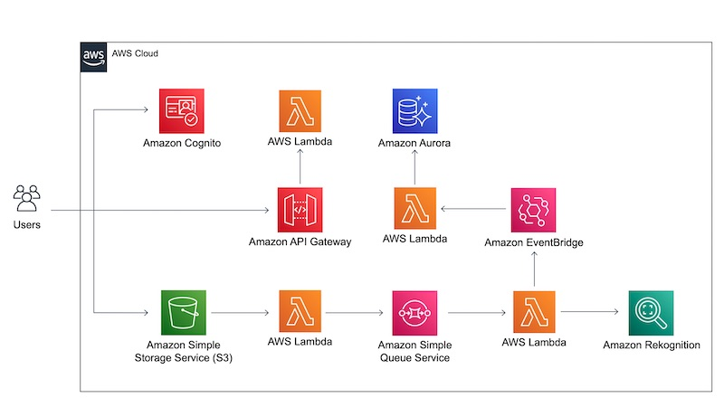
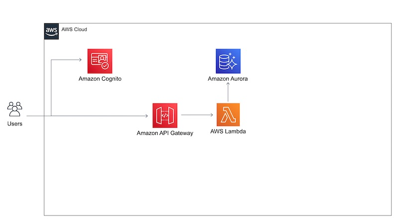

# Image Content Search

The project is an implementation of Image Content Search service which demonstrates a fully working example of AWS CDK in Python. This examples shows an end to end integrations of different components of a Serverless stack; from Authentication with Amazon Cognito and API Gateway to Database with Aurora Serverless.

The following resources are defined in the CDK Stack:
- [Amazon Cognito](https://aws.amazon.com/cognito/getting-started/)
- [Amazon API Gateway](https://aws.amazon.com/api-gateway/getting-started/)
- [Amazon S3](https://aws.amazon.com/s3/getting-started/)
- [Amazon SQS](https://aws.amazon.com/sqs/getting-started/)
- [AWS Lambda](https://aws.amazon.com/lambda/getting-started/)
- [Amazon RDS](https://aws.amazon.com/rds/getting-started/)
- [AWS Secret Manager](https://aws.amazon.com/secrets-manager/getting-started/)
- [Amazon EventBridge](https://aws.amazon.com/eventbridge/)

</br>

## Architecture

In this example you can quickly spin up a fully serverless architecture including a simple UI to upload images and search images by content. The authentication fully relies on Amazon Cognito with hosted UI for sign up or sign in which redirects the user to the main UI. 

The upload image flow uses the authorization token from Cognito to request a signed URL through API Gateway. The signed URL will be used to upload the image to S3 bucket. The pre-processing and image analyser Lambda functions are invoked by events from S3 and SQS; and use Amazon Rekognition to extract the objects in image (as well as offensive labels). To better demonstrate the loosely coupled concept we used Amazon EventBridge as destination for Lambda image analysis which will trigger another lambda function which handles mutations/queries. On the database side, Aurora serverless will handle the data; where for security Secret Manager automatically generates and manage the db credentials.

The following is the data flow when adding new images:



The following diagram demonstrates the search flow:



</br>
  
## Setup

This project is set up like a standard Python project.  The initialization process also creates
a virtualenv within this project, stored under the .env directory.  To create the virtualenv
it assumes that there is a `python3` executable in your path with access to the `venv` package.
If for any reason the automatic creation of the virtualenv fails, you can create the virtualenv
manually once the init process completes.

To manually create a virtualenv on MacOS and Linux:

```
$ python3 -m venv .env
```

After the init process completes and the virtualenv is created, you can use the following
step to activate your virtualenv.

```
$ source .env/bin/activate
```

If you are a Windows platform, you would activate the virtualenv like this:

```
% .env\Scripts\activate.bat
```

Once the virtualenv is activated, you can install the required dependencies.

```
$ pip install -r requirements.txt
```


Install the latest version of the AWS CDK CLI:

```
$ npm i -g aws-cdk
```

</br>

## Deployment


At this point you can now synthesize the CloudFormation template for this code.

```
$ cdk synth
```

Or simple proceed to deployment of the stack.

```
$ cdk deploy
```

</br>

## Useful commands

 * `cdk ls`          list all stacks in the app
 * `cdk synth`       emits the synthesized CloudFormation template
 * `cdk deploy`      deploy this stack to your default AWS account/region
 * `cdk diff`        compare deployed stack with current state
 * `cdk docs`        open CDK documentation
