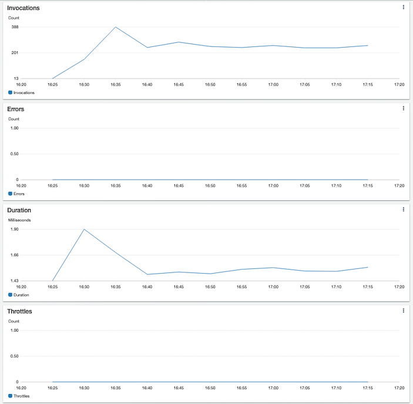

# CloudWatch Dashboards for Lambda Functions

This project demonstrates how to setup a CloudWatch Dashboard for Lambda Functions.
CloudWatch dashboards are used to create customized views of the metrics and alarms for your AWS resources.

This CDK sample uses an AWS Lambda Function, as an example, for the source of CloudWatch metrics. This
approach can used with AWS Services that create [CloudWatch metrics](https://docs.aws.amazon.com/AmazonCloudWatch/latest/monitoring/working_with_metrics.html) or even [Custom CloudWatch metrics](https://docs.aws.amazon.com/AmazonCloudWatch/latest/monitoring/publishingMetrics.html) that you publish yourself.

The following resources are defined in the CDK Stack:
- [AWS Lambda Function](https://aws.amazon.com/lambda/)
- [Amazon CloudWatch](https://aws.amazon.com/cloudwatch/)

After deploying solution, you will have created a CloudWatch Dashboard, like the one shown below:



---
### Requirements:

- git
- npm (node.js)
- python 3.x
- AWS access key & secret for AWS user with permissions to create resources listed above

---

## Setup

This project is set up like a standard Python project.  The initialization process also creates
a virtualenv within this project, stored under the .env directory.  To create the virtualenv
it assumes that there is a `python3` executable in your path with access to the `venv` package.
If for any reason the automatic creation of the virtualenv fails, you can create the virtualenv
manually once the init process completes.

To manually create a virtualenv on MacOS and Linux:

```
$ python3 -m venv .env
```

After the init process completes and the virtualenv is created, you can use the following
step to activate your virtualenv.

```
$ source .env/bin/activate
```

If you are a Windows platform, you would activate the virtualenv like this:

```
$ .env\Scripts\activate.bat
```

Once the virtualenv is activated, you can install the required dependencies.

```
$ pip install -r requirements.txt
```


Install the latest version of the AWS CDK CLI:

```
$ npm i -g aws-cdk
```

## Deployment

At this point you can now synthesize the CloudFormation template for this code.
```
cdk synth
```

Or simple proceed to deployment of the stack.
```
cdk deploy
```

## Test

### Invoke Lambda Function
In order to generate some metrics, you can invoke the sample Lambda Function:

Replace `<NAME_OF_FUNCTION>` with the value of this CDK Stack Output: `LambdaCloudwatchDashboardStack.LambdaName`
```
aws lambda invoke --function-name <NAME_OF_FUNCTION> text_output.txt
```

### View CloudWatch Dashboard

1) Sign into to the AWS Console
2) Navigate to the URL in this CDK Stack Output: `LambdaCloudwatchDashboardStack.DashboardOutput`
3) Please note, the metrics are aggregated for a period of 5 minutes before being displayed on the Dashboard.  The value of the period can be configured, please see the [CDK documentation](https://docs.aws.amazon.com/cdk/api/latest/python/aws_cdk.aws_cloudwatch/MetricProps.html) for further details.


## Clean Up
To clean up, issue this command:
```
cdk destroy
```

## Useful commands

 * `cdk ls`          list all stacks in the app
 * `cdk synth`       emits the synthesized CloudFormation template
 * `cdk deploy`      deploy this stack to your default AWS account/region
 * `cdk diff`        compare deployed stack with current state
 * `cdk docs`        open CDK documentation

Enjoy!
