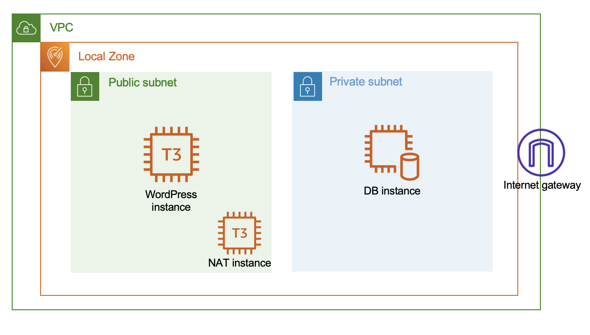

# AWS Local Zones - Getting resources deployed with CDK

This is a project that demonstrates how to deploy resources in a AWS Local Zone.

## Overview



The generated stack creates a new Amazon VPC with a public and a private subnet associated with the specified Local Zone.
To allow resources in the private subnet to initiate traffic towards the Internet, it deploys an EC2 instance that acts as a NAT instance. The reason why a self managed NAT instance is used is because currently NAT Gateway is not supported in Local Zone.

The NAT instance is configured following the best practices described in [the public documentation](https://docs.aws.amazon.com/vpc/latest/userguide/VPC_NAT_Instance.html#basics). The route table of the private instance is automatically configured to have a default route pointing to the NAT instance in the public subnet.

In addition, to demonstrate how to use other services in the Local Zone, the script will deploy:

1. an EC2 in private subnet with WordPress installed through the User Data script. This EC2 is part of an AutoScaling Group with desired and maximum capacity at 1. The role of the AS Group will be to maintain the EC2 with Wordpress always healthy;
2. a MySQL database installed in a EC2 through User Data script in the private subnet;
3. an Application Load Balancer deployed in the public subnet that can be used as a single point of access to the WordPress application.

## Local Zone

For this sample it is used Atlanta Local Zone in us-east-1 region. 
To use a different Local Zone, please change *LZ_NAME* variable in *vpc_ec2_local_zones/vpc_ec2_local_zones_stack.py* 
In that case, you need to set accordingly the region. The stack uses automatically the default region configured in the [AWS CLI profile](https://docs.aws.amazon.com/cli/latest/userguide/cli-configure-quickstart.html#cli-configure-quickstart-region). If no region is configured in the profile, us-east-1 region is used. See *app.py* for details.


```
# Local Zone to be used
LZ_NAME="us-east-1-atl-1a"
# VPC CIDR that will be used to create a new VPC
VPC_CIDR="172.31.100.0/24"
# Subnet size of the subnets in the Local Zone
SUBNET_SIZE=26

[...]

vpc = ec2.Vpc(
            self, 
            "Vpc",
            ip_addresses = ec2.IpAddresses.cidr("172.31.100.0/24"),
            subnet_configuration=[
                ec2.SubnetConfiguration(
                    name = 'Public-Subent',
                    subnet_type = ec2.SubnetType.PUBLIC,
                    cidr_mask = 26,
                ),
                ec2.SubnetConfiguration(
                    name = 'Private-Subent',
                    subnet_type = ec2.SubnetType.PRIVATE_ISOLATED,
                    cidr_mask = 26,
                ),
            ]       
        )

[...]
```
Please note that in the subnet definitions above there is no specification of the Availability Zone or AWS Local Zone that we want to associate with them. We can define this setting at VPC level, overwriting the availability_zones method as shown below: 

```
@property
def availability_zones(self):
   return [“us-east-1-las-1a”] 
```

As an alternative, you can pass a Local Zone name as value of availability_zones parameter in each [Subnet](https://docs.aws.amazon.com/cdk/api/v1/python/aws_cdk.aws_ec2/Subnet.html) definition.


## Instance types

In this sample the Instance Type used for the EC2 instances is **T3 Medium**.
You can check the supported instance types in a specific Local Zone with [DescribeInstanceTypeOfferings](https://docs.aws.amazon.com/AWSEC2/latest/APIReference/API_DescribeInstanceTypeOfferings.html) API (please note that the Local Zone must be enabled to use the API).

CLI command:

```
aws ec2 describe-instance-type-offerings --location-type "availability-zone" --filters Name=location,Values=<LZ Name> --region <Region>
```

or using Boto3:

```
ec2 = boto3.client('ec2', config=Config(region_name=<region>))
response = ec2.describe_instance_type_offerings(
      LocationType='availability-zone',
      Filters=[
                {
                 'Name': 'location',
                 'Values': [<LZ Name>]
                },
              ]
      )
```

## Application Load Balancer

Please be aware that currently Application Load Balancer is not supported in all the Local Zones. If you plan to use a Local Zone where ALB is not available, you will need to replace it deploying a load balancer in a self managed EC2 instance or use or use a load balancer available in [AWS Marketplace](https://aws.amazon.com/marketplace)

## Security Groups

The Security Groups rules are tailored to allow only the traffic needed to access the application. That means:

1. The SG attached to the ALB allow only HTTP traffic on port 80 in Ingress and TCP traffic on port 8080 (the port used by WordPress to accept requests) in Egress;
2. The SGs attached to the EC2 with WordPress allows only TCP traffic on the service port (i.e. 8080) in Ingress from the ALB;
3. The SGs attached to the EC2 with MySQL database allows only TCP traffic on the service port (i.e. 3306) in Ingress from the WordPress instance;
4. The SG attached to the NAT instance allows only HTTP and HTTPS traffic from the VPC CIDR in Ingress and same type of traffic to everywhere in Egress.

## Usage

The `cdk.json` file tells the CDK Toolkit how to execute your app.

This project is set up like a standard Python project.  The initialization
process also creates a virtualenv within this project, stored under the `.venv`
directory.  To create the virtualenv it assumes that there is a `python3`
(or `python` for Windows) executable in your path with access to the `venv`
package. If for any reason the automatic creation of the virtualenv fails,
you can create the virtualenv manually.

To manually create a virtualenv on MacOS and Linux:

```
python3 -m venv .venv
```

After the init process completes and the virtualenv is created, you can use the following
step to activate your virtualenv.

```
source .venv/bin/activate
```

If you are a Windows platform, you would activate the virtualenv like this:

```
% .venv\Scripts\activate.bat
```

Once the virtualenv is activated, you can install the required dependencies.

```
pip install -r requirements.txt
```

At this point you can now synthesize the CloudFormation template for this code.

```
cdk synth
```

To add additional dependencies, for example other CDK libraries, just add
them to your `setup.py` file and rerun the `pip install -r requirements.txt`
command.

## Useful commands

* `cdk ls`          list all stacks in the app
* `cdk synth`       emits the synthesized CloudFormation template
* `cdk deploy`      deploy this stack to your default AWS account/region
* `cdk diff`        compare deployed stack with current state
* `cdk docs`        open CDK documentation
