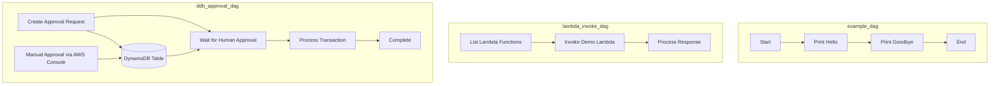

<!--BEGIN STABILITY BANNER-->
---


> **This is a stable example.** It should successfully build out of the box

---
<!--END STABILITY BANNER-->

# AWS MWAA (Managed Workflows for Apache Airflow) with CDK

This sample demonstrates how to deploy AWS Managed Workflows for Apache Airflow (MWAA) using AWS CDK with example DAGs for basic workflows, Lambda integration, and human approval processes.

## Overview

This CDK project creates:
- **VPC** with public/private subnets and NAT Gateway
- **S3 bucket** for DAG storage with automatic deployment
- **MWAA environment** with proper IAM roles and security groups
- **DynamoDB table** for human approval workflows
- **Lambda function** for integration testing
- **Three example DAGs** demonstrating different patterns

### DAG Workflows



**Example DAGs included:**
1. **`example_dag.py`** - Basic Airflow workflow with simple tasks
2. **`lambda_invoke_dag.py`** - Demonstrates Lambda function invocation from Airflow
3. **`ddb_approval_dag.py`** - Human approval workflow using DynamoDB sensors

## Build

```bash
npm install
npm run build
```

## Deploy

```bash
cdk deploy
```

**Note the outputs** after deployment:
- **MwaaWebServerUrl** - Access the Airflow web interface
- **S3BucketName** - Where your DAGs are stored
- **ApprovalTableName** - DynamoDB table for approval workflows

## Usage

### Access Airflow Web UI
1. **Login to AWS Console first** - Ensure you're logged into the AWS Console in your browser
2. **Use the deployment output URL** - Copy the `MwaaWebServerUrl` from the deployment outputs
3. **Access Airflow** - Open the URL in the same browser where you're logged into AWS Console

**Note:** MWAA requires AWS authentication even with `PUBLIC_ONLY` access mode. You must be logged into the AWS Console to access the Airflow web interface.

### Test Human Approval Workflow
1. Trigger the `dynamodb_human_approval_pipeline` DAG
2. Go to AWS Console → DynamoDB → Tables → `mwaa-approval-table-{region}`
3. Find your process record and change `approval_status` from `PENDING` to `APPROVED`
4. Watch the workflow complete automatically

### Test Lambda Integration
1. Trigger the `lambda_invoke_example` DAG
2. View logs to see Lambda function listing and invocation results

## Clean up

```bash
cdk destroy
```

All resources are configured with `RemovalPolicy.DESTROY` for easy cleanup.

## Architecture

- **Environment Class**: `mw1.small` (1-2 workers)
- **Airflow Version**: 2.7.2
- **Web Access**: Public (configure private access for production)
- **Logging**: All log types enabled at INFO level

## Security Notes

This sample uses demo-friendly settings. For production:

- **Web Access**: Change from `PUBLIC_ONLY` to `PRIVATE_ONLY` for MWAA environment
- **IAM Permissions**: Replace wildcard (`'*'`) permissions with specific resource ARNs
- **S3 Encryption**: Enable server-side encryption for the DAGs bucket
- **VPC Endpoints**: Add endpoints for S3, DynamoDB, and Lambda to avoid internet traffic
- **Resource Policies**: Use `RETAIN` instead of `DESTROY` for production resources
- **DynamoDB**: Enable point-in-time recovery (currently disabled)
- **Monitoring**: Enable CloudTrail and CloudWatch alarms for security monitoring
