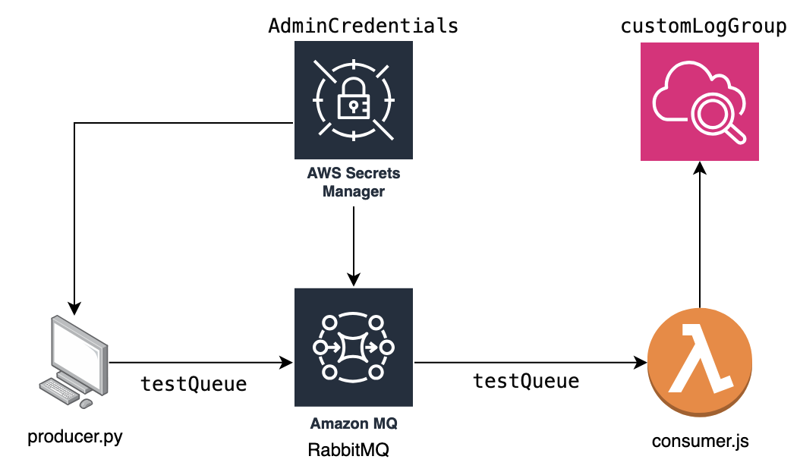

# Amazon MQ RabbitMQ Integration with Lambda, Secrets Manager, and CloudWatch Logs
<!--BEGIN STABILITY BANNER-->
---


> **This is an experimental example. It may not build out of the box**
>
> This example is built on Construct Libraries marked "Developer Preview" and may not be updated for latest breaking changes.
>
> It may additionally requires infrastructure prerequisites that must be created before successful build.
>
> If build is unsuccessful, please create an [issue](https://github.com/aws-samples/aws-cdk-examples/issues/new) so that we may debug the problem
---
<!--END STABILITY BANNER-->
This example demonstrates how to set up an Amazon MQ RabbitMQ cluster, integrate it with AWS Lambda for message processing,
use AWS Secrets Manager for storing sensitive information, and configure CloudWatch Logs for monitoring.

## Deploy

To deploy this app, you need to be in this example's root folder.

Run `cdk deploy`. This will deploy / redeploy your Stack to your AWS Account.

After the deployment you will see the RabbitMQ Broker's endpoints, which will be similar to the following:

```
AmazonMqRabbitmqLambdaStack.AmqpEndpointPort = 5671
AmazonMqRabbitmqLambdaStack.AmqpEndpointUrl = amqps://<broker-id>.mq.us-west-2.amazonaws.com:5671
AmazonMqRabbitmqLambdaStack.WebConsolePort = 443
AmazonMqRabbitmqLambdaStack.WebConsoleUrl = https://<broker-id>.mq.us-west-2.amazonaws.com
```

This will install the necessary CDK, then this example's dependencies, and then build your TypeScript files and your CloudFormation template.

## Testing with [producer.py](producer.py)
> **Important:**
> Update the `username`, `password`, and `broker_endpoint` fields in the [producer.py](producer.py) script as indicated by the comments in the code.
>
> - The `username` and `password` can be retrieved from the secret stored in **AWS Secrets Manager**. You can find the secret created during deployment by searching for the secret name in the AWS Management Console.
> - The `broker_endpoint` should be set to the broker's endpoint shown in the terminal after the cdk deploy command finishes. Specifically, use the URL format: <broker-id>.mq.us-west-2.amazonaws.com

You can test the example by running the [producer.py](producer.py) script provided in the repository.
This script connects to the RabbitMQ broker using the provided credentials and publishes three test messages to the `testQueue`.

After running the producer.py script, you can check the CloudWatch Log Group for your Lambda function to see the output from [consumer.js](lambda/consumer.js).
The [consumer.js](lambda/consumer.js) file includes an example output that shows the details of the received messages, including their Base64-encoded data.

Additionally, you can check the RabbitMQ management console to see the three messages that were published by producer.py
and consumed by the Lambda function, similar to the picture below.


## Stack Components



This stack includes:

- An Amazon MQ RabbitMQ single instance broker, provided by the [AWS::AmazonMQ L2 Construct Library](https://constructs.dev/packages/@cdklabs/cdk-amazonmq/v/0.0.1?lang=go#rabbitmq-brokers).
- An AWS Lambda function for message processing, located in [consumer.js](lambda/consumer.js).
- AWS Secrets Manager for storing RabbitMQ credentials.
- A CloudWatch Log group for Lambda function logs.

## Testing
```bash
npm run test
```

## Cleanup

To avoid incurring future charges, remember to destroy the resources:

```bash
cdk destroy
```

## Future Enhancements and Exploration Opportunities


## Further Reading

- [Amazon MQ Documentation](https://docs.aws.amazon.com/amazon-mq/)
- [AWS Lambda Developer Guide](https://docs.aws.amazon.com/lambda/latest/dg/welcome.html)
- [AWS Secrets Manager User Guide](https://docs.aws.amazon.com/secretsmanager/latest/userguide/intro.html)
- [Amazon CloudWatch Logs User Guide](https://docs.aws.amazon.com/AmazonCloudWatch/latest/logs/WhatIsCloudWatchLogs.html)

## Reference

- [AWS::AmazonMQ L2 Construct Library](https://constructs.dev/packages/@cdklabs/cdk-amazonmq/v/0.0.1?lang=go#rabbitmq-brokers)
