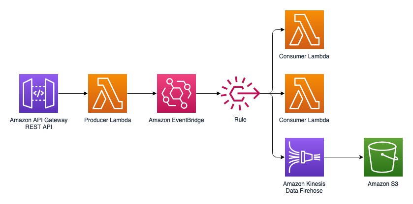

# API Gateway + Lambda + EventBridge + [Lambda , KinesisFirehose(S3)]

## <!--BEGIN STABILITY BANNER-->


> **This is a stable example. It should successfully build out of the box**
>
> This example is built on Construct Libraries marked "Stable" and does not have any infrastructure prerequisites to build.

---

<!--END STABILITY BANNER-->

## Overview

1. Requests to the API are sent to EventBridge using the producer Lambda.
2. Producer Lambda triggers the Consumer Lambda functions and Kinesis Data Firehose based on the EventBridge Rule.

## Resources Created

- API Gateway API with a POST Method
- Lambda as Data Producer
- EventBridge that routes to AWS services based on Rules
- Two Lambda functions which consume data based on Rules
- Kinesis Data Data Firehose which receives data from EventBridge based on Rules, then stores data in S3 bucket.



The `cdk.json` file tells the CDK Toolkit how to execute your app.

## Build

To build this app, you need to be in this example's root folder. Then run the following:

```bash
npm install -g aws-cdk
npm install
npm run build
```

This will install the necessary CDK, install dependencies, and then build TypeScript files and CloudFormation template.

## Deploy

Run `cdk deploy`. This will deploy / redeploy your Stack to your AWS Account.

After the deployment you will see the API's URL, which represents the url you can then use.

## Synthesize Cloudformation Template

To see the Cloudformation template generated by the CDK, run `cdk synth`, then check the output file in the "cdk.out" directory.

## Testing the app

Upon successful deployment, you should see an API Gateway REST API in your account. It can be tested from the console or the CLI:

From the AWS Console:

1. Navigate to Amazon API Gateway > APIs > SampleAPI-EventBridge-Multi-Consumer > Resources > Items > POST
2. Click "Test"
3. In "Request Body" enter `{"item1": "123", "item2": "456"}` and submit.
4. Verify the Status is "200" and body is `{"result": "from Producer"}`
5. Verify a new json object is in the S3 bucket with details from request.

or

```
$ aws apigateway test-invoke-method --rest-api-id <API ID> --resource-id <RESOURCE ID> --http-method POST --body {"item1":"123","item2":"456"}
```

This request should complete with a 200 OK. The Lambda function should print the API Gateway request body in its CloudWatch logs. (https://docs.aws.amazon.com/lambda/latest/dg/monitoring-cloudwatchlogs.html)

This message will also be visible in the S3 bucket that has been created by Kinesis Firehose. Also you should be able to see the event in Consumer Lambda's cloudwatch logs.

## Cleanup

You can either delete the stack through the AWS CloudFormation console or run `cdk destroy`.
