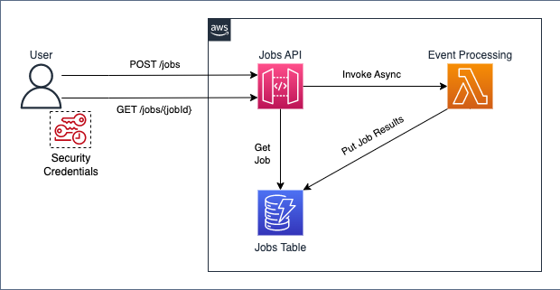

# API Gateway Asynchronous Lambda Invocation

Sample architecture to process events asynchronously using API Gateway and Lambda and store result in DynamoDB.

## Architecture


## Background:

In Lambda non-proxy (custom) integration, the backend Lambda function is invoked synchronously by default. This is the desired behavior for most REST API operations.  
Some applications, however, require work to be performed asynchronously (as a batch operation or a long-latency operation), typically by a separate backend component.  
In this case, the backend Lambda function is invoked asynchronously, and the front-end REST API method doesn't return the result.

## Solution:

### API Gateway:

- `POST` `/job`: Integrates with the Lambda function for job submission.
- `GET` `/job/{jobId}`: Direct DynamoDB integration to fetch the job status by jobId.

### DynamoDB Integration:

- The stack includes the DynamoDB table for storing job statuses with jobId as the partition key.
- The Lambda function has permissions to write to the DynamoDB table.

### IAM Role:
- An IAM role is created for API Gateway with permissions to access the DynamoDB table for the GET /job/{jobId} method

### Example structure:
```
/api-gateway-async-lambda-invocation
  ├── /assets
  │   └── /lambda-functions
  │       └── job_handler.js
  ├── /lib
  |   |-- app.ts
  │   └── api-gateway-async-lambda-invocation-stack.ts
  ├── node_modules
  ├── package.json
  ├── cdk.json
  └── ...
```

## Test:
- `POST` curl command:
```shell
curl -X POST https://<API-ID>.execute-api.<REGION>.amazonaws.com/<stage>/job \
    -H "X-Amz-Invocation-Type: Event" \
    -H "Content-Type: application/json" \
    -d '{}'
```

- `GET` curl command to get job details:
```shell
# jobId refers the output of the POST curl command.
curl https://<API-ID>.execute-api.<REGION>.amazonaws.com/<stage>/job/<jobId>
```

## Reference:
[1] Set up asynchronous invocation of the backend Lambda function  
https://docs.aws.amazon.com/apigateway/latest/developerguide/set-up-lambda-integration-async.html
