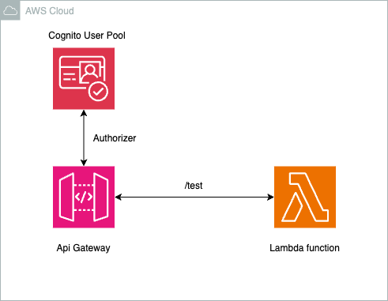

## <!--BEGIN STABILITY BANNER-->


> **This is a stable example. It should successfully build out of the box**
>
> This example is built on Construct Libraries marked "Stable" and does not have any infrastructure prerequisites to build.

---

<!--END STABILITY BANNER-->

This project is intended to be sample code only. Not for use in production.

## Architecture



This project will create the following in your AWS cloud environment:

- REST Api Gateway
- Example lambda function

This is an example to showcase how to add a Cognito authorizer in an REST Api Gateway with a Lambda Integration.

## Deploy

---

Requirements:

- git
- npm (node.js)
- AWS access key & secret for AWS user with permissions to create resources listed above
- Cognito User Pool

---

First, you will need to install the AWS CDK:

```
$ npm install -g aws-cdk
```

You can check the toolkit version with this command:

```
$ cdk --version
```

Next, you will want to create a project directory:

```
$ mkdir ~/cdk-samples
```

Now you're ready to clone this repo and change to this sample directory:

```
$ git clone https://github.com/aws-samples/aws-cdk-examples.git
$ cd typescript/api-gateway-lambda-cognito-authorizer
```

Install the required dependencies:

```
$ npm install
```

Go to `bin/apigw-lambda-cognito-authorizer.ts` and update the Cognito User Pool Id with yours.

```ts
//....
const app = new cdk.App();
new ApigwLambdaCognitoAuthorizerStack(
  app,
  "ApigwLambdaCognitoAuthorizerStack",
  {
    cognitoUserPoolId: "<your-cognito-userpool-id>",
  }
);
```

At this point you can now synthesize the CloudFormation template for this code.

```
$ cdk synth
```

If everything looks good, go ahead and deploy! This step will actually make
changes to your AWS cloud environment.

```
$ cdk bootstrap
$ cdk deploy
```

## Testing the app

To test this application:

1. Note the endpoint of the newly created Api Gateway.
2. Retrieve the Cognito access token.
3. Make the following call in your cli:

```bash
curl --location --request GET '<https://<api-gateway-endpoint>/<stage>/test' \
--header 'Authorization: Bearer <your-cognito-access-token>' \
```

4. After this call you will see:

```bash
{"message":"Hello World"}
```

To clean up, issue this command (this will NOT remove CloudWatch logs -- you will need to do those manually)

Also, you will need to empty the bucket before deleting the stack.

```
$ cdk destroy
```

# Useful commands

- `cdk ls` list all stacks in the app
- `cdk synth` emits the synthesized CloudFormation template
- `cdk deploy` deploy this stack to your default AWS account/region
- `cdk diff` compare deployed stack with current state
- `cdk docs` open CDK documentation

---

This code has been tested and verified to run with AWS CDK 2.81.0
