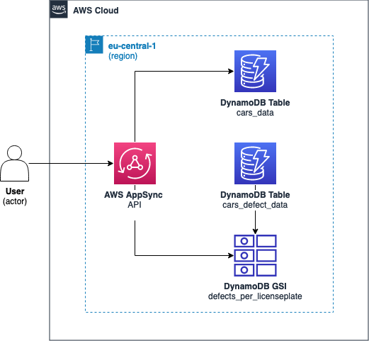

# AWS CDK AppSync DynamoDB Table Joining Demo

<!--BEGIN STABILITY BANNER-->


> **This is a stable example. It should successfully build out of the box**
>
> This example is built on Construct Libraries marked "Stable" and does not have any infrastructure prerequisites to build.
---

<!--END STABILITY BANNER-->

This project demonstrates how to use AWS CDK (Cloud Development Kit) to create an AWS AppSync API backed by DynamoDB tables. The essence of this project lies in establishing a one-to-many relationship between two tables, where one table stores information about cars, and the other stores information about defects associated with cars. This allows querying both tables together as a sort of nested query.

## Table of Contents
- [Overview](#overview)
- [Prerequisites](#prerequisites)
- [Installation](#installation)
- [Usage](#usage)
- [Architecture](#architecture)

## Overview

This project sets up an AWS AppSync API named `carAPI` with two DynamoDB tables: `cardata-cars` and `cardata-defects`. The `cardata-cars` table stores information about cars, while the `cardata-defects` table stores information about defects associated with cars. The AppSync API provides GraphQL endpoints to query and mutate data in these tables. The essence of this project is to enable querying both tables in a nested manner, representing the one-to-many relationship between cars and defects.

The data used in this project is sourced from public data of RDW (Government agency Dienst Wegverkeer, commonly known as RDW, which handles the type-approval and registration of motorized vehicles and driving licences in the Netherlands). This data used in this project is based on data freely available for use without any restrictions.

## Prerequisites

Before getting started, ensure you have the following prerequisites:
- Node.js installed (v18.x)
- AWS CDK installed (`npm install -g aws-cdk`)
- AWS CLI configured with appropriate credentials

## Installation

1. Clone this repository to your local machine.
2. Navigate to the project directory.
3. Install dependencies by running `npm install`.

## Usage

To deploy the AWS infrastructure, run the following command:

```bash
cdk deploy
```

To remove the deployed infrastructure, run:

```bash
cdk destroy
```

The data in the DynamoDB tables can be populated using the utilities provided in `utils/index.js`. It will take a couple of seconds to push all the data to DynamoDB. Execute the following command to populate the tables:

```bash
npm run push-data
```

Once the CDK stack is deployed and the data is ingested into the DynamoDB tables you can query it through the AWS Appsync Console. If you can go to the query tab you can execute the following GraphQL Request:

```graphql
query GetCar {
  getCar(licenseplate: "BR794ZQ3") {
    expirydateapk
    cylindervolume
    catalogprice
    defects {
      defectdescription
      defectstartdate
      licenseplate
    }
    firstcolor
    firstregistrationdate
    licenseplate
  }
}
```

## Architecture



The AWS CDK stack defined in `cdk-appsync-demo-stack.ts` sets up the following resources:
- DynamoDB tables:
  - `cardata-cars`: Stores information about cars.
  - `cardata-defects`: Stores information about defects associated with cars.
   - `defects-by-licenseplate` Global Secondary Index (GSI) that allows to query defects by licenseplate
- AppSync API (`carAPI`):
  - GraphQL schema defined in `graphql/schema.graphql`.
  - Data sources connected to DynamoDB tables.
  - Resolvers to query data.
- Resolvers:
  - `getCar.js`: Resolver function to fetch cars from the `cardata-cars` table.
  - `getDefects.js`: Resolver function to fetch defects associated with cars from the `cardata-defects` table.

## Costs
The operational expenses associated with deploying this architecture are estimated to be approximately a couple of dollars per month (based on the eu-central-1 region). Cost optimization measures can be implemented by adjusting the write capacity of DynamoDB tables and indexes to a lower setting after the execution of the `npm run push-data` command.
