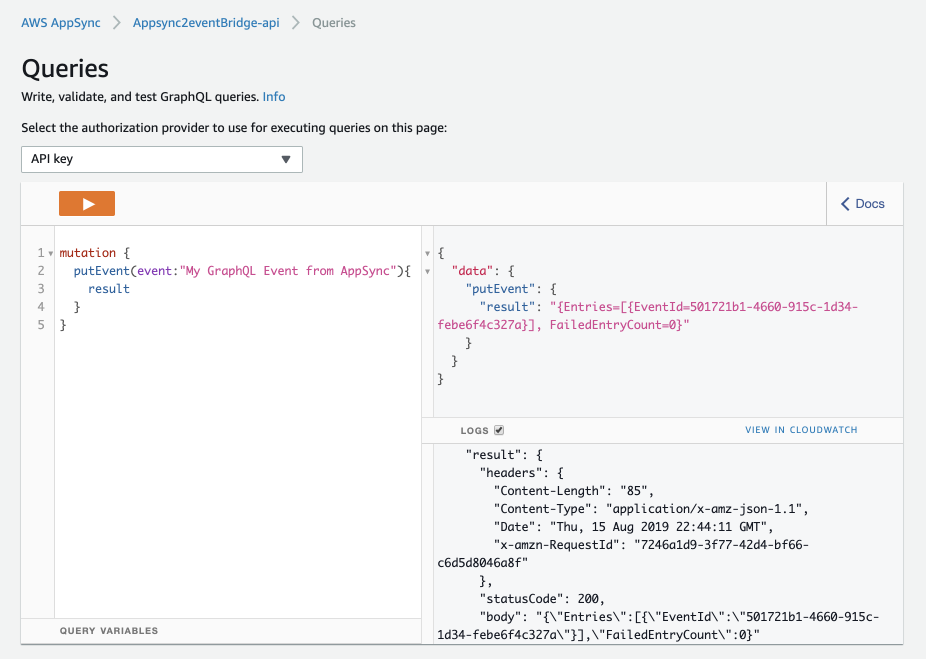

# AppSync GraphQL sending events to Event Bridge

This an example of an AppSync GraphQL API sending events to Event Bridge and trigerring a rule that invokes a Lambda function



## Build

To build this app, you need run the following commands from the root folder:

```bash
npm install -g aws-cdk
npm install
npm run build
```

This will install the necessary CDK, then this example's dependencies, and then build your TypeScript files and your CloudFormation template.

## Deploy

Run `cdk deploy`. This will deploy / redeploy your Stack to your AWS Account.

After the deployment you will see the API's URL, which represents the url you can then use.

## Synthesize Cloudformation Template

To see the Cloudformation template generated by the CDK, run `cdk synth`, then check the output file in the "cdk.out" directory.

## The Component Structure

This Stack contains:

- a **GraphQL API** with an API Key (Use with caution, each key is only valid for 7 days.)
- a **GraphQL Schema** with a Mutation that sends an event to Event Bridge
- an **IAM Role** that allows AppSync to send events to your Event Bus
- an **AppSync DataSource**, connecting your API to Event Bridge using a HTTP Resolver
- an **AppSync Resolver** for a Mutation `putEvent` that sends a custom event to Event Bridge
- an **Event Rule** that listens for the custom event comming from AppSync and triggers a Lambda function in response to the event
- a **Lambda** function that just prints out the event, you can confirm it's triggered by the Event Bridge's rule by checking the function logs on CloudWatch.
