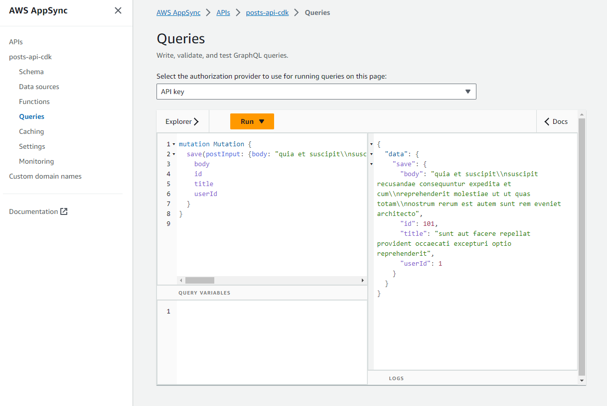

# AppSync GraphQL API Acting on HTTP

<!--BEGIN STABILITY BANNER-->


> **This is a stable example. It should successfully build out of the box**
>
> This examples is built on Construct Libraries marked "Stable" and does not have any infrastructure prerequisites to build.

---

<!--END STABILITY BANNER-->

This an example of an AppSync GraphQL API, pointing to four resolvers doing CRUD operations with a single HTTP datasource.



## Build

To build this app, you need run the following commands from the root folder:

```bash

npm  install

npm  run  build

```

This will install the dependencies for this example and then create your TypeScript files and CloudFormation template.

## Deploy

Run `cdk deploy`. This will deploy / redeploy your Stack to your AWS Account.

After the deployment you will see the API's URL, which represents the url you can then use.

## Synthesize Cloudformation Template

To see the Cloudformation template generated by the CDK, run `cdk synth`, then check the output file in the "cdk.out" directory.

## The Component Structure

This Stack contains:

- a **GraphQL API** with an API Key (Use with caution, each key is only valid for 7 days.)
- a **GraphQL Schema** with Queries to get one and all items and two mutations to save and delete an item
- an **AppSync DataSource**, connecting your API to the datasource HTTP with the previously specified role.
- a **AppSync Resolver** for a Query `getOne` to get one item from datasource HTTP.
- a **AppSync Resolver** for a Query `all` to get all items from datasource HTTP.
- a **AppSync Resolver** for a Mutation `save` to put an item into datasource HTTP.
- a **AppSync Resolver** for a Mutation `delete` to delete one item from datasource HTTP.
