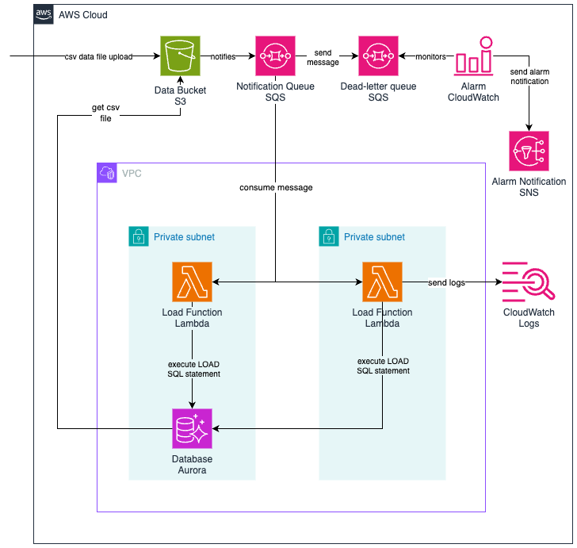

# demo-aurora-eventual-s3-data-load

## Project Overview

This project implements a robust, event-driven architecture that seamlessly ingests `CSV` files uploaded to an _Amazon
S3_ bucket into an _Aurora MySQL_ database. It leverages the powerful `LOAD` command of the _MySQL_ engine to
efficiently load the data into the target database.

Key Features:

1. **Event-Driven Architecture**: The system is designed to react to events triggered by `CSV` file uploads to the
   designated _S3_ bucket. This ensures real-time data ingestion and minimizes manual intervention.

2. **Reliable Data Ingestion**: The `LOAD` command is utilized to efficiently and reliably load the `CSV` data into the
   _Aurora MySQL_ database, ensuring data integrity and consistency.

3. **Error Handling and Notifications**: In the event of errors or warnings during the data ingestion process, the
   system captures and stores the error details in an _SQS Dead Letter Queue_ (DLQ). This facilitates subsequent
   analysis and troubleshooting. Additionally, an alarm is triggered to notify the relevant stakeholders, enabling
   prompt resolution of issues.

4. **Monitoring and Observability**: The system incorporates monitoring capabilities, allowing you to track the
   transaction, health, and potential issues in the data ingestion pipeline.

## Architecture

The architecture consists of the following components:

1. An _S3_ bucket that will store the `CSV` file and notify the subsequent components.
2. An _SQS_ queue to store the event notification from the _S3_ bucket.
3. An _SQS_ queue to store any failed attempts of processing the files (_Dead-letter queue_).
4. A _Lambda_ function deployed in the same _VPC_ as the database. This function will consume the message from the _SQS_
   queue and trigger the database `LOAD` process, providing the data file details.
5. An _Aurora MySQL_ database where the data is persisted and the new data will be loaded. The database is responsible
   to fetch the data file from the _S3_ bucket through the use of the `LOAD` command.
6. A _CloudWatch Alarm_ that will monitor the metric `NumberOfMessagesReceived` of the _DLQ_.
7. An _SNS_ topic that will be triggered from the alarm created in case of new messages arriving in the _DLQ_. The
   stakeholders can subscribe to this topic directly using their e-mail addresses or mobile phone numbers. It's also
   possible to create a custom integration that will allow the architecture to notify the related stakeholders using
   third-party components.
8. _CloudWatch Logs_ will capture and store all the logs produced by the _Lambda_ functions for further analysis.



## Deployment Guide

### Prerequisites

- AWS CLI installed and configured with appropriate IAM permissions
- NodeJS installed (version 22.4 or later)
- AWS CDK installed (version 2.160 or later)

### CDK Toolkit

The `cdk.json` file tells the CDK Toolkit how to execute your app.

To start working with the project, first you will need to install all dependencies as well as the cdk module (if not
installed already). In the project directory, run:

```bash
$ npm install
```

### Deploying the solution

To deploy the solution, we will need to request cdk to deploy the stacks:

```shell
$ cdk deploy --all
```

> **Note**: After the deployment is done, some output data is presented on the terminal, providing information regarding
> the deployed solution:
> - **DataBucketName**: S3 bucket where the data files will be uploaded.
> - **DataLoadQueueName**: Queue responsible for storing the events sent from S3.
> - **DLQName**: Dead-letter queue responsible for storing failed events.
> - **NotificationTopicName**: SNS topic responsible for notifying the stakeholders regarding failed processes.
> - **FunctionLogGroupName**: CloudWatch Log Group responsible for storing the Lambda's function logs.

```shell
Outputs:
DemoAuroraEventualDataLoadStack.BastionHostSecurityGroupId = sg-XXXXXXXXXXX
DemoAuroraEventualDataLoadStack.DLQName = demo-data-load-dlq
DemoAuroraEventualDataLoadStack.DataBucketName = data-bucket-XXXXXXXXXXX
DemoAuroraEventualDataLoadStack.DataLoadQueueName = demo-data-load
DemoAuroraEventualDataLoadStack.DatabaseSecretName = demo-aurora-eventual-load-database-secret
DemoAuroraEventualDataLoadStack.FunctionLogGroupName = /aws/lambda/demo-aurora-eventual-data-load-function
DemoAuroraEventualDataLoadStack.NotificationTopicName = demo-aurora-eventual-load-notification
DemoAuroraEventualDataLoadStack.VpcId = vpc-XXXXXXXXXXX
```

## Testing the solution

1. Head to _AWS_ console and then to _S3_
2. Select the bucket provided from the deployment command and click on `Upload`
3. Select one of the files present on this repo in the _/data_ directory.
    1. `db-data.csv` will load successfully into the database and will generate enough logs for you to check the number
       of rows loaded.
    2. `db-data-with-error.csv` will produce some errors and will deliver the message to the _DLQ_, which will trigger
       the alarm and send a message to the alarm topic. This will also generate enough logs for better understand the
       errors encountered.
4. You can check the logs produced by the solution using the _CloudWatch Log Group_ provided after the deployment
   process.
5. Whenever you want to test the failure scenario, after uploading the data file with errors, you will be able to see
   the failure logs on the _CloudWatch Log Group_ and the alarm in "In Alarm" state on _CloudWatch Alarms_ section.
6. **(OPTIONAL)** You can subscribe your e-mail address to the _SNS Notification Topic_ and validate the e-mail sent on
   the failure event.
7. **(OPTIONAL)** You can access the database by deploying an _EC2_ bastion host or _CloudShell_ session inside the
   created _VPC_ (see the `VpcId` output). You will need to install the _MySQL_ client and use the database credentials
   through _Secrets Manager_ (see the `DatabaseSecretName` output).

## Cleanup

To destroy the provisioned infrastructure, you can simply run the following command:

```shell
$ cdk destroy --all
```
