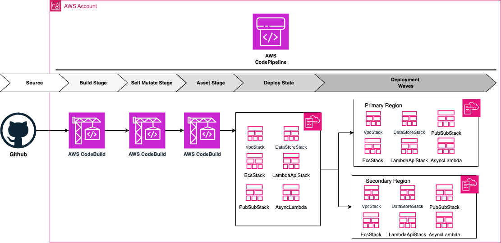

# AWS Codepipeline CI/CD Solution for ECS Fargate and Lambda

## Architect Design:

## Overview

This CDK package provides a production-grade template for setting up AWS resources to enable smooth migration from monolithic EC2-based architectures to cloud-native solutions on AWS. It's designed for startups looking to scale their infrastructure efficiently.

Key features:
- CICD pipeline using AWS CodePipeline
- Lambda functions (async triggered and REST endpoints behind API Gateway)
- ECS Fargate based service with automatic deployment
- Integration with private GitHub repositories
- Reference to CDK created VPCs
- Creates RDS Instances with credentials managed by AWS Secrets Manager
- Event-driven architecture using SQS, SNS, and EventBridge

## Getting Started

### Prerequisites

- Create a Private Github Repository with source code inside 'aws-codepipeline-ecs-lambda' directory.
- Create a connection to GitHub or GitHub Enterprise Cloud, see [Create a connection to GitHub](https://docs.aws.amazon.com/dtconsole/latest/userguide/connections-create-github.html). 
- Modify the `connectionArn` in `pipeline-stack.ts` file. 
- Modify `githubOrg`, `githubRepo`, `githubBranch` with your private repository details.

## Project Structure

The project is organized into six main stacks:

1. `VpcStack`: Network infrastructure resources
2. `DataStoresStack`: Database resources
3. `PubSubStack`: Event-based infrastructure (SQS, SNS, EventBridge)
4. `AsyncLambdasStack`: Asynchronously triggered Lambda functions
5. `LambdaApisStack`: Lambda functions as REST endpoints behind API Gateway
6. `EcsFargateStack`: ECS Fargate Service, Cluster, Tasks, and Containers

You can easily customize the infrastructure by modifying or removing specific stacks in the `lib/pipeline-stage.ts` file.

## Solution overview

The CDK application is structured as follows:

`lib/pipeline-stack.ts` contains the definition of the CI/CD pipeline. The main component here is the CodePipeline construct that creates the pipeline for us

`lib/stage-app.ts` contains definitions of all the six stacks which the pipeline will deploy. 

`lib/stage-app-vpc-stack.ts` creates new vpc resource along with subnets, nat gateways and remaining networking infrastructure. 

`lib/stage-app-datastore-stack.ts` creates a Aurora Serverless V2 Cluster along with KMS key to encrypt the database. 

`lib/stage-app-ecs-fargate-stack.ts` builds the `Dockerfile` and creates ecs fargate service along with loadbalancer. 

`lib/stage-app-lambda-api-stack.ts` creates lambda functions as REST endpoints behind API Gateway resource. 

`lib/PubSubStack.ts` creates sns, eventbridge and lambda function.

---
