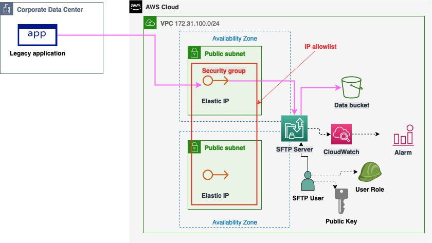

# AWS CDK Example for deploying AWS Transfer SFTP Server

<!--BEGIN STABILITY BANNER-->
---


> **This is a stable example. It should successfully build out of the box**
>
> This example is built on Construct Libraries marked "Stable" and does not have any infrastructure prerequisites to build.
---
<!--END STABILITY BANNER-->

## AWS Transfer Family

AWS Transfer Family is a secure transfer service that enables you to transfer files into and out of AWS storage services. AWS Transfer Family supports [Secure Shell (SSH) File Transfer Protocol (SFTP): version 3](https://docs.aws.amazon.com/transfer/latest/userguide/what-is-aws-transfer-family.html).

File transfer protocols are used in data exchange workflows across different industries such as financial services, healthcare, advertising, and retail, among others. Transfer Family simplifies the migration of file transfer workflows to AWS.

With Transfer Family, you get access to a file transfer protocol-enabled server in AWS without the need to run any server infrastructure. You can use this service to migrate your file transfer-based workflows to AWS while maintaining your end users' clients and configurations as is.

## Solution overview

The example will deploy an [SFTP server](https://docs.aws.amazon.com/transfer/latest/userguide/create-server-sftp.html) with a single user and configures a public key for the [user](https://docs.aws.amazon.com/transfer/latest/userguide/service-managed-users.html).

A security group can optionally be configured to allowlist only specific IPs.

S3 bucket is created for storing the data. User is scoped to only have access to a specific prefix in the bucket.



## Build and test

First, follow the [CDK getting started guide](https://docs.aws.amazon.com/cdk/v2/guide/getting_started.html).

To build this app, you need to be in this example's root folder. Then run the following:

```sh
npm install -g aws-cdk
npm install
```

This will install the latest version of CDK and other dependencies.

Then verify that the snapshot test succeeds:

```sh
npm run test
```

## Deploy

First, review the `main.ts` to see if you want to configure account, region or SFTP user name.
Proceed to run CDK deploy with [context variable](https://docs.aws.amazon.com/cdk/v2/guide/context.html) `userPublicKeys` and optionally also `allowedIps`.

```sh
cdk deploy --context "userPublicKeys=ecdsa-sha2-nistp256 AAAAE2VjZHNhLXNoYTItbmlzdHAyNTYAAAAIbmlzdHAyNTYAAABBBCJlxu5q1M3icgvrvNvCyE4gavDWaB8L7ZyGjnpsp/7GZhczaqY49KmZnZrbsKfoKtKu5bkNN8BXcjrAAwwv0Hk="
```

When running the deployment in CI/CD environment, you likely want to fetch the context from your own parameter or secrets store.

The command will deploy or update the stack on the active AWS account.
`cdk destroy` can be used to remove the deployed resources after they are no longer needed.

## Connect

Test the server using SFTP client:

```sh
$ sftp -i ~/.ssh/id_ecdsa sftp-user-dev@s-server-id.server.transfer.eu-north-1.amazonaws.com
sftp> ls
sftp> put example_file
sftp> ls
example_file
sftp>
```
