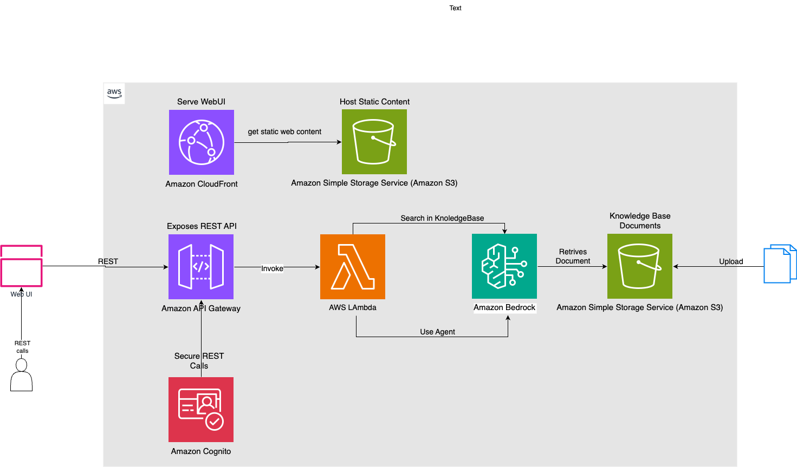
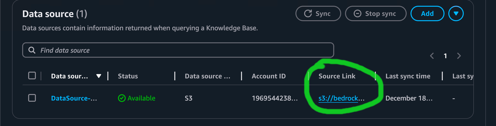

## Intro

### Knowledge bases and agents

Knowledge bases and agents are essential tools in enhancing organizational efficiency and decision-making. Knowledge bases serve as centralized repositories of information, enabling quick access to accurate data, which reduces search times, improves productivity, and supports consistent communication across teams. Knowledge-based agents, on the other hand, utilize this information to make informed decisions and take appropriate actions based on their understanding of the environment, thereby facilitating learning and adaptation through continuous knowledge updates. Together, they streamline operations, reduce training time for new employees, and enhance customer support by providing instant access to resources, ultimately leading to improved organizational performance.

### Amazon Bedrock Knowledge bases and agents

Amazon Bedrock Knowledge Bases and Agents offer powerful tools for ingesting documentation and answering questions intelligently. This example demonstrates how to leverage these capabilities effectively.
Amazon Bedrock Knowledge Bases are used for implementing Retrieval Augmented Generation (RAG), a technique that enhances AI responses by incorporating contextual information from your company's data sources. The knowledge base ingests and processes your documentation, converting it into vector embeddings that can be efficiently searched.
Amazon Bedrock Agents, built on top of the knowledge base, provide a natural language interface to interact with the stored information3. These agents can be configured to not only retrieve relevant data but also to execute various actions, including leveraging third-party APIs, in response to user queries.

By combining these technologies, you can create a system that:

1. Ingests and processes your documentation semi-automatically
2. Retrieves relevant information based on user queries
3. Generates accurate and contextually appropriate responses
4. Performs additional actions or API calls as needed to supplement the information

This approach enables the creation of highly customized, intelligent applications that can efficiently answer questions about your specific documentation while also integrating external data sources when necessary

#### AWS Powertools

For this examples we leverage [AWS Powertools](https://docs.powertools.aws.dev/lambda/python/latest/) for lambda.
The reason is, AWS Powertools is essential for optimizing AWS Lambda functions, providing a suite of utilities that enhance performance, monitoring, and security while reducing the complexity of serverless application development.
By implementing best practices such as structured logging, custom metrics, and distributed tracing, AWS Powertools enables developers to focus on business logic rather than boilerplate code, streamlining the development process.
Additionally, it supports multiple programming languages and integrates seamlessly with AWS services, making it a versatile tool for teams looking to improve their serverless architecture and operational efficiency.

### Architecture



To understand the architecture of this solution, let’s break it down step by step, moving from left to right in the system's workflow:

#### **User Interaction and REST API**

- **User Interaction**: The system begins with user interaction through REST API calls. These calls can be initiated from a **Web UI**, enabling users to interact with the solution seamlessly.
- **Security with Amazon Cognito**: All REST API interactions are secured using **Amazon Cognito**. This ensures that only authenticated and authorized users can access the APIs. Users must register and authenticate via Cognito to obtain valid tokens, which are included in the API requests for validation.

#### **API Gateway**

- The **Amazon API Gateway** acts as the entry point for all REST API requests. It exposes the system's functionality by routing requests to the appropriate backend services.
- API Gateway integrates with Amazon Cognito to validate user credentials before forwarding requests, ensuring robust security and fine-grained access control.

#### **AWS Lambda**

- Once the request passes through the API Gateway, it is processed by **AWS Lambda** functions. These serverless functions handle business logic and interact with other components of the architecture.
- Lambda functions are responsible for querying and interacting with:
  - **Knowledge Bases**: These could include databases or other structured repositories of information.
  - **Agents**: External or internal systems that perform specific tasks or provide additional data.

#### **Data Storage in Amazon S3**

- The data to be processed or searched by the knowledge base and agents is stored in an **Amazon S3 bucket**.
- For this specific use case, it is assumed that users manually upload documents to the S3 bucket. This allows the system to process these documents as part of its operations.

#### **Key Features of the Architecture**

1. **Security**: By leveraging Amazon Cognito and JWT-based authentication, the architecture ensures secure access to APIs without requiring session management overhead[6].
2. **Scalability**: With serverless components like AWS Lambda and S3, the system is highly scalable, capable of handling varying workloads efficiently.
3. **Modularity**: Each component (API Gateway, Lambda, Cognito, S3) is independent yet seamlessly integrated, allowing for easy updates or replacements without disrupting the entire system.

This architecture demonstrates a robust design for handling secure user interactions, efficient data processing, and scalable storage using AWS services. It aligns with best practices in solution architecture by ensuring security, scalability, and maintainability.

## Deploying the CDK Stack: A Step-by-Step Guide

Follow the these steps to install the example:

### 1. Install Dependencies

Begin by installing the necessary npm dependencies. Navigate to the top-level directory of your project in your terminal and run:

```
npm install
```

This command will fetch and install all required packages specified in your `package.json` file.

### 2. Bootstrap CDK

Before deploying your stack, you need to bootstrap CDK in your AWS account and region. This process sets up the necessary resources for CDK to manage deployments. Execute the following command, replacing `<account>` and `<region>` with your AWS account ID and desired region:

```
npx cdk bootstrap aws://<account>/<region>
```

For example, if your account ID is 123456789012 and you're deploying to us-east-1, the command would be:

```
npx cdk bootstrap aws://123456789012/us-east-1
```

### 3. Deploy the Stack

With the dependencies installed and CDK bootstrapped, you're ready to deploy your stack. Simply run:

```
npx cdk deploy
```

This command synthesizes a CloudFormation template from your CDK code and deploys it to your AWS account, creating or updating the specified resources.

By following these steps, you'll have your CDK stack up and running in your AWS environment, ready to manage your infrastructure efficiently.

### 4. Knowledge Base Configuration and Document Processing

After completing the installation process, you'll be able to access your newly created Knowledge Base within Amazon Bedrock. To view and manage your Knowledge Base:

1. Navigate to the AWS Management Console
2. Locate and select the Amazon Bedrock service
3. Choose "Knowledge and datasource" from the sidebar menu

This will display your Knowledge Base and its associated S3 bucket, which serves as the repository for documents used in your Knowledge Base.



### Document Upload and Synchronization

To populate your Knowledge Base with relevant information:

1. Select an appropriate document for ingestion. For this exercise, we recommend using the [Amazon S3 user manual](https://docs.aws.amazon.com/AmazonS3/latest/userguide/s3-userguide.pdf), which provides a comprehensive overview of S3 functionality.
2. Upload the chosen document to the S3 bucket directory specified in your Knowledge Base configuration.
3. After successful upload, locate and press the "Synchronize" button within the Bedrock console.

The synchronization process is a crucial step that accomplishes the following:

- It triggers the creation of embeddings for the uploaded documents.
- These embeddings are vector representations of the text content, enabling efficient semantic search and retrieval.
- The system uses a specified embeddings model to convert the textual data into these high-dimensional vectors.

### Behind the Scenes

During synchronization, Amazon Bedrock performs several important tasks:

1. **Document Chunking**: The uploaded content is divided into manageable chunks, optimizing it for processing and retrieval.

2. **Embedding Generation**: Each chunk is processed through the selected embeddings model, transforming the text into numerical vectors.

3. **Vector Storage**: The generated embeddings are stored in the configured vector database, which could be Amazon OpenSearch Serverless or another compatible service.

4. **Metadata Association**: Any relevant metadata from the original documents is preserved and associated with the corresponding embeddings.

This process enables your Knowledge Base to efficiently search and retrieve relevant information when queried, forming the foundation for powerful retrieval-augmented generation (RAG) applications.

By following these steps, you'll have successfully initialized and populated your Amazon Bedrock Knowledge Base, preparing it for use in various AI-driven tasks and applications.

### Test the Knowledge Base with the AWS console

To interact with Amazon Bedrock Knowledge Bases using the AWS console, you first need to navigate to the Amazon Bedrock service and select "Knowledge bases" from the left navigation pane.
You will notice the new created knowledge base named: `KBBedrockKb.....` select it and then use the knowledge base chat to query information or generate AI responses based on the ingested data. For this step you need to choose a model, for this exercise we sued Anthropic/Claude 3 Haiku.

If you choose to use the `Amazon S3 user manual` you can test the Knowledge Base you can ask for questions about S3.

#### Amazon Bedrock Model access

In order to be able to use foundation models you need to request access for. In order to do this navigate to the Amazon Bedrock service and select "Model access" from the left navigation pane.
On the Model access page, users can review the End User License Agreement (EULA) for each model and then click "Modify model access" to select the desired models. After selecting the models, users should review the terms, submit any required use case details (such as for Anthropic models), and click "Submit" to request access, which may take several minutes to be reflected in the console.

For this exercise we recommend you to request access for all Anthropic/Claude 3 models.

## Test it with AWS Console

The interaction/functionality from section `Test the Knowledge Base with the AWS console` is can be done programmatic as well as code.
For this exercise we prepared two distinct functionalities, the Knowledge Base RAG query and Agent query.
The codebase provide two Amazon Powertools lambdas let's try to explore them.

### Knowledge Base RAG query and agent query

The code is available in the `api/example-powertools/example.py` file.

The AWS Lambda function in this code is designed to be triggered by API Gateway when a REST request is received.
API Gateway routes incoming HTTP requests to the appropriate Lambda function based on the configured API endpoints.
When a request matches a defined route, API Gateway invokes the Lambda function, passing the request details as an event object.

You can test the lambda function from the AWS console using the event the predefined events with the Lambda AWS console as follow steps.

First navigate to the Lambda function `BedrockKbAgentStack-ExampleLambdaFn....` in the AWS console and click on the "Test" tab.
Create a new test event by selecting "Configure test event" from the dropdown menu, then enter `..test/lambda-events/ask-kb.json` JSON payload in the event body. Finally, click "Test" to execute the Lambda function with your specified event, and view the results in the console's execution output.

Same logic for agent query, with the difference that for the agent query you need to use `..test/lambda-events/ask-agent.json`

This is how the `ask-kb` event response looks like

```json
{
  "statusCode": 200,
  "body": "{\"conv_id\":\"0b772d3a-3b56-4bb4-ac8f-ee5d4272dc89\",\"question\":\"what is s3?\",\"answer\":\"Amazon S3 (Simple Storage Service) is an object storage service offered by Amazon Web Services (AWS). It allows users to store and retrieve data of any amount or type, from anywhere on the web. Some key features of Amazon S3 include:\\n\\n- Storage classes: S3 offers a range of storage classes designed for different use cases, such as frequently accessed data, infrequently accessed data, and archived data.\\n- Data protection: S3 is designed to provide 99.999999999% durability and 99.99% availability of objects over a given year.\\n- Lifecycle management: Users can configure lifecycle rules to automatically transition objects between storage classes or expire objects that reach the end of their lifetimes.\\n- Access management: S3 provides various access management tools to control who can access the stored data and what actions they can perform.\"}",
  "isBase64Encoded": false,
  "headers": {
    "Content-Type": "application/json"
  },
  "cookies": []
}
```

Let's try to understand it

1. for the exercise we ingest the `S3 user manual` and this means we can ask S# specific questions, for this case we send the question: `what is s3?`
2. the Knowledge Base RAG answer is: `Amazon S3 (Simple Storage Service) is an object storage ....`
3. the method returns also conversation id, useful if you want to create a longer conversation.

This is how the `ask-kb` event response looks like

```json
{
  "statusCode": 200,
  "body": "{\"conv_id\":\"adc56b78a40b4a99bf82c5236596bc01\",\"question\":\"how is the weather in London?\",\"answer\":\"The weather in London is rainy\"}",
  "isBase64Encoded": false,
  "headers": {
    "Content-Type": "application/json"
  },
  "cookies": []
}
```

Let's try to understand it.

This event is routed to the Knowledge Base Agent, the source code for this is in the `./api/example-agent/example.py`.
This file s is simple implementation of a Knowledge Base Agent.

The Knowledge Base Agent, implemented in example.py, is designed to recognize and respond to weather-related questions for specific locations. This agent utilizes a llm mechanisms to determine the location mentioned in a query and provides a mock weather forecast for that location.
The implementation includes a /weather endpoint that generates a random weather condition (either "rainy" or "sunny") for the given location, demonstrating a basic example of how a knowledge-based system can process and respond to user queries.

## Destroy

In order to remove this example run:

```
npx cdk destroy
```
