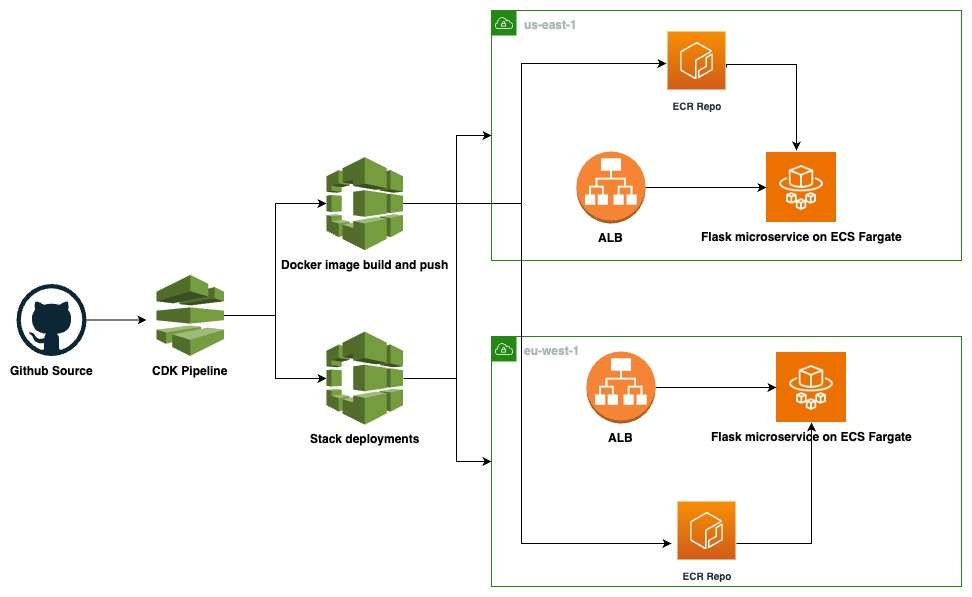

# CDK Pipeline for multi-region ECS deployments

## Architecture 

## Overview

[CDK Pipelines](https://docs.aws.amazon.com/cdk/api/v2/docs/aws-cdk-lib.pipelines-readme.html) is an opinionated construct library. It is purpose-built to deploy one or more copies of your CDK applications using CloudFormation with a minimal amount of effort on your part.

In this example, CDK pipelines is used to deploy an [ApplicationLoadBalancedFargateService](https://docs.aws.amazon.com/cdk/api/v2/docs/aws-cdk-lib.aws_ecs_patterns.ApplicationLoadBalancedFargateService.html), along with build of the application container image. The source code containes the source of the pipeline along with the application and related DOCKERFILE. 

This example highlights the amount of code required build a fully functional pipeline to get started with rather than the ECS Fargate service, hence the application is a "hello world".

## Pre-requisistes 

Create a [Connection](https://docs.aws.amazon.com/dtconsole/latest/userguide/connections.html) to GitHub in your AWS account and provide the arn to the prop `connectionArn` in the pipeline. This connection would be used to pull the source code. Alternatively you can also use code commit. A full list of sources are available [here](https://docs.aws.amazon.com/cdk/api/v2/docs/aws-cdk-lib.pipelines.CodePipelineSource.html).

Replace the connection arn, repo name and branch in the [pipelines.ts](./lib/pipeline-stack.ts) file

## Useful CDK commands
* `npm run build`   compile typescript to js
* `npm run watch`   watch for changes and compile
* `npm run test`    perform the jest unit tests
* `npx cdk deploy`  deploy this stack to your default AWS account/region
* `npx cdk diff`    compare deployed stack with current state
* `npx cdk synth`   emits the synthesized CloudFormation template
