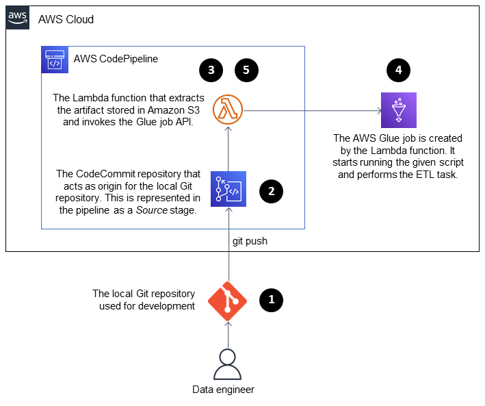

# AWS Glue job with an AWS CodePipeline CI/CD pipeline

## How to Run CDK TypeScript project

The `cdk.json` file tells the CDK Toolkit how to execute your app.

### Useful commands

* `aws configure`   configure access to your AWS account
* `npm run watch`   watch for changes and compile
* `npm run test`    perform the jest unit tests
* `cdk deploy --parameters glueJob="Glue Job Name"`      deploy this stack to your default AWS account/region
* `cdk diff`        compare deployed stack with current state
* `cdk synth`       emits the synthesized CloudFormation template

## About Pattern

This pattern demonstrates how you can integrate Amazon Web Services (AWS) CodeCommit and AWS CodePipeline with AWS Glue, and use AWS Lambda to launch jobs as soon as a developer pushes their changes to a remote AWS CodeCommit repository. 

When a developer submits a change to an extract, transform, and load (ETL) repository and pushes the changes to AWS CodeCommit, a new pipeline is invoked. The pipeline initiates a Lambda function that launches an AWS Glue job with these changes. The AWS Glue job performs the ETL task.

This solution is helpful in the situation where businesses, developers, and data engineers want to launch jobs as soon as changes are committed and pushed to the target repositories. It helps achieve a higher level of automation and reproducibility, therefore avoiding errors during the job launch and lifecycle.

The process consists of these steps:

1. The developer or data engineer makes a modification in the ETL code, commits, and pushes the change to AWS CodeCommit.
2. The push initiates the pipeline.
3. The pipeline initiates a Lambda function, which calls codecommit:GetFile on the repository and uploads the file to Amazon Simple Storage Service (Amazon S3).
4. The Lambda function launches a new AWS Glue job with the ETL code.
5. The Lambda function finishes the pipeline.

### Automation and scale

The sample attachment demonstrates how you can integrate AWS Glue with AWS CodePipeline. It provides a baseline example that you can customize or extend for your own use. 

### References 
* [Adding jobs in AWS Glue](https://docs.aws.amazon.com/glue/latest/dg/add-job.html)
* [Invoke an AWS Lambda function in CodePipeline](https://docs.aws.amazon.com/codepipeline/latest/userguide/actions-invoke-lambda-function.html)
* [Source action integrations in CodePipeline](https://docs.aws.amazon.com/codepipeline/latest/userguide/integrations-action-type.html#integrations-source)