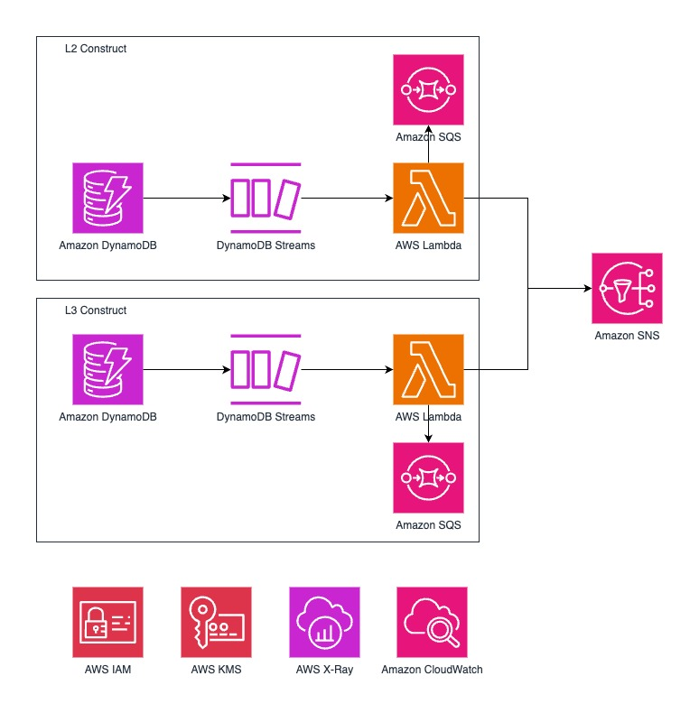

# DynamoDB Stream Integration with Lambda and SNS

<!--BEGIN STABILITY BANNER-->
---


> **This is an experimental example. It may not build out of the box**
>
> This example is built on Construct Libraries marked "Developer Preview" and may not be updated for latest breaking changes.
>
> It may additionally requires infrastructure prerequisites that must be created before successful build.
>
> If build is unsuccessful, please create an [issue](https://github.com/aws-samples/aws-cdk-examples/issues/new) so that we may debug the problem 
---
<!--END STABILITY BANNER-->

## Overview

This repository provides both L2 and L3 constructs example usage for working with DynamoDB streams [AWS Cloud Development Kit (CDK)](https://aws.amazon.com/cdk/) with TypeScript. It showcases the integration of DynamoDB streams with AWS Lambda and Amazon SNS (Simple Notification Service), providing an example of real-time data processing and notification workflows.

This solution demonstrates a use case for real-time notifications: alerting users about low inventory of an item in the system.

## Architecture Diagram



## Features

- L2 (low-level) construct for fine-grained control over DynamoDB streams
- [L3 (high-level)](https://docs.aws.amazon.com/solutions/latest/constructs/aws-dynamodbstreams-lambda.html) construct for simplified, best-practice implementations of DynamoDB streams
- Integration with Lambda functions for stream processing
- Implements an SQS Dead Letter Queue (DLQ) for the Lambda function failure handling
- Shows how to use Amazon SNS to distribute stream processing results or notifications.


## Build, Deploy and Testing

### Prerequisites

Before you begin, ensure you have met the following requirements:

* You have installed the latest version of [Node.js and npm](https://nodejs.org/en/download/)
* You have installed the [AWS CLI](https://aws.amazon.com/cli/) and configured it with your credentials
* You have installed the [AWS CDK Toolkit](https://docs.aws.amazon.com/cdk/latest/guide/cli.html) globally
* You have an AWS account and have set up your [AWS credentials](https://docs.aws.amazon.com/cli/latest/userguide/cli-configure-files.html)
* You have [bootstrapped your AWS account](https://docs.aws.amazon.com/cdk/latest/guide/bootstrapping.html) for CDK


### Build
To build this app, you need to be in this example's root folder. Then run the following:

```bash
npm install
npm run build
```

This will install the dependencies for this example.

### Deploy

Run `cdk deploy`. This will deploy the Stack to your AWS Account.

Post deployment, you should see the table arn, lambda function arn and sns topic arn on the output of your CLI.

## Testing
```bash
npm run test
```

## Usage

### Configuring SNS Notification Subscription

1. After deploying the stack, locate the SNS topic Amazon Resource Name (ARN) from the CLI output.

2. To subscribe an email address to the SNS topic:

   ```bash
   aws sns subscribe --topic-arn <your-sns-topic-arn> --protocol email --notification-endpoint your-email@example.com
    ```
Replace <your-sns-topic-arn> with the actual ARN of your SNS topic, and your-email@example.com with the email address you want to subscribe.

3. Check your email inbox for a confirmation message from AWS. Click the link in the email to confirm your subscription.

### Creating an Item in DynamoDB with id, itemName, and count
To trigger the stream processing and email notification, you need to create an item in your DynamoDB table with the fields id, itemName, and count. You can do this using the AWS CLI or AWS Management Console.

Example item.json provided in this repo:
```bash
{
    "id": {
        "S": "1"
    },
    "count": {
        "N": "10"
    },
    "itemName": {
        "S": "Coffee Beans"
    }
}
```

1. Use the following command to put the item into your DynamoDB table:

```bash
aws dynamodb put-item --table-name <your-table-name> --item file://item.json
```

Replace <your-table-name> with the actual name of your DynamoDB table.

2. Whenever you update the count field of the item to 0, the DynamoDB stream will trigger the Lambda function, which will process the data and send a notification to the subscribed email address via SNS.


## Cleanup

To avoid incurring future charges, please destroy the resources when they are no longer needed:

```bash
cdk destroy
```
