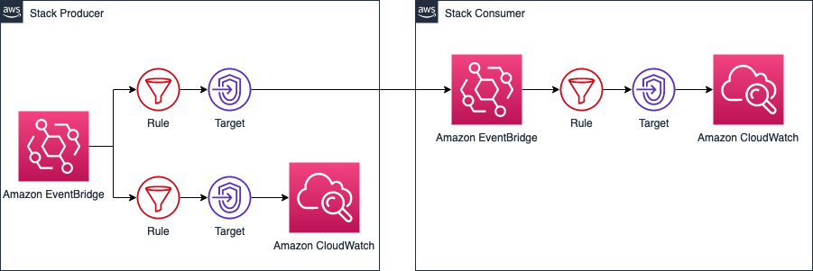
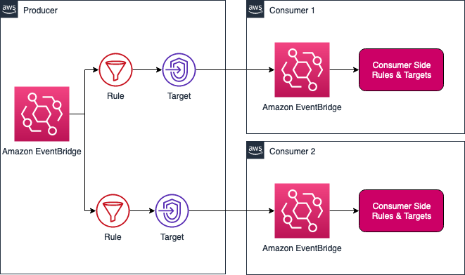

# CDK Sample: Event Bridge mesh with CDK

## Description 
A CDK way to set up a Event Bridge Mesh, where you relay the messages from one Event Bridge in a producer account to another Event Bridge in a consumer account

## Backgroud

## Solution

### Single consumer

### Multiple consumers

