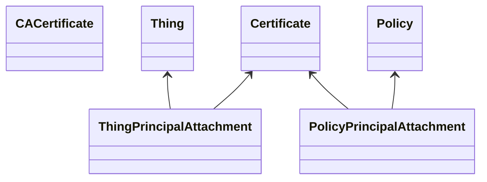

# Create Thing And Certificate

This example creates and deploys some kind of certificates following
[this documentation](https://docs.aws.amazon.com/iot/latest/developerguide/x509-client-certs.html).
And this example also confirm to work the certificates with getting and updating device shadow.

## Stack Over View



## Usage

### 1. Create some kinds of certificates

First, it is needed to create some certificates.
This example creates certificates with `openssl`.
Process to create certificates is written in `./create-certs`.

```console
./create-certs
```

### 2. Deploy the certificates

Next, let's deploy the certificates with aws-cdk.

```console
npx cdk deploy
```

or

```console
yarn cdk deploy
```

### 3. Confirm to work the certificates

Finally, let's confirm to work the certificates with getting and updating the
device shadow as following:

```console
./shadow-get
```

and

```console
./shadow-update
```

## Synthesize Cloudformation Template

To see the Cloudformation template generated by the CDK, run cdk synth, then check the output file in the "cdk.out" directory.
